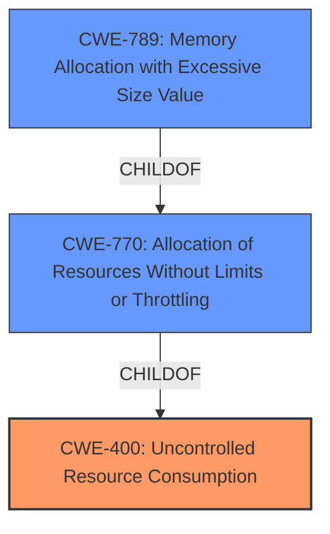

# Enhanced Analysis for CVE-2024-43515

# Summary
| CWE ID | CWE Name | Confidence | CWE Abstraction Level | CWE Vulnerability Mapping Label | CWE-Vulnerability Mapping Notes |
|---|---|---|---|---|---|
| CWE-400 | Uncontrolled Resource Consumption | 0.7 | Class | Primary | Allowed |

## Evidence and Confidence

*   **Confidence Score:** 0.7
*   **Evidence Strength:** LOW

## Relationship Analysis
The primary CWE selected is CWE-400, which is a Class-level CWE. The retriever results also included several related CWEs, like CWE-770 (Allocation of Resources Without Limits or Throttling), a child of CWE-400. While more specific CWEs exist, the provided description lacks sufficient detail to justify selecting a Base or Variant level CWE. The hierarchical relationship between CWE-400 and its children indicates the possibility of more specific weaknesses related to resource management, but without further information, the Class level CWE-400 is the most appropriate.



## Vulnerability Chain
The vulnerability chain appears to be:
1.  Unspecified **WEAKNESS** in the iSCSI component.
2.  Leads to **Uncontrolled Resource Consumption (CWE-400)**.
3.  Results in a Denial of Service **impact**.

The provided information is very limited. The retriever results suggest that a more specific vulnerability could be present, such as CWE-770, which could then lead to CWE-789.

## Summary of Analysis
The vulnerability description indicates a Denial of Service in the iSCSI component. The only provided key phrase is the "impact: Denial of Service". The CVE Reference Links Content Summary is "UNRELATED", so it provides no information on the Root Cause or Weakness.

Given the limited information, the most appropriate CWE is CWE-400 (Uncontrolled Resource Consumption). This is based on the fact that a Denial of Service often results from a lack of proper resource management.

CWE-20 (Improper Input Validation) was considered, but it is discouraged when more specific CWEs are available. Since the DoS is likely due to resource exhaustion, CWE-400 is more appropriate.

I am overriding the retriever's ranking of CWEs due to the density scores being based on unrelated content. I am relying more on the description of the vulnerability itself to determine the best fit.

Relevant CWE Information:
*   CWE-400: Uncontrolled Resource Consumption
*   CWE-770: Allocation of Resources Without Limits or Throttling
*   CWE-789: Memory Allocation with Excessive Size Value


## CWE Relationship Analysis

Current CWEs represent these abstraction levels: .


### Vulnerability Chain Analysis

**Chain starting from CWE-400:**
- 400 (Uncontrolled Resource Consumption) - ROOT


**Chain starting from CWE-789:**
- 789 (Memory Allocation with Excessive Size Value) - ROOT


### CWE Relationship Diagram

```mermaid
graph TD
    classDef primary fill:#f96,stroke:#333,stroke-width:2px
    classDef secondary fill:#69f,stroke:#333
    classDef tertiary fill:#9e9,stroke:#333
```