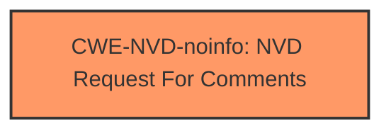

# Analysis Report for CVE-2024-43526

# Vulnerability Analysis Report: CVE-2024-43526

## Description

Windows Mobile Broadband Driver Remote Code Execution Vulnerability

## Vulnerability Description Key Phrases

- **Impact:** Remote Code Execution
- **Product:** Windows Mobile Broadband Driver

## Analysis (with Relationship Data)

# Summary

| CWE ID     | CWE Name                                                                 | Confidence | CWE Abstraction Level | CWE Vulnerability Mapping Label | CWE-Vulnerability Mapping Notes |
| ---------- | ------------------------------------------------------------------------ | ---------- | --------------------- | ------------------------------- | ------------------------------- |
| CWE-NVD-noinfo | NVD Request for Comments                                              | 0.7       | Pillar                  | Primary                         | Allowed                       |

## Evidence and Confidence

*   **Confidence Score:** 0.7
*   **Evidence Strength:** LOW

## Relationship Analysis

The primary identified CWE is CWE-NVD-noinfo, a pillar-level CWE, indicating a lack of specific information to pinpoint the vulnerability's root cause. There are no child, parent, peer, or chain relationships that can be analyzed because there is not enough information.

## Vulnerability Chain

The vulnerability chain is incomplete due to the lack of specific information. The description only mentions a remote code execution vulnerability in the Windows Mobile Broadband Driver without detailing the underlying weakness.

## Summary of Analysis

The analysis is heavily constrained by the lack of detailed information in the vulnerability description. The primary evidence available is the "Vulnerability Description Key Phrases" which identify the **impact** as Remote Code Execution and the **product** as Windows Mobile Broadband Driver. The "CWE for similar CVE Descriptions" section suggests CWE-NVD-noinfo as the primary match. Given the minimal information, selecting CWE-NVD-noinfo is the most appropriate choice, despite its high level of abstraction. The Retriever Results provide various CWEs related to buffer overflows, race conditions, and IOCTL vulnerabilities, but none can be definitively linked to the vulnerability description without more evidence.

Relevant CWE Information:

# Enhanced Context (25 CWEs)

CWE-NVD-noinfo is selected because the vulnerability description lacks sufficient detail to identify the specific weakness.

*Report generated on 2025-07-13 14:56:55*
