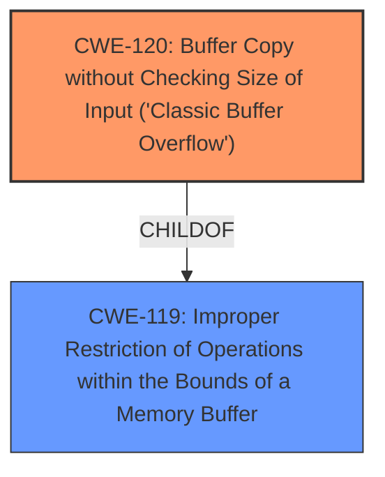

# Enhanced Analysis for CVE-2024-43593

# Summary
| CWE ID | CWE Name | Confidence | CWE Abstraction Level | CWE Vulnerability Mapping Label | CWE-Vulnerability Mapping Notes |
|---|---|---|---|---|---|
| CWE-120 | Buffer Copy without Checking Size of Input ('Classic Buffer Overflow') | 0.8 | Base | Allowed | Primary CWE |

## Evidence and Confidence

*   **Confidence Score:** 0.8
*   **Evidence Strength:** MEDIUM

## Relationship Analysis
The primary relationship considered was the parent-child relationship. CWE-120 is a child of CWE-119 (Improper Restriction of Operations within the Bounds of a Memory Buffer). The description mentions "improper input validation and insufficient bounds checking," which is characteristic of CWE-120. CWE-787 (Out-of-bounds Write) is another potential child of CWE-119. The selection of CWE-120 over CWE-787 is influenced by the description explicitly referencing a buffer overflow scenario, aligning with the classic buffer overflow description of CWE-120.



## Vulnerability Chain
The vulnerability chain starts with **improper input validation and insufficient bounds checking**, which leads to a buffer overflow, and ultimately results in Remote Code Execution.
  - Root Cause: **Improper input validation and insufficient bounds checking** (CWE-120)
  - Impact: Remote Code Execution

## Summary of Analysis
The vulnerability description indicates that the Windows Routing and Remote Access Service (RRAS) is vulnerable to Remote Code Execution due to how it handles certain network packets. The key phrases highlight **improper input validation and insufficient bounds checking** as the root cause.

Initially, the primary CWE match was CWE-NVD-noinfo, but this is a placeholder and not a real CWE. The top CWEs list includes CWE-362 (Concurrent Execution using Shared Resource with Improper Synchronization ('Race Condition')) and CWE-787 (Out-of-bounds Write). However, the description does not provide enough information to confirm a race condition (CWE-362).

The retriever results show several candidate CWEs, including CWE-362, CWE-184 (Incomplete List of Disallowed Inputs), CWE-917 (Improper Neutralization of Special Elements used in an Expression Language Statement ('Expression Language Injection')), CWE-252 (Unchecked Return Value), and CWE-787 (Out-of-bounds Write). Considering the provided information, CWE-120 (Buffer Copy without Checking Size of Input ('Classic Buffer Overflow')) is the most appropriate because the **improper input validation and insufficient bounds checking** directly relates to the classic buffer overflow scenario described by CWE-120.

The evidence from the vulnerability description: "A vulnerability exists in how the Windows Routing and Remote Access Service (RRAS) handles certain network packets" and the weakness is "**Improper input validation and insufficient bounds checking**."

CWE-120 is at the Base level of abstraction, which is preferred. The mapping guidance is "Allowed." Therefore, CWE-120 is selected as the primary CWE with a confidence of 0.8.

CWE-787 (Out-of-bounds Write) was considered but not chosen as the primary CWE because CWE-120 more directly reflects the **improper input validation and insufficient bounds checking** leading to a buffer overflow. While an out-of-bounds write could occur due to a buffer overflow, the description more closely aligns with the classic buffer overflow scenario.


## CWE Relationship Analysis

Current CWEs represent these abstraction levels: .


### Vulnerability Chain Analysis

**Chain starting from CWE-917:**
- 917 (Improper Neutralization of Special Elements used in an Expression Language Statement ('Expression Language Injection')) - ROOT


**Chain starting from CWE-787:**
- 787 (Out-of-bounds Write) - ROOT


### CWE Relationship Diagram

```mermaid
graph TD
    classDef primary fill:#f96,stroke:#333,stroke-width:2px
    classDef secondary fill:#69f,stroke:#333
    classDef tertiary fill:#9e9,stroke:#333
```