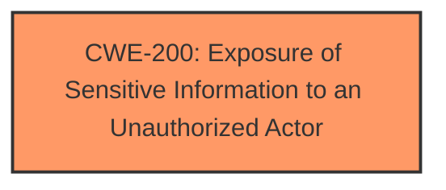

# Enhanced Analysis for CVE-2024-43610

# Summary
| CWE ID | CWE Name | Confidence | CWE Abstraction Level | CWE Vulnerability Mapping Label | CWE-Vulnerability Mapping Notes |
|---|---|---|---|---|---|
| CWE-200 | Exposure of Sensitive Information to an Unauthorized Actor | 0.7 | Class | Allowed | Primary CWE |

## Evidence and Confidence

*   **Confidence Score:** 0.7
*   **Evidence Strength:** LOW

## Relationship Analysis
The primary relationship considered was the parent-child relationship, specifically looking for more specific CWEs than CWE-200. While several child CWEs of CWE-200 were considered, the lack of specific root cause information prevented a more precise mapping.



## Vulnerability Chain
The vulnerability chain starts with an unspecified weakness that leads to the **impact** of exposing sensitive information to an unauthorized actor.

## Summary of Analysis
The vulnerability description indicates an **impact** of "Exposure of Sensitive Information to an Unauthorized Actor" via a "network attack vector" by an "unauthenticated attacker."

The primary candidate CWE is CWE-200 (Exposure of Sensitive Information to an Unauthorized Actor). However, the retriever results also suggest more specific CWEs like CWE-497 (Exposure of Sensitive System Information to an Unauthorized Control Sphere), CWE-532 (Insertion of Sensitive Information into Log File), and CWE-306 (Missing Authentication for Critical Function).

Given the limited information, it's difficult to pinpoint the exact root cause. Without knowing the specific mechanism causing the exposure, mapping to a more specific CWE would be speculative. Therefore, CWE-200 is selected, with the understanding that it's a high-level categorization.

CWE-200 is a Class-level CWE. The guidance for CWE-200 states that it is **Discouraged** because it is often misused to represent the loss of confidentiality which is a technical impact and not a root cause error. However, as the root cause is unknown, it is used.

Relevant CWE Information:
*   CWE-200: Exposure of Sensitive Information to an Unauthorized Actor


## CWE Relationship Analysis

Current CWEs represent these abstraction levels: .


### Vulnerability Chain Analysis

**Chain starting from CWE-200:**
- 200 (Exposure of Sensitive Information to an Unauthorized Actor) - ROOT


**Chain starting from CWE-306:**
- 306 (Missing Authentication for Critical Function) - ROOT


### CWE Relationship Diagram

```mermaid
graph TD
    classDef primary fill:#f96,stroke:#333,stroke-width:2px
    classDef secondary fill:#69f,stroke:#333
    classDef tertiary fill:#9e9,stroke:#333
```