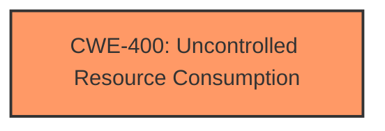

# Analysis Report for CVE-2024-43647

# Vulnerability Analysis Report: CVE-2024-43647

## Description

A vulnerability has been identified in SIMATIC S7-200 SMART CPU CR40 (6ES7288-1CR40-0AA0) (All versions), SIMATIC S7-200 SMART CPU CR60 (6ES7288-1CR60-0AA0) (All versions), SIMATIC S7-200 SMART CPU SR20 (6ES7288-1SR20-0AA0) (All versions), SIMATIC S7-200 SMART CPU SR20 (6ES7288-1SR20-0AA1) (All versions), SIMATIC S7-200 SMART CPU SR30 (6ES7288-1SR30-0AA0) (All versions), SIMATIC S7-200 SMART CPU SR30 (6ES7288-1SR30-0AA1) (All versions), SIMATIC S7-200 SMART CPU SR40 (6ES7288-1SR40-0AA0) (All versions), SIMATIC S7-200 SMART CPU SR40 (6ES7288-1SR40-0AA1) (All versions), SIMATIC S7-200 SMART CPU SR60 (6ES7288-1SR60-0AA0) (All versions), SIMATIC S7-200 SMART CPU SR60 (6ES7288-1SR60-0AA1) (All versions), SIMATIC S7-200 SMART CPU ST20 (6ES7288-1ST20-0AA0) (All versions), SIMATIC S7-200 SMART CPU ST20 (6ES7288-1ST20-0AA1) (All versions), SIMATIC S7-200 SMART CPU ST30 (6ES7288-1ST30-0AA0) (All versions), SIMATIC S7-200 SMART CPU ST30 (6ES7288-1ST30-0AA1) (All versions), SIMATIC S7-200 SMART CPU ST40 (6ES7288-1ST40-0AA0) (All versions), SIMATIC S7-200 SMART CPU ST40 (6ES7288-1ST40-0AA1) (All versions), SIMATIC S7-200 SMART CPU ST60 (6ES7288-1ST60-0AA0) (All versions), SIMATIC S7-200 SMART CPU ST60 (6ES7288-1ST60-0AA1) (All versions). Affected devices **do not properly handle TCP packets with an incorrect structure**. This could allow an unauthenticated remote attacker to cause a denial of service condition. To restore normal operations, the network cable of the device needs to be unplugge

## Vulnerability Description Key Phrases

- **Rootcause:** do not properly handle TCP packets with an incorrect structure
- **Impact:** denial of service condition
- **Attacker:** unauthenticated remote attacker
- **Product:** SIMATIC S7-200 SMART CPU
- **Version:** ['All versions', 'All versions', 'All versions', 'All versions', 'All versions', 'All versions', 'All versions', 'All versions', 'All versions', 'All versions', 'All versions', 'All versions', 'All versions', 'All versions', 'All versions', 'All versions', 'All versions', 'All versions', 'All versions']

## Analysis (with Relationship Data)

# Summary
| CWE ID | CWE Name | Confidence | CWE Abstraction Level | CWE Vulnerability Mapping Label | CWE-Vulnerability Mapping Notes |
|---|---|---|---|---|---|
| CWE-400 | Uncontrolled Resource Consumption | 0.9 | Class | Primary CWE | Discouraged |

## Evidence and Confidence

*   **Confidence Score:** 0.9
*   **Evidence Strength:** HIGH

## Relationship Analysis
The primary CWE is CWE-400, which is a Class-level CWE. While more specific CWEs might exist, the provided information strongly suggests that the **improper handling of TCP packets** leads directly to **uncontrolled resource consumption**, resulting in a denial-of-service condition.



## Vulnerability Chain
The vulnerability chain is relatively simple:

1.  **Root Cause:** **Improper handling of TCP packets with an incorrect structure**.
2.  **Weakness:** Uncontrolled resource consumption (CWE-400).
3.  **Impact:** Denial of service.

## Summary of Analysis
The analysis is based on the provided evidence, particularly the **Vulnerability Description Key Phrases** and **CVE Reference Links Content Summary**. The key phrase "do not properly handle TCP packets with an incorrect structure" directly implies a lack of proper resource management when dealing with malformed packets. This leads to uncontrolled resource consumption, which is accurately represented by CWE-400.

The Complete CWE Specifications and Retriever Results were also considered. While CWE-400 is a Class-level CWE, the provided evidence does not offer enough specificity to select a more granular Base or Variant CWE. The suggested alternative CWEs from the Retriever Results, such as CWE-119 (Improper Restriction of Operations within the Bounds of a Memory Buffer), CWE-755 (Improper Handling of Exceptional Conditions), and CWE-835 (Loop with Unreachable Exit Condition), do not directly address the core weakness of uncontrolled resource consumption.

The decision to use CWE-400 is justified by the direct link between the **improper handling of TCP packets** and the resulting denial-of-service condition due to **uncontrolled resource consumption**.

Relevant CWE Information:

# Enhanced Context (25 CWEs)
The following CWEs were identified as potentially relevant to this vulnerability:

## CWE-755: Improper Handling of Exceptional Conditions
**Abstraction Level**: Class
**Similarity Score**: 0.78
**Source**: dense

**Description**:
The product does not handle or incorrectly handles an exceptional condition.

**Mapping Guidance**:
- Usage: Discouraged
- Rationale: This CWE entry is a level-1 Class (i.e., a child of a Pillar). It might have lower-level children that would be more appropriate

## CWE-294: Authentication Bypass by Capture-replay
**Abstraction Level**: Base
**Similarity Score**: 0.77
**Source**: dense

**Description**:
A capture-replay flaw exists when the design of the product makes it possible for a malicious user to sniff network traffic and bypass authentication by replaying it to the server in question to the same effect as the original message (or with minor changes).

**Mapping Guidance**:
- Usage: Allowed
- Rationale: This CWE entry is at the Base level of abstraction, which is a preferred level of abstraction for mapping to the root causes of vulnerabilities.

## CWE-400: Uncontrolled Resource Consumption
**Abstraction Level**: Class
**Similarity Score**: 0.77
**Source**: dense

**Description**:
The product does not properly control the allocation and maintenance of a limited resource, thereby enabling an actor to influence the amount of resources consumed, eventually leading to the exhaustion of available resources.

**Mapping Guidance**:
- Usage: Discouraged
- Rationale: CWE-400 is intended for incorrect behaviors in which the product is expected to track and restrict how many resources it consumes, but CWE-400 is often misused because it is conflated with the "technical impact" of vulnerabilities in which resource consumption occurs. It is sometimes used for low-information vulnerability reports. It is a level-1 Class (i.e., a child of a Pillar).

## CWE-119: Improper Restriction of Operations within the Bounds of a Memory Buffer
**Abstraction Level**: Class
**Similarity Score**: 0.77
**Source**: dense

**Description**:
The product performs operations on a memory buffer, but it reads from or writes to a memory location outside the buffer's intended boundary. This may result in read or write operations on unexpected memory locations that could be linked to other variables, data structures, or internal program data.

**Mapping Guidance**:
- Usage: Discouraged
- Rationale: CWE-119 is commonly misused in low-information vulnerability reports when lower-level CWEs could be used instead, or when more details about the vulnerability are available.

## CWE-824: Access of Uninitialized Pointer
**Abstraction Level**: Base
**Similarity Score**: 0.76
**Source**: dense

**Description**:
The product accesses or uses a pointer that has not been initialized.

**Mapping Guidance**:
- Usage: Allowed
- Rationale: This CWE entry is at the Base level of abstraction, which is a preferred level of abstraction for mapping to the root causes of vulnerabilities.

## CWE-326: Inadequate Encryption Strength
**Abstraction Level**: Class
**Similarity Score**: 0.76
**Source**: dense

**Description**:
The product stores or transmits sensitive data using an encryption scheme that is theoretically sound, but is not strong enough for the level of protection required.

**Mapping Guidance**:
- Usage: Allowed-with-Review
- Rationale: This CWE entry is a Class and might have Base-level children that would be more appropriate

## CWE-303: Incorrect Implementation of Authentication Algorithm
**Abstraction Level**: Base
**Similarity Score**: 0.76
**Source**: dense

**Description**:
The requirements for the product dictate the use of an established authentication algorithm, but the implementation of the algorithm is incorrect.

**Mapping Guidance**:
- Usage: Allowed
- Rationale: This CWE entry is at the Base level of abstraction, which is a preferred level of abstraction for mapping to the root causes of vulnerabilities.

## CWE-345: Insufficient Verification of Data Authenticity
**Abstraction Level**: Class
**Similarity Score**: 0.76
**Source**: dense

**Description**:
The product does not sufficiently verify the origin or authenticity of data, in a way that causes it to accept invalid data.

**Mapping Guidance**:
- Usage: Discouraged
- Rationale: This CWE entry is a level-1 Class (i.e., a child of a Pillar). It might have lower-level children that would be more appropriate

## CWE-200: Exposure of Sensitive Information to an Unauthorized Actor
**Abstraction Level**: Class
**Similarity Score**: 0.75
**Source**: dense

**Description**:
The product exposes sensitive information to an actor that is not explicitly authorized to have access to that information.

**Mapping Guidance**:
- Usage: Discouraged
- Rationale: CWE-200 is commonly misused to represent the loss of confidentiality in a vulnerability, but confidentiality loss is a technical impact - not a root cause error. As of CWE 4.9, over 400 CWE entries can lead to a loss of confidentiality. Other options are often available. [REF-1287].

## CWE-696: Incorrect Behavior Order
**Abstraction Level**: Class
**Similarity Score**: 0.75
**Source**: dense

**Description**:
The product performs multiple related behaviors, but the behaviors are performed in the wrong order in ways which may produce resultant weaknesses.

**Mapping Guidance**:
- Usage: Allowed-with-Review
- Rationale: This CWE entry is a Class and might have Base-level children that would be more appropriate

## CWE-1269: Product Released in Non-Release Configuration
**Abstraction Level**: Base
**Similarity Score**: 1107.09
**Source**: sparse

**Description**:
The product released to market is released in pre-production or manufacturing configuration.

**Mapping Guidance**:
- Usage: Allowed
- Rationale: This CWE entry is at the Base level of abstraction, which is a preferred level of abstraction for mapping to the root causes of vulnerabilities.

## CWE-119: Improper Restriction of Operations within the Bounds of a Memory Buffer
**Abstraction Level**: Class
**Similarity Score**: 1105.87
**Source**: sparse

**Description**:
The product performs operations on a memory buffer, but it reads from or writes to a memory location outside the buffer's intended boundary. This may result in read or write operations on unexpected memory locations that could be linked to other variables, data structures, or internal program data.

**Mapping Guidance**:
- Usage: Discouraged
- Rationale: CWE-119 is commonly misused in low-information vulnerability reports when lower-level CWEs could be used instead, or when more details about the


## CWE Relationship Analysis

Current CWEs represent these abstraction levels: .


### Vulnerability Chain Analysis

**Chain starting from CWE-400:**
- 400 (Uncontrolled Resource Consumption) - ROOT


**Chain starting from CWE-345:**
- 345 (Insufficient Verification of Data Authenticity) - ROOT


### CWE Relationship Diagram

```mermaid
graph TD
    classDef primary fill:#f96,stroke:#333,stroke-width:2px
    classDef secondary fill:#69f,stroke:#333
    classDef tertiary fill:#9e9,stroke:#333
```


*Report generated on 2025-07-13 15:06:19*
