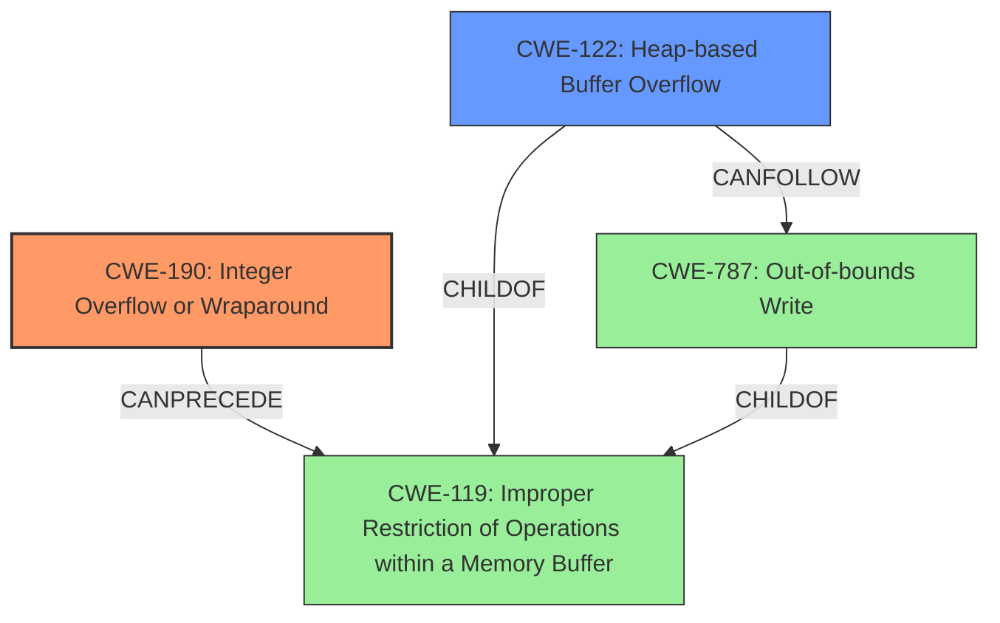

# Raw Analyzer Response for CVE-2024-43768

# Summary
| CWE ID | CWE Name | Confidence | CWE Abstraction Level | CWE Vulnerability Mapping Label | CWE-Vulnerability Mapping Notes |
|---|---|---|---|---|---|
| CWE-190 | Integer Overflow or Wraparound | 1.0 | Base | Primary | Allowed |
| CWE-122 | Heap-based Buffer Overflow | 0.9 | Variant | Secondary | Allowed |

## Evidence and Confidence

*   **Confidence Score:** 0.95
*   **Evidence Strength:** HIGH

## Relationship Analysis
The primary weakness is an **integer overflow** (CWE-190), which can lead to a **heap-based buffer overflow** (CWE-122). CWE-190 can precede CWE-119 (Improper Restriction of Operations within a Memory Buffer), which is a parent of CWE-122 and CWE-787 (Out-of-bounds Write). This shows a clear chain of events: integer overflow leading to memory corruption, and ultimately, an out-of-bounds write.

## Vulnerability Chain
The vulnerability chain starts with an **integer overflow** (CWE-190) in the `skia_alloc_func` function. This leads to an incorrect calculation of the buffer size, resulting in a small memory allocation. Subsequently, a **heap-based buffer overflow** (CWE-122) occurs when data is written beyond the allocated buffer. This **out of bounds write** (CWE-787) allows for memory corruption and potential elevation of privilege.

## Summary of Analysis
The vulnerability description clearly states the presence of an **integer overflow** leading to an **out of bounds write**. The CVE reference summary confirms that the root cause is a missing bounds check in `skia_alloc_func`, which causes an integer overflow when the requested size is too large. This then results in a heap overflow due to the small allocation size.

The primary CWE is CWE-190 (Integer Overflow or Wraparound) because it is the root cause of the vulnerability. The secondary CWE is CWE-122 (Heap-based Buffer Overflow) because it is the direct consequence of the integer overflow.

The selected CWEs are at the optimal level of specificity, with CWE-190 being a Base level CWE and CWE-122 being a Variant level CWE.

Relevant evidence from the description:
*   "In skia_alloc_func of SkDeflate.cpp, there is a possible **out of bounds write** due to an **integer overflow**."
*   "The vulnerability stems from a missing bounds check within the `skia_alloc_func` when dealing with zlib allocation."
*   "This can lead to an integer overflow when the size of an allocation is too large which could wrap around to a small value, causing a heap overflow when the small allocation is filled and written past the allocated region."

Other CWEs Considered:

*   CWE-131 (Incorrect Calculation of Buffer Size): While related, the root cause is the integer overflow leading to the incorrect calculation, making CWE-190 more appropriate as the primary weakness.
*   CWE-787 (Out-of-bounds Write): This is a consequence of the heap overflow (CWE-122), not the root cause.
*   CWE-125 (Out-of-bounds Read): There's no mention of out-of-bounds read in the description.
*   CWE-1284 (Improper Validation of Specified Quantity in Input): This could be a contributing factor, but the core issue is the integer overflow, making CWE-190 a more direct representation of the vulnerability's root cause.