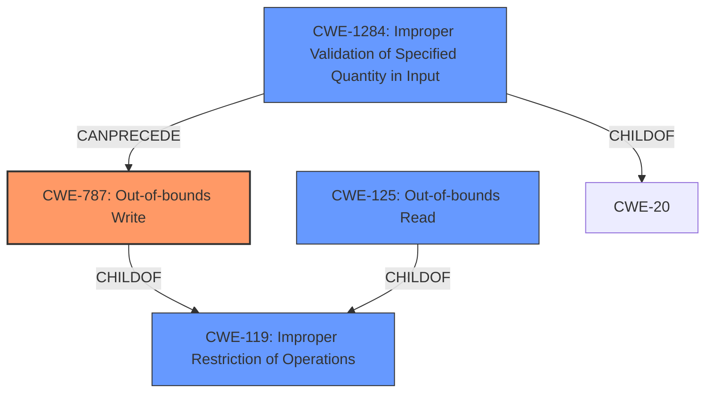

# Raw Analyzer Response for CVE-2024-43771

# Summary
| CWE ID | CWE Name | Confidence | CWE Abstraction Level | CWE Vulnerability Mapping Label | CWE-Vulnerability Mapping Notes |
|---|---|---|---|---|---|
| CWE-787 | Out-of-bounds Write | 1.0 | Base | Primary CWE | Allowed |
| CWE-125 | Out-of-bounds Read | 0.5 | Base | Secondary Candidate CWE | Allowed |
| CWE-1284 | Improper Validation of Specified Quantity in Input | 0.5 | Base | Secondary Candidate CWE | Allowed |

## Evidence and Confidence

*   **Confidence Score:** 0.9
*   **Evidence Strength:** MEDIUM

## Relationship Analysis
The primary relationship that impacted my decision was the parent-child relationship between CWE-119 (Improper Restriction of Operations within the Bounds of a Memory Buffer) and CWE-787 (Out-of-bounds Write). While CWE-119 is a broader category, the vulnerability description explicitly states an out-of-bounds write, making CWE-787 a more specific and appropriate choice. CWE-125 (Out-of-bounds Read) was considered as a peer but the vulnerability explicitly indicated a write.

## Vulnerability Chain
The vulnerability chain starts with the **missing bounds check**, leading to an **out of bounds write**, and ultimately resulting in potential code execution.
  - **Root Cause:** **Missing bounds check**
  - **Weakness:** **Out-of-bounds Write**
  - **Impact:** Code execution

## Summary of Analysis
The primary weakness is an **out of bounds write** due to a **missing bounds check**, as explicitly stated in the vulnerability description. The retriever results also list CWE-787 as a candidate. The "Vulnerability Description Key Phrases" section also identifies these.

The selection of CWE-787 is based on the direct evidence from the vulnerability description: "In gatts_process_read_req of gatt_sr.cc, there is a possible **out of bounds write** due to a **missing bounds check**."

CWE-125 (Out-of-bounds Read) was considered because it is related to memory safety issues, but the description explicitly mentions a write operation, making CWE-787 more appropriate.

CWE-1284 (Improper Validation of Specified Quantity in Input) was considered because the root cause is a **missing bounds check**.

CWE-787 is at the Base level of abstraction, which is the preferred level for mapping root causes.

Other CWEs Considered and Rejected:

*   CWE-280, CWE-274, CWE-266, CWE-267, CWE-863, CWE-269, CWE-285, CWE-250: These CWEs relate to improper privilege management, which is not the primary issue described in the vulnerability.
*   CWE-131: While a missing bounds check could lead to incorrect calculation of buffer size, the description specifically mentions an out-of-bounds write, making CWE-787 more directly relevant.
*   CWE-754, CWE-703: These CWEs deal with improper handling of exceptional conditions, which is a higher-level concept and less specific than an out-of-bounds write.
*   CWE-41, CWE-1289: These CWEs relate to path equivalence and unsafe equivalence in input, which are not relevant to the described vulnerability.
*   CWE-170: Improper Null Termination is not directly related to the described vulnerability.
*   CWE-606: While a missing bounds check could relate to a loop condition, the direct impact is an out-of-bounds write.
*   CWE-120: Buffer Copy without Checking Size of Input is related, but the description focuses on the result, not the classic copy without checking size.

# Enhanced Context (25 CWEs)
The following CWEs were identified as potentially relevant to this vulnerability:

## CWE-280: Improper Handling of Insufficient Permissions or Privileges 
**Abstraction Level**: Base
**Similarity Score**: 0.78
**Source**: dense

**Description**:
The product does not handle or incorrectly handles when it has insufficient privileges to access resources or functionality as specified by their permissions. This may cause it to follow unexpected code paths that may leave the product in an invalid state.

**Mapping Guidance**:
- Usage: Allowed
- Rationale: This CWE entry is at the Base level of abstraction, which is a preferred level of abstraction for mapping to the root causes of vulnerabilities.

## CWE-274: Improper Handling of Insufficient Privileges
**Abstraction Level**: Base
**Similarity Score**: 0.78
**Source**: dense

**Description**:
The product does not handle or incorrectly handles when it has insufficient privileges to perform an operation, leading to resultant weaknesses.

**Mapping Guidance**:
- Usage: Discouraged
- Rationale: This CWE entry could be deprecated in a future version of CWE.

## CWE-266: Incorrect Privilege Assignment
**Abstraction Level**: Base
**Similarity Score**: 0.77
**Source**: dense

**Description**:
A product incorrectly assigns a privilege to a particular actor, creating an unintended sphere of control for that actor.

**Mapping Guidance**:
- Usage: Allowed
- Rationale: This CWE entry is at the Base level of abstraction, which is a preferred level of abstraction for mapping to the root causes of vulnerabilities.

## CWE-267: Privilege Defined With Unsafe Actions
**Abstraction Level**: Base
**Similarity Score**: 0.77
**Source**: dense

**Description**:
A particular privilege, role, capability, or right can be used to perform unsafe actions that were not intended, even when it is assigned to the correct entity.

**Mapping Guidance**:
- Usage: Allowed
- Rationale: This CWE entry is at the Base level of abstraction, which is a preferred level of abstraction for mapping to the root causes of vulnerabilities.

## CWE-131: Incorrect Calculation of Buffer Size
**Abstraction Level**: Base
**Similarity Score**: 0.76
**Source**: dense

**Description**:
The product does not correctly calculate the size to be used when allocating a buffer, which could lead to a buffer overflow.

**Mapping Guidance**:
- Usage: Allowed
- Rationale: This CWE entry is at the Base level of abstraction, which is a preferred level of abstraction for mapping to the root causes of vulnerabilities.

## CWE-754: Improper Check for Unusual or Exceptional Conditions
**Abstraction Level**: Class
**Similarity Score**: 0.76
**Source**: dense

**Description**:
The product does not check or incorrectly checks for unusual or exceptional conditions that are not expected to occur frequently during day to day operation of the product.

**Mapping Guidance**:
- Usage: Allowed-with-Review
- Rationale: This CWE entry is a Class and might have Base-level children that would be more appropriate

## CWE-404: Improper Resource Shutdown or Release
**Abstraction Level**: Class
**Similarity Score**: 0.76
**Source**: dense

**Description**:
The product does not release or incorrectly releases a resource before it is made available for re-use.

**Mapping Guidance**:
- Usage: Allowed-with-Review
- Rationale: This CWE entry is a Class and might have Base-level children that would be more appropriate

## CWE-41: Improper Resolution of Path Equivalence
**Abstraction Level**: Base
**Similarity Score**: 0.75
**Source**: dense

**Description**:
The product is vulnerable to file system contents disclosure through path equivalence. Path equivalence involves the use of special characters in file and directory names. The associated manipulations are intended to generate multiple names for the same object.

**Mapping Guidance**:
- Usage: Allowed
- Rationale: This CWE entry is at the Base level of abstraction, which is a preferred level of abstraction for mapping to the root causes of vulnerabilities.

## CWE-1289: Improper Validation of Unsafe Equivalence in Input
**Abstraction Level**: Base
**Similarity Score**: 0.75
**Source**: dense

**Description**:
The product receives an input value that