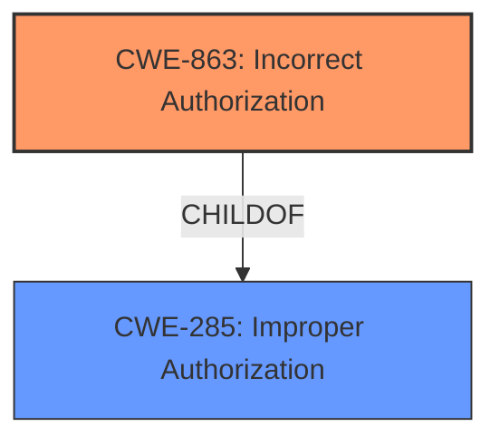

# Analysis Report for CVE-2024-43780

# Vulnerability Analysis Report: CVE-2024-43780

## Description

Mattermost versions 9.9.x <= 9.9.1, 9.5.x <= 9.5.7, 9.10.0, 9.8.x <= 9.8.2 **fail to enforce permissions** which allows a guest user with read access to upload files to a channel.

## Vulnerability Description Key Phrases

- **Rootcause:** fail to enforce permissions
- **Impact:** ['read access', 'upload files to a channel']
- **Attacker:** guest user with read access
- **Product:** Mattermost
- **Version:** ['9.9.x <= 9.9.1', '9.5.x <= 9.5.7', '9.10.0', '9.8.x <= 9.8.2']

## Analysis (with Relationship Data)

# Summary
| CWE ID | CWE Name | Confidence | CWE Abstraction Level | CWE Vulnerability Mapping Label | CWE-Vulnerability Mapping Notes |
|---|---|---|---|---|---|
| CWE-863 | Incorrect Authorization | 0.9 | Class | Primary CWE | Allowed-with-Review |
| CWE-285 | Improper Authorization | 0.6 | Class | Secondary Candidate | Discouraged |

## Evidence and Confidence

*   **Confidence Score:** 0.9
*   **Evidence Strength:** HIGH

## Relationship Analysis
The primary relationship considered was the hierarchical structure of CWEs related to authorization. CWE-863 (Incorrect Authorization) is a Class-level CWE, and while it has more specific children, the provided information doesn't give enough details to determine the exact flaw in the authorization logic. Therefore, it serves as the most appropriate, albeit general, classification. CWE-285 is a parent of CWE-863 and was considered, but it is too general.



## Vulnerability Chain
The vulnerability chain starts with a **failure to enforce permissions**, which leads to a guest user being able to upload files to a channel, effectively bypassing intended access controls.

*   **Root Cause:** **Fail to enforce permissions** (CWE-863 Incorrect Authorization)
*   **Impact:** Guest user can upload files to a channel (Authorization Bypass)

## Summary of Analysis
The initial analysis focused on the vulnerability description stating that the software **fails to enforce permissions**. This directly points to an authorization issue. The Retriever Results suggested CWE-863 (Incorrect Authorization) as the top candidate, and this aligns with the description. The guidance on privileges vs. permissions also reinforced this choice, as the issue is about *what* the user is allowed to do.

CWE-863 is a Class-level CWE, meaning it may have more specific descendants. However, the description doesn't provide enough detail to pinpoint the exact flaw in the authorization logic (e.g., a specific logic error). Therefore, CWE-863 is the most appropriate level of specificity given the available information.

Other CWEs were considered but deemed less suitable:

*   CWE-732 (Incorrect Permission Assignment for Critical Resource): This is about the assignment of permissions, not the enforcement. The vulnerability is about the **failure to enforce** existing permissions.
*   CWE-285 (Improper Authorization): This is a parent of CWE-863. While related, CWE-863 is a better fit as it specifies that authorization is happening, just incorrectly.
*   CWE-306 (Missing Authentication for Critical Function): This is about missing authentication, which isn't the case here. The users are authenticated (they are guest users), but their authorization is not properly enforced.

The final decision is based on the evidence from the vulnerability description ("**fail to enforce permissions**") and the guidance provided about privileges vs. permissions. The confidence is high (0.9) because the description directly aligns with the definition of CWE-863.

Relevant CWE Information:
# Enhanced Context (25 CWEs)
The following CWEs were identified as potentially relevant to this vulnerability:

## CWE-863: Incorrect Authorization
**Abstraction Level**: Class
**Similarity Score**: 1479.02
**Source**: sparse

**Description**:
The product performs an authorization check when an actor attempts to access a resource or perform an action, but it does not correctly perform the check.

**Mapping Guidance**:
- Usage: Allowed-with-Review
- Rationale: This CWE entry is a Class and might have Base-level children that would be more appropriate

## CWE-285: Improper Authorization
**Abstraction Level**: Class
**Similarity Score**: 1415.71
**Source**: sparse

**Description**:
The product does not perform or incorrectly performs an authorization check when an actor attempts to access a resource or perform an action.

**Mapping Guidance**:
- Usage: Discouraged
- Rationale: CWE-285 is high-level and lower-level CWEs can frequently be used instead. It is a level-1 Class (i.e., a child of a Pillar).


## CWE Relationship Analysis

Current CWEs represent these abstraction levels: .


### Vulnerability Chain Analysis

**Chain starting from CWE-863:**
- 863 (Incorrect Authorization) - ROOT


**Chain starting from CWE-306:**
- 306 (Missing Authentication for Critical Function) - ROOT


### CWE Relationship Diagram

```mermaid
graph TD
    classDef primary fill:#f96,stroke:#333,stroke-width:2px
    classDef secondary fill:#69f,stroke:#333
    classDef tertiary fill:#9e9,stroke:#333
```


*Report generated on 2025-07-13 15:14:20*
