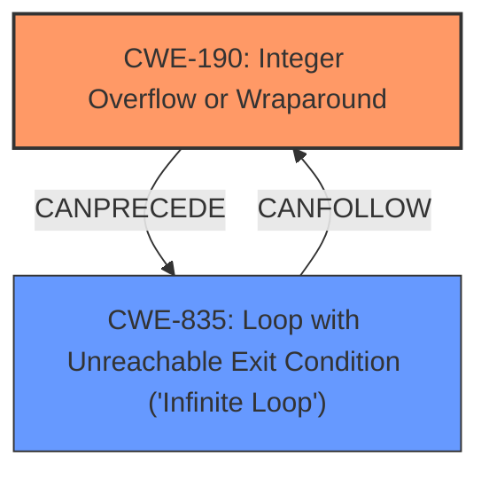

# Analysis for CVE-2024-43890

# Summary
| CWE ID | CWE Name | Confidence | CWE Abstraction Level | CWE Vulnerability Mapping Label | CWE-Vulnerability Mapping Notes |
|---|---|---|---|---|---|
| CWE-190 | Integer Overflow or Wraparound | 1 | Base | Primary | Allowed |
| CWE-835 | Loop with Unreachable Exit Condition ('Infinite Loop') | 0.7 | Base | Secondary | Allowed |

## Evidence and Confidence

*   **Confidence Score:** 0.85
*   **Evidence Strength:** HIGH

## Relationship Analysis
The primary weakness is **CWE-190 Integer Overflow or Wraparound**, which can lead to other issues like **CWE-835 Loop with Unreachable Exit Condition ('Infinite Loop')**. **CWE-190** is a base-level CWE, providing a good level of detail for the **overflow** issue. **CWE-835** occurs because the system continues to insert elements after the **overflow**, leading to the infinite loop.

## Vulnerability Chain
1.  **Root Cause:** **CWE-190 Integer Overflow or Wraparound** occurs in `tracing_map->next_elt` because the atomic increment was not properly checked against `max_elts`.
2.  **Weakness:** The overflow allows inserting elements beyond `max_elts`, filling the `tracing_map` completely.
3.  **Impact:** Attempting to insert into a full `tracing_map` triggers **CWE-835 Loop with Unreachable Exit Condition ('Infinite Loop')**, leading to a CPU hang.

## Summary of Analysis
The primary **weakness** is the **integer overflow**, **CWE-190 Integer Overflow or Wraparound**, which causes the `tracing_map->next_elt` to **overflow**, and the secondary is **CWE-835 Loop with Unreachable Exit Condition ('Infinite Loop')**.

The evidence for **CWE-190 Integer Overflow or Wraparound** is: "tracing **Fix overflow** in get_free_elt() tracing_map->next_elt in get_free_elt() is at risk of **overflowing**."
The evidence for **CWE-835 Loop with Unreachable Exit Condition ('Infinite Loop')** is: "If any attempt is made to insert an element into a full tracing_map using `__tracing_map_insert()`, it will cause an **infinite loop** with preemption disabled, leading to a CPU hang problem."

The retriever results also listed **CWE-190 Integer Overflow or Wraparound** and **CWE-835 Loop with Unreachable Exit Condition ('Infinite Loop')** as potential CWEs.

**CWE-1284 Improper Validation of Specified Quantity in Input** was considered, but the issue is not about validating the quantity but about what happens when the quantity **overflows**.

**CWE-787 Out-of-bounds Write** was considered, but the infinite loop occurs due to the failed insertion.

The selected CWEs are at the optimal level of specificity because they accurately represent the **root cause** and impact of the vulnerability.