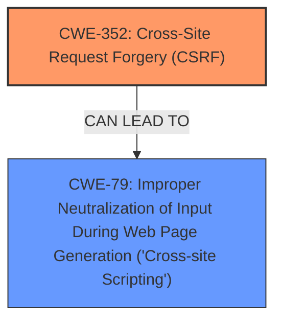

# Analysis Report for CVE-2024-44028

# Vulnerability Analysis Report: CVE-2024-44028

## Description

Cross-Site Request Forgery (CSRF) vulnerability in Nicejob NiceJob allows Stored **XSS**.This issue affects NiceJob from n/a before 3.6.5.

## Vulnerability Description Key Phrases

- **Rootcause:** improper input sanitization
- **Weakness:** ['XSS', 'cross-site request forgery']
- **Impact:** execute stored JavaScript code
- **Product:** Nicejob NiceJob
- **Version:** before 3.6.5

## Analysis (with Relationship Data)

# Summary
| CWE ID    | CWE Name                                                                 | Confidence | CWE Abstraction Level | CWE Vulnerability Mapping Label | CWE-Vulnerability Mapping Notes |
| --------- | ------------------------------------------------------------------------ | ---------- | --------------------- | ------------------------------- | ------------------------------- |
| CWE-352   | Cross-Site Request Forgery (CSRF)                                        | 0.9        | Compound              | Primary                         | Allowed                         |
| CWE-79    | Improper Neutralization of Input During Web Page Generation ('Cross-site Scripting') | 0.8        | Base                  | Secondary                       | Allowed                         |

## Evidence and Confidence

*   **Confidence Score:** 0.85
*   **Evidence Strength:** MEDIUM

## Relationship Analysis
The primary weakness is CWE-352 Cross-Site Request Forgery (CSRF), which is a compound weakness. The secondary weakness is CWE-79 Improper Neutralization of Input During Web Page Generation ('Cross-site Scripting'), which can be a consequence of **improper input sanitization**. There isn't a direct parent-child relationship, but CSRF can lead to XSS if successfully exploited. The abstraction levels are appropriate, with CSRF being a compound weakness and XSS being a base weakness.



## Vulnerability Chain
The vulnerability chain starts with the **lack of CSRF protection (CWE-352)**. If an attacker successfully leverages CSRF, they can potentially inject malicious scripts into the application, leading to **Stored XSS (CWE-79)**.

## Summary of Analysis
The vulnerability description clearly states a Cross-Site Request Forgery (CSRF) vulnerability exists, leading to Stored **XSS**. The key phrases also indicate **improper input sanitization**.

*   **CWE-352 Cross-Site Request Forgery (CSRF)** is selected as the primary CWE because the description explicitly mentions "Cross-Site Request Forgery (CSRF) vulnerability". This aligns with the CWE's description: "The web application does not, or can not, sufficiently verify whether a well-formed, valid, consistent request was intentionally provided by the user who submitted the request."
*   **CWE-79 Improper Neutralization of Input During Web Page Generation ('Cross-site Scripting')** is selected as a secondary CWE because the description mentions "Stored XSS". The key phrases also indicate **improper input sanitization**. This aligns with the CWE's description: "The product does not neutralize or incorrectly neutralizes user-controllable input before it is placed in output that is used as a web page that is served to other users."

The selection of these CWEs is based on the provided evidence and the relationships between them. The abstraction levels are also appropriate, with CSRF being a compound weakness and XSS being a base weakness.

Other CWEs Considered but Not Used:

*   CWE-601: URL Redirection to Untrusted Site ('Open Redirect') - While the retriever results suggested this CWE, it is not directly related to the vulnerability described.
*   CWE-89: Improper Neutralization of Special Elements used in an SQL Command ('SQL Injection') - Although **improper input sanitization** is present, there is no mention of SQL injection in the vulnerability description.
*   CWE-918: Server-Side Request Forgery (SSRF) - This is also not directly related to the vulnerability described.
*   CWE-113: Improper Neutralization of CRLF Sequences in HTTP Headers ('HTTP Request/Response Splitting') - Not directly related.
*   CWE-78: Improper Neutralization of Special Elements used in an OS Command ('OS Command Injection') - Not directly related.
*   CWE-472: External Control of Assumed-Immutable Web Parameter - Not directly related, although CSRF involves external control.
*   CWE-494: Download of Code Without Integrity Check - Not directly related.
*   CWE-201: Insertion of Sensitive Information Into Sent Data - Not directly related.
*   CWE-116: Improper Encoding or Escaping of Output - While related to **improper input sanitization**, CWE-79 is a better fit for the XSS component.
*   CWE-138: Improper Neutralization of Special Elements - Too generic compared to CWE-79.
*   CWE-1004: Sensitive Cookie Without 'HttpOnly' Flag - Not directly related, although cookies might be involved in CSRF.


## CWE Relationship Analysis

Current CWEs represent these abstraction levels: .


### Vulnerability Chain Analysis

**Chain starting from CWE-89:**
- 89 (Improper Neutralization of Special Elements used in an SQL Command ('SQL Injection')) - ROOT


**Chain starting from CWE-116:**
- 116 (Improper Encoding or Escaping of Output) - ROOT


### CWE Relationship Diagram

```mermaid
graph TD
    classDef primary fill:#f96,stroke:#333,stroke-width:2px
    classDef secondary fill:#69f,stroke:#333
    classDef tertiary fill:#9e9,stroke:#333
```


*Report generated on 2025-07-13 15:22:06*
