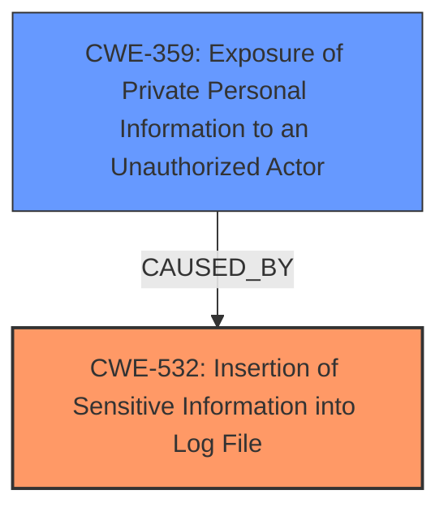

# Enhanced Analysis for CVE-2024-44152

# Summary
| CWE ID | CWE Name | Confidence | CWE Abstraction Level | CWE Vulnerability Mapping Label | CWE-Vulnerability Mapping Notes |
|---|---|---|---|---|---|
| CWE-532 | Insertion of Sensitive Information into Log File | 0.8 | Base | Allowed | Primary CWE. The root cause is related to a privacy issue, which was addressed through improved private data redaction for log entries, aligning with sensitive information being written to logs. |
| CWE-359 | Exposure of Private Personal Information to an Unauthorized Actor | 0.6 | Base | Allowed | Secondary candidate. An app may be able to access user-sensitive data. |

## Evidence and Confidence

*   **Confidence Score:** 0.7
*   **Evidence Strength:** MEDIUM

## Relationship Analysis
The primary relationship influencing the selection is that of CWE-532 as the **root cause** of the privacy issue. The "improved private data redaction for log entries" directly implies that sensitive information was previously being written to logs, which aligns with CWE-532. CWE-359 represents the impact.



## Vulnerability Chain
The vulnerability chain starts with the **root cause**:

1.  **CWE-532**: Sensitive information is written to log files.
2.  **CWE-359**: An application can access this log information, leading to exposure of private personal information to an unauthorized actor.

## Summary of Analysis
The initial analysis focused on the description "A privacy issue was addressed with improved private data redaction for log entries" and "An app may be able to access user-sensitive data". The key is the redaction of log entries, which strongly suggests that sensitive information was being logged. The **root cause** is that sensitive information was being written to the log file (CWE-532). An attacker (app) could then potentially access this data (CWE-359).

The relationship graph helped to solidify the understanding of the vulnerability chain. The evidence directly supports CWE-532 as the root cause and CWE-359 as the impact.

The selected CWEs are at the optimal level of specificity. CWE-532 is a Base-level CWE, which is the preferred level of abstraction.

CWE-NVD-noinfo was rejected, as the description does provide enough information to identify a weakness. CWE-285, Improper Authorization, was considered but deemed less appropriate because the core issue is the logging of sensitive information, not an authorization failure. While unauthorized access leads to the vulnerability being exploited, the presence of information is the first step.

Relevant CWE Information:
# Enhanced Context (25 CWEs)
The following CWEs were identified as potentially relevant to this vulnerability:

## CWE-203: Observable Discrepancy
**Abstraction Level**: Base
**Similarity Score**: 0.71

## CWE-212: Improper Removal of Sensitive Information Before Storage or Transfer
**Abstraction Level**: Base
**Similarity Score**: 0.70

## CWE-497: Exposure of Sensitive System Information to an Unauthorized Control Sphere
**Abstraction Level**: Base
**Similarity Score**: 0.70

## CWE-347: Improper Verification of Cryptographic Signature
**Abstraction Level**: Base
**Similarity Score**: 0.69

## CWE-538: Insertion of Sensitive Information into Externally-Accessible File or Directory
**Abstraction Level**: Base
**Similarity Score**: 0.69

## CWE-277: Insecure Inherited Permissions
**Abstraction Level**: Variant
**Similarity Score**: 0.69

## CWE-532: Insertion of Sensitive Information into Log File
**Abstraction Level**: Base
**Similarity Score**: 0.69

## CWE-667: Improper Locking
**Abstraction Level**: Class
**Similarity Score**: 0.69

## CWE-209: Generation of Error Message Containing Sensitive Information
**Abstraction Level**: Base
**Similarity Score**: 0.68

## CWE-451: User Interface (UI) Misrepresentation of Critical Information
**Abstraction Level**: Class
**Similarity Score**: 0.68

## CWE-285: Improper Authorization
**Abstraction Level**: Class
**Similarity Score**: 482.91

## CWE-347: Improper Verification of Cryptographic Signature
**Abstraction Level**: Base
**Similarity Score**: 480.48

## CWE-639: Authorization Bypass Through User-Controlled Key
**Abstraction Level**: Base
**Similarity Score**: 473.23

## CWE-532: Insertion of Sensitive Information into Log File
**Abstraction Level**: Base
**Similarity Score**: 472.42

## CWE-843: Access of Resource Using Incompatible Type ('Type Confusion')
**Abstraction Level**: Base
**Similarity Score**: 471.36

## CWE-787: Out-of-bounds Write
**Abstraction Level**: base
**Similarity Score**: 4.33

## CWE-825: Expired Pointer Dereference
**Abstraction Level**: base
**Similarity Score**: 4.33

## CWE-359: Exposure of Private Personal Information to an Unauthorized Actor
**Abstraction Level**: base
**Similarity Score**: 2.40

## CWE-639: Authorization Bypass Through User-Controlled Key
**Abstraction Level**: base
**Similarity Score**: 2.40

## CWE-226: Sensitive Information in Resource Not Removed Before Reuse
**Abstraction Level**: base
**Similarity Score**: 2.34

## CWE-824: Access of Uninitialized Pointer
**Abstraction Level**: base
**Similarity Score**: 2.21

## CWE-823: Use of Out-of-range Pointer Offset
**Abstraction Level**: base
**Similarity Score**: 2.21

## CWE-822: Untrusted Pointer Dereference
**Abstraction Level**: base
**Similarity Score**: 2.21

## CWE-562: Return of Stack Variable Address
**Abstraction Level**: base
**Similarity Score**: 2.21

## CWE-125: Out-of-bounds Read
**Abstraction Level**: base
**Similarity Score**: 2.21


## CWE Relationship Analysis

Current CWEs represent these abstraction levels: .


### Vulnerability Chain Analysis

**Chain starting from CWE-226:**
- 226 (Sensitive Information in Resource Not Removed Before Reuse) - ROOT


**Chain starting from CWE-639:**
- 639 (Authorization Bypass Through User-Controlled Key) - ROOT


### CWE Relationship Diagram

```mermaid
graph TD
    classDef primary fill:#f96,stroke:#333,stroke-width:2px
    classDef secondary fill:#69f,stroke:#333
    classDef tertiary fill:#9e9,stroke:#333
```