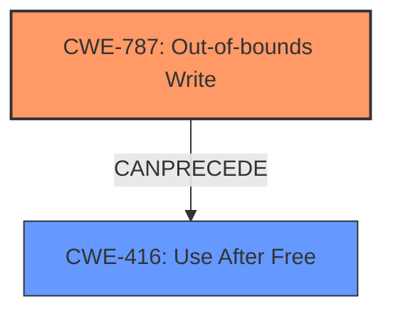

# Analysis Report for CVE-2024-44169

# Vulnerability Analysis Report: CVE-2024-44169

## Description

The issue was addressed with improved memory handling. This issue is fixed in macOS Ventura 13.7, iOS 17.7 and iPadOS 17.7, visionOS 2, watchOS 11, macOS Sequoia 15, iOS 18 and iPadOS 18, macOS Sonoma 14.7, tvOS 18. An app may be able to cause unexpected system termination.

## Vulnerability Description Key Phrases

- **Impact:** unexpected system termination
- **Product:** ['macOS Ventura', 'iOS', 'iPadOS', 'visionOS', 'watchOS', 'macOS Sequoia', 'iOS', 'iPadOS', 'macOS Sonoma', 'tvOS']
- **Version:** ['13.7', '17.7', '17.7', '2', '11', '15', '18', '18', '14.7', '18']

## Analysis (with Relationship Data)

# Summary
| CWE ID  | CWE Name                                                                      | Confidence | CWE Abstraction Level | CWE Vulnerability Mapping Label | CWE-Vulnerability Mapping Notes |
| :-------- | :----------------------------------------------------------------------------- | :--------- | :---------------------- | :-------------------------------- | :------------------------------ |
| CWE-787   | Out-of-bounds Write                                                            | 0.75       | Base                    | Primary                           | Allowed                       |
| CWE-416   | Use After Free                                                                 | 0.6        | Variant                 | Secondary                         | Allowed                       |

## Evidence and Confidence

*   **Confidence Score:** 0.7
*   **Evidence Strength:** MEDIUM

## Relationship Analysis
The primary CWE is CWE-787, Out-of-bounds Write, which describes writing data past the end or before the beginning of a buffer. CWE-416, Use After Free, is a variant where memory is accessed after it has been freed. These two can be related, where an out-of-bounds write could corrupt memory management data structures, leading to a use-after-free condition. The relationship is that CWE-787 can precede CWE-416.



## Vulnerability Chain
The vulnerability chain starts with a memory handling issue. This leads to an out-of-bounds write (CWE-787), which could potentially corrupt memory and lead to a use-after-free condition (CWE-416). The **impact** is an unexpected system termination.

## Summary of Analysis
The vulnerability description states, "An app may be able to cause unexpected system termination," and that "The issue was addressed with improved memory handling." The **weakness** described in the CVE Reference Links Content Summary also states "An app may be able to cause unexpected system termination."

CWE-787 (Out-of-bounds Write) is selected as the primary CWE because it aligns with memory handling issues that can lead to system termination. The retriever results also listed CWE-787 with the highest sparse score, and graph scores indicated it is a reasonable choice. CWE-416 (Use After Free) is considered as a possible secondary weakness, which could be a consequence of memory corruption due to an out-of-bounds write.

CWE-20 (Improper Input Validation) was considered but rejected because the description focuses on memory handling rather than input validation. Other CWEs such as CWE-843 (Access of Resource Using Incompatible Type) and CWE-665 (Improper Initialization) were also considered but deemed less relevant because the core issue seems to be related to writing beyond the allocated memory region.

The selection of CWE-787 and CWE-416 is based on the provided evidence and the relationships between CWEs. Both are at appropriate levels of abstraction (Base and Variant, respectively).

Relevant CWE Information:
*   CWE-787: Out-of-bounds Write. The product writes data past the end, or before the beginning, of the intended buffer.
*   CWE-416: Use After Free. The product calls free() twice on the same memory address, potentially leading to modification of unexpected memory locations.


## CWE Relationship Analysis

Current CWEs represent these abstraction levels: .


### Vulnerability Chain Analysis

**Chain starting from CWE-416:**
- 416 (Use After Free) - ROOT


**Chain starting from CWE-787:**
- 787 (Out-of-bounds Write) - ROOT


### CWE Relationship Diagram

```mermaid
graph TD
    classDef primary fill:#f96,stroke:#333,stroke-width:2px
    classDef secondary fill:#69f,stroke:#333
    classDef tertiary fill:#9e9,stroke:#333
```


*Report generated on 2025-07-13 15:28:30*
