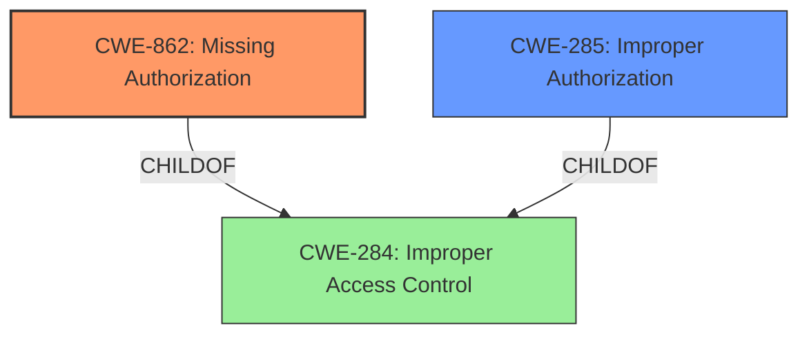

# Analysis Report for CVE-2024-44313

# Vulnerability Analysis Report: CVE-2024-44313

## Description

TastyIgniter 3.7.6 contains an **Incorrect Access Control** vulnerability in the invoice() function within Orders.php which allows unauthorized users to access and generate invoices due to missing permission checks.

## Vulnerability Description Key Phrases

- **Component:** invoice() function within Orders.php
- **Rootcause:** Incorrect Access Control
- **Product:** TastyIgniter
- **Impact:** access and generate invoices, generate invoices
- **Attacker:** unauthorized users
- **Version:** 3.7.6

## Analysis (with Relationship Data)

# Summary
| CWE ID  | CWE Name                                                       | Confidence | CWE Abstraction Level | CWE Vulnerability Mapping Label | CWE-Vulnerability Mapping Notes |
| :-------- | :------------------------------------------------------------- | :--------- | :-------------------- | :------------------------------ | :------------------------------ |
| CWE-862   | Missing Authorization                                          | 1.0        | Class                 | Primary                         | Allowed-with-Review             |
| CWE-285   | Improper Authorization                                         | 0.8        | Class                 | Secondary                       | Discouraged                     |

## Evidence and Confidence

*   **Confidence Score:** 0.9
*   **Evidence Strength:** HIGH

## Relationship Analysis

The primary CWE is CWE-862, which indicates a complete lack of authorization checks. CWE-285 represents a more general case of improper authorization, which could apply if the authorization mechanism was present but flawed. However, the vulnerability description states a **missing** permission check, supporting CWE-862 as the more precise classification. Both CWE-862 and CWE-285 are children of CWE-284 (Improper Access Control), but choosing the more specific CWE-862 provides better granularity.



## Vulnerability Chain

The vulnerability chain consists of a **missing authorization** check leading to unauthorized access to sensitive order details.

1.  **Root Cause:** **Missing Authorization** (CWE-862) - The `invoice()` function lacks permission checks.
2.  **Impact:** Unauthorized access and generation of invoices.

## Summary of Analysis

The analysis is primarily based on the vulnerability description, which explicitly states that the `invoice()` function lacks permission checks. The **root cause** is the **incorrect access control**, specifically a **missing authorization** check in the `invoice()` function. This directly aligns with the definition of CWE-862 (Missing Authorization).

The vulnerability description key phrases also point to "**Incorrect Access Control**" and "**missing** permission checks," reinforcing the selection of CWE-862. The CVE Reference Links Content Summary further confirms the **root cause** as the `invoice()` function not performing access control checks.

While CWE-285 (Improper Authorization) could be considered a broader classification, the explicit mention of **missing** checks makes CWE-862 a more accurate and specific choice. The retriever results also list CWE-862, CWE-863 and CWE-285 as potential candidates, but the evidence supports CWE-862 being the most appropriate due to the complete lack of authorization.

The chosen CWEs are at the optimal level of specificity because CWE-862 directly reflects the identified weakness, and it is a Class-level CWE, which is preferred over the Pillar CWE-284.

Relevant CWE Information:

# Enhanced Context (25 CWEs)

## CWE-639: Authorization Bypass Through User-Controlled Key
**Abstraction Level**: Base
**Similarity Score**: 0.73
**Source**: dense

**Description**:
The system's authorization functionality does not prevent one user from gaining access to another user's data or record by modifying the key value identifying the data.

**Mapping Guidance**:
- Usage: Allowed
- Rationale: This CWE entry is at the Base level of abstraction, which is a preferred level of abstraction for mapping to the root causes of vulnerabilities.

## CWE-863: Incorrect Authorization
**Abstraction Level**: Class
**Similarity Score**: 2420.52
**Source**: sparse

**Description**:
The product performs an authorization check when an actor attempts to access a resource or perform an action, but it does not correctly perform the check.

**Mapping Guidance**:
- Usage: Allowed-with-Review
- Rationale: This CWE entry is a Class and might have Base-level children that would be more appropriate

## CWE-285: Improper Authorization
**Abstraction Level**: Class
**Similarity Score**: 2372.74
**Source**: sparse

**Description**:
The product does not perform or incorrectly performs an authorization check when an actor attempts to access a resource or perform an action.

**Mapping Guidance**:
- Usage: Discouraged
- Rationale: CWE-285 is high-level and lower-level CWEs can frequently be used instead. It is a level-1 Class (i.e., a child of a Pillar).

## CWE-862: Missing Authorization
**Abstraction Level**: Class
**Similarity Score**: 2186.04
**Source**: sparse

**Description**:
The product does not perform an authorization check when an actor attempts to access a resource or perform an action.

**Mapping Guidance**:
- Usage: Allowed-with-Review
- Rationale: This CWE entry is a Class and might have Base-level children that would be more appropriate

## CWE-284: Improper Access Control
**Abstraction Level**: Pillar
**Similarity Score**: 0.73
**Source**: dense

**Description**:
The product does not adequately control access to resources or functions, which allows an attacker to perform unauthorized actions or gain access to sensitive information.

**Mapping Guidance**:
- Usage: Discouraged
- Rationale: CWE-284 is high-level and is often misused as a catch-all when lower-level CWE IDs might be applicable. It is a Pillar. It is not useful for trend analysis.

## CWE-306: Missing Authentication for Critical Function
**Abstraction Level**: Base
**Similarity Score**: 2191.05
**Source**: sparse

**Description**:
The product does not perform any authentication for functionality that requires a provable user identity or consumes a significant amount of resources.

**Mapping Guidance**:
- Usage: Allowed
- Rationale: This CWE entry is at the Base level of abstraction, which is a preferred level of abstraction for mapping to the root causes of vulnerabilities.

## Other CWEs Considered but Not Used:

*   **CWE-306 (Missing Authentication for Critical Function)**: While the vulnerability allows unauthorized access, the description doesn't explicitly mention the absence of authentication. The focus is on the lack of authorization checks after a user might be authenticated. Therefore, CWE-306 is not the primary weakness.
*   **CWE-639 (Authorization Bypass Through User-Controlled Key)**: This CWE is related to authorization bypass, but it's specifically about modifying key values. The vulnerability description doesn't mention any manipulation of keys, so this CWE is not applicable.
*   **CWE-863 (Incorrect Authorization)**: This CWE implies that an authorization check exists but is flawed. The vulnerability description explicitly states that there are **missing** permission checks, which means there is no authorization, so CWE-862 is more appropriate.


## CWE Relationship Analysis

Current CWEs represent these abstraction levels: .


### Vulnerability Chain Analysis

**Chain starting from CWE-863:**
- 863 (Incorrect Authorization) - ROOT


**Chain starting from CWE-862:**
- 862 (Missing Authorization) - ROOT


### CWE Relationship Diagram

```mermaid
graph TD
    classDef primary fill:#f96,stroke:#333,stroke-width:2px
    classDef secondary fill:#69f,stroke:#333
    classDef tertiary fill:#9e9,stroke:#333
```


*Report generated on 2025-07-13 15:33:22*
