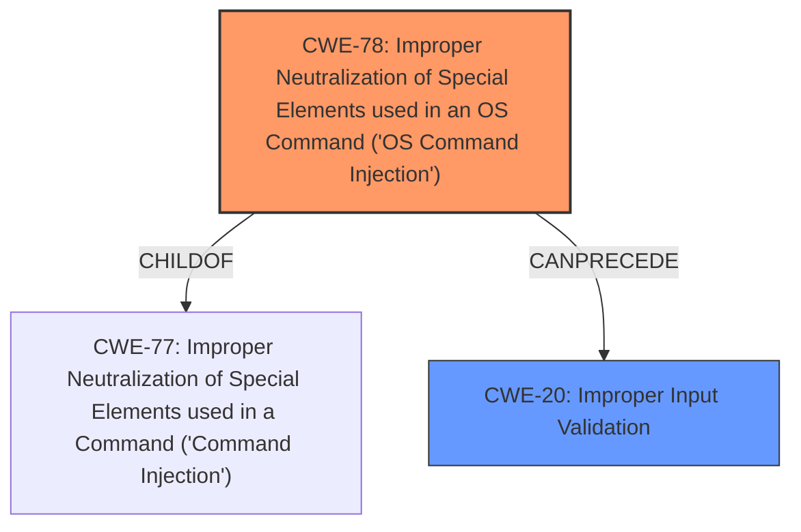

# Analysis Report for CVE-2024-44335

# Vulnerability Analysis Report: CVE-2024-44335

## Description

D-Link DI-7003G v19.12.24A1, DI-7003GV2 v24.04.18D1, DI-7100G+V2 v24.04.18D1, DI-7100GV2 v24.04.18D1, DI-7200GV2 v24.04.18E1, DI-7300G+V2 v24.04.18D1, and DI-7400G+V2 v24.04.18D1 are vulnerable to Remote Command Execution (RCE) via version_upgrade.asp.

## Vulnerability Description Key Phrases

- **Impact:** Remote Command Execution
- **Product:** ['D-Link DI-7003G', 'DI-7003GV2', 'DI-7100G+V2', 'DI-7100GV2', 'DI-7200GV2', 'DI-7300G+V2', 'DI-7400G+V2']
- **Version:** ['v19.12.24A1', 'v24.04.18D1', 'v24.04.18D1', 'v24.04.18D1', 'v24.04.18E1', 'v24.04.18D1', 'v24.04.18D1']
- **Component:** version_upgrade.asp

## Analysis (with Relationship Data)

# Summary
| CWE ID | CWE Name | Confidence | CWE Abstraction Level | CWE Vulnerability Mapping Label | CWE-Vulnerability Mapping Notes |
|---|---|---|---|---|---|
| CWE-78 | Improper Neutralization of Special Elements used in an OS Command ('OS Command Injection') | 1.0 | Base | Allowed | Primary CWE. The **root cause** of the vulnerability is the **improper neutralization** of special elements in OS commands. |
| CWE-20 | Improper Input Validation | 0.7 | Class | Discouraged | Secondary CWE. The **lack of proper input validation** is a contributing factor to the command injection vulnerability. |

## Evidence and Confidence

*   **Confidence Score:** 0.9
*   **Evidence Strength:** HIGH

## Relationship Analysis
The primary relationship that impacted the decision was the child-of relationship between CWE-78 and CWE-77. While both relate to command injection, CWE-78 is more specific as it focuses on OS commands. Since the vulnerability description explicitly mentions OS command execution, CWE-78 was chosen.



## Vulnerability Chain
The vulnerability chain starts with **improper input validation** (CWE-20), leading to the **improper neutralization of special elements** in OS commands (CWE-78), which results in **remote command execution (RCE)**.

## Summary of Analysis
The initial analysis identified CWE-78 as the primary weakness due to the clear evidence of OS command injection in the vulnerability description. The `commandInjectionCheck` function's failure to adequately filter special characters allows for command injection.

The analysis is based on the "CVE Reference Links Content Summary" section, which provides detailed information about the **root cause** and weakness. Specifically, it states: "The vulnerability stems from insufficient input validation in the `version_upgrade_asp` CGI handler within the `jhttpd` binary. Specifically, the `commandInjectionCheck` function inadequately filters characters, failing to prevent command injection via characters like `$()`."

The selection of CWE-78 is at the optimal level of specificity because it directly addresses the OS command injection vulnerability. While CWE-77 (Improper Neutralization of Special Elements used in a Command ('Command Injection')) is a parent, CWE-78 is more precise.

Relevant CWE Information:

# Enhanced Context (25 CWEs)
The following CWEs were identified as potentially relevant to this vulnerability:

## CWE-78: Improper Neutralization of Special Elements used in an OS Command ('OS Command Injection')
**Abstraction Level**: Base
**Similarity Score**: 0.78
**Source**: dense

**Description**:
The product constructs all or part of an OS command using externally-influenced input from an upstream component, but it does not neutralize or incorrectly neutralizes special elements that could modify the intended OS command when it is sent to a downstream component.

**Mapping Guidance**:
- Usage: Allowed
- Rationale: This CWE entry is at the Base level of abstraction, which is a preferred level of abstraction for mapping to the root causes of vulnerabilities.

## CWE-20: Improper Input Validation
**Abstraction Level**: Class
**Similarity Score**: 1150.40
**Source**: sparse

**Description**:
The product receives input or data, but it does
        not validate or incorrectly validates that the input has the
        properties that are required to process the data safely and
        correctly.

**Mapping Guidance**:
- Usage: Discouraged
- Rationale: CWE-20 is commonly misused in low-information vulnerability reports when lower-level CWEs could be used instead, or when more details about the vulnerability are available [REF-1287]. It is not useful for trend analysis. It is also a level-1 Class (i.e., a child of a Pillar).

**CWE Details:**

*   **CWE-78:** Improper Neutralization of Special Elements used in an OS Command ('OS Command Injection')
    *   **Technical Explanation:** The application fails to properly sanitize input used in the construction of OS commands, allowing an attacker to inject arbitrary commands. The `commandInjectionCheck` function only filters a limited set of characters (`&`, `|`, and `;`), leaving other injection vectors open.
    *   **Security Implications:** An attacker can execute arbitrary commands on the device, potentially leading to full system compromise.
    *   **Relationship:** ChildOf CWE-77 (Improper Neutralization of Special Elements used in a Command ('Command Injection')).
    *   **Usage:** Allowed, as it is a Base level CWE and accurately describes the **root cause**.
*   **CWE-20:** Improper Input Validation
    *   **Technical Explanation:** The application does not adequately validate the input provided to the `version_upgrade_asp` CGI handler. The `commandInjectionCheck` function is insufficient, and the lack of proper input validation enables command injection.
    *   **Security Implications:** This weakness allows attackers to bypass security checks and inject malicious commands.
    *   **Relationship:** Can Precede CWE-78.
    *   **Usage:** Discouraged as per the MITRE guidelines, but included as secondary because the lack of validation contributes to the command injection.

**CWEs Considered but Not Used:**

*   **CWE-77:** While related, CWE-78 is more specific to OS commands.
*   **CWE-74:** (Improper Neutralization of Special Elements in Output Used by a Downstream Component ('Injection')) - In this case, the injection happens directly in the command construction, not in output to another component.
*   **CWE-94:** (Improper Control of Generation of Code ('Code Injection')) - While code execution is the result, the **root cause** is the **improper neutralization** of special elements, not the generation of code.
*   **CWE-425:** (Direct Request ('Forced Browsing')) - This is not a case of forced browsing, but rather a command injection vulnerability.
*   **CWE-22:** (Improper Limitation of a Pathname to a Restricted Directory ('Path Traversal')) - This vulnerability is not related to path traversal.
*   **CWE-434:** (Unrestricted Upload of File with Dangerous Type) - There is no file upload involved in this vulnerability.


## CWE Relationship Analysis

Current CWEs represent these abstraction levels: .


### Vulnerability Chain Analysis

**Chain starting from CWE-94:**
- 94 (Improper Control of Generation of Code ('Code Injection')) - ROOT


**Chain starting from CWE-77:**
- 77 (Improper Neutralization of Special Elements used in a Command ('Command Injection')) - ROOT


### CWE Relationship Diagram

```mermaid
graph TD
    classDef primary fill:#f96,stroke:#333,stroke-width:2px
    classDef secondary fill:#69f,stroke:#333
    classDef tertiary fill:#9e9,stroke:#333
```


*Report generated on 2025-07-13 15:34:32*
