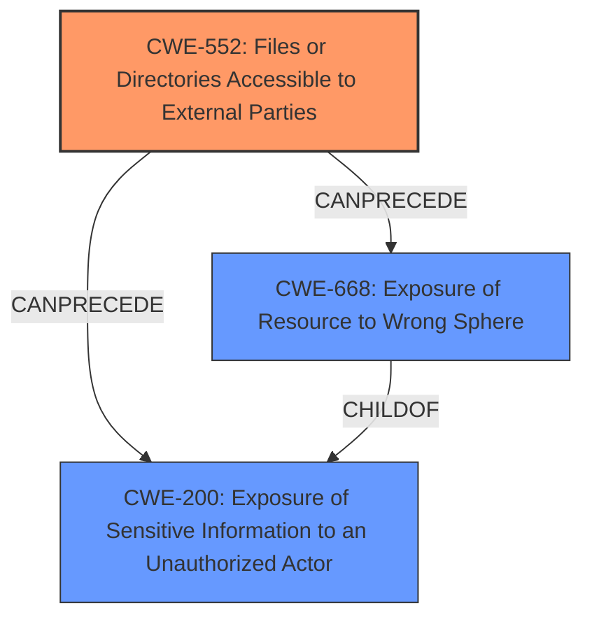

# Analysis for CVE-2024-44336

# Summary
| CWE ID | CWE Name | Confidence | CWE Abstraction Level | CWE Vulnerability Mapping Label | CWE-Vulnerability Mapping Notes |
|---|---|---|---|---|---|
| CWE-552 | Files or Directories Accessible to External Parties | 0.9 | Base | Allowed | Primary CWE |
| CWE-668 | Exposure of Resource to Wrong Sphere | 0.5 | Class | Discouraged | Secondary Candidate |
| CWE-200 | Exposure of Sensitive Information to an Unauthorized Actor | 0.4 | Class | Discouraged | Secondary Candidate |

## Evidence and Confidence

*   **Confidence Score:** 0.9
*   **Evidence Strength:** MEDIUM

## Relationship Analysis
The primary CWE, CWE-552, is a base-level CWE which is good. CWE-552 has parent relationships to more specific issues. CWE-668 and CWE-200 are class level CWEs, so they are less specific. CWE-668 and CWE-200 can result from CWE-552.

## Vulnerability Chain
The vulnerability chain starts with the **files or directories being accessible to external parties** (CWE-552). This leads to **exposure of the resource to the wrong sphere** (CWE-668) and ultimately results in the **exposure of sensitive information to an unauthorized actor** (CWE-200).

## Summary of Analysis
The vulnerability description clearly states that the issue allows attackers to retrieve internal files from a specific directory and save it into publicly available storage. This aligns directly with **CWE-552: Files or Directories Accessible to External Parties**. The retriever results also indicate this CWE as a potential match.

CWE-668 and CWE-200 were also considered because the vulnerability leads to information exposure. However, they are less specific and represent the impact rather than the root cause. Therefore, CWE-552 is the most appropriate primary CWE.

Relevant CWE Information:

# Enhanced Context (25 CWEs)
The following CWEs were identified as potentially relevant to this vulnerability:

## CWE-203: Observable Discrepancy
**Abstraction Level**: Base
**Similarity Score**: 0.68
**Source**: dense
*This CWE is not relevant.*

## CWE-1021: Improper Restriction of Rendered UI Layers or Frames
**Abstraction Level**: Base
**Similarity Score**: 0.66
**Source**: dense
*This CWE is not relevant.*

## CWE-941: Incorrectly Specified Destination in a Communication Channel
**Abstraction Level**: Base
**Similarity Score**: 0.66
**Source**: dense
*This CWE is not relevant.*

## CWE-927: Use of Implicit Intent for Sensitive Communication
**Abstraction Level**: Variant
**Similarity Score**: 0.65
**Source**: dense
*This CWE is not relevant.*

## CWE-451: User Interface (UI) Misrepresentation of Critical Information
**Abstraction Level**: Class
**Similarity Score**: 0.65
**Source**: dense
*This CWE is not relevant.*

## CWE-538: Insertion of Sensitive Information into Externally-Accessible File or Directory
**Abstraction Level**: Base
**Similarity Score**: 0.65
**Source**: dense
*This CWE is not relevant.*

## CWE-116: Improper Encoding or Escaping of Output
**Abstraction Level**: Class
**Similarity Score**: 0.65
**Source**: dense
*This CWE is not relevant.*

## CWE-926: Improper Export of Android Application Components
**Abstraction Level**: Variant
**Similarity Score**: 0.65
**Source**: dense
*This CWE is not relevant.*

## CWE-908: Use of Uninitialized Resource
**Abstraction Level**: Base
**Similarity Score**: 0.65
**Source**: dense
*This CWE is not relevant.*

## CWE-345: Insufficient Verification of Data Authenticity
**Abstraction Level**: Class
**Similarity Score**: 0.64
**Source**: dense
*This CWE is not relevant.*

## CWE-668: Exposure of Resource to Wrong Sphere
**Abstraction Level**: Class
**Similarity Score**: 371.05
**Source**: sparse
*This CWE is a possible secondary match since the files are being exposed.*

## CWE-200: Exposure of Sensitive Information to an Unauthorized Actor
**Abstraction Level**: Class
**Similarity Score**: 359.31
**Source**: sparse
*This CWE is a possible secondary match since the files are being exposed.*

## CWE-918: Server-Side Request Forgery (SSRF)
**Abstraction Level**: Base
**Similarity Score**: 358.75
**Source**: sparse
*This CWE is not relevant.*

## CWE-732: Incorrect Permission Assignment for Critical Resource
**Abstraction Level**: Class
**Similarity Score**: 352.11
**Source**: sparse
*This CWE is not relevant.*

## CWE-532: Insertion of Sensitive Information into Log File
**Abstraction Level**: Base
**Similarity Score**: 345.84
**Source**: sparse
*This CWE is not relevant.*

## CWE-499: Serializable Class Containing Sensitive Data
**Abstraction Level**: variant
**Similarity Score**: 3.88
**Source**: graph
*This CWE is not relevant.*

## CWE-498: Cloneable Class Containing Sensitive Information
**Abstraction Level**: variant
**Similarity Score**: 2.68
**Source**: graph
*This CWE is not relevant.*

## CWE-552: Files or Directories Accessible to External Parties
**Abstraction Level**: base
**Similarity Score**: 2.47
**Source**: graph
*This CWE is the primary match.*

## CWE-201: Insertion of Sensitive Information Into Sent Data
**Abstraction Level**: base
**Similarity Score**: 2.47
**Source**: graph
*This CWE is not relevant.*

## CWE-22: Improper Limitation of a Pathname to a Restricted Directory ('Path Traversal')
**Abstraction Level**: base
**Similarity Score**: 2.42
**Source**: graph
*This CWE is not relevant.*

## CWE-918: Server-Side Request Forgery (SSRF)
**Abstraction Level**: base
**Similarity Score**: 2.40
**Source**: graph
*This CWE is not relevant.*

## CWE-770: Allocation of Resources Without Limits or Throttling
**Abstraction Level**: base
**Similarity Score**: 2.33
**Source**: graph
*This CWE is not relevant.*

## CWE-1272: Sensitive Information Uncleared Before Debug/Power State Transition
**Abstraction Level**: base
**Similarity Score**: 2.21
**Source**: graph
*This CWE is not relevant.*

## CWE-212: Improper Removal of Sensitive Information Before Storage or Transfer
**Abstraction Level**: base
**Similarity Score**: 2.21
**Source**: graph
*This CWE is not relevant.*

## CWE-226: Sensitive Information in Resource Not Removed Before Reuse
**Abstraction Level**: base
**Similarity Score**: 2.21
**Source**: graph
*This CWE is not relevant.*