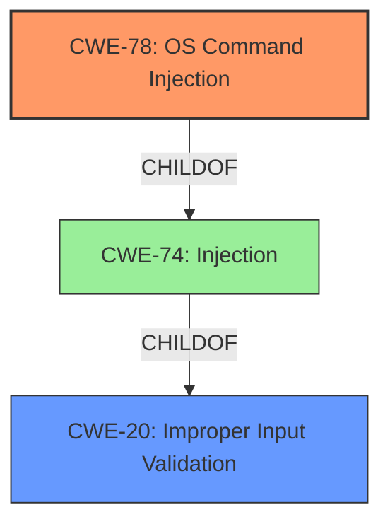

# Enhanced Analysis for CVE-2024-44382

# Summary
| CWE ID | CWE Name | Confidence | CWE Abstraction Level | CWE Vulnerability Mapping Label | CWE-Vulnerability Mapping Notes |
|---|---|---|---|---|---|
| CWE-78 | Improper Neutralization of Special Elements used in an OS Command ('OS Command Injection') | 1.0 | Base | Allowed | Primary CWE. The vulnerability stems from the application's failure to properly neutralize special elements in externally influenced input when constructing OS commands. |
| CWE-20 | Improper Input Validation | 0.7 | Class | Discouraged | Secondary CWE. This represents the broader class of **improper input validation** that leads to the command injection. |

## Evidence and Confidence

*   **Confidence Score:** 0.9
*   **Evidence Strength:** HIGH

## Relationship Analysis
The primary relationship is that CWE-78 is a specific type of injection, making it a child of the broader CWE-74 (Improper Neutralization of Special Elements in Output Used by a Downstream Component ('Injection')) and CWE-20 (Improper Input Validation). CWE-78 is also related to CWE-77 (Improper Neutralization of Special Elements used in a Command ('Command Injection')), but specifically targets OS commands. The abstraction level of CWE-78 is Base, which is preferred for root cause analysis. CWE-20 is a Class level CWE, and is less specific than CWE-78, but represents the broader category of the weakness.



## Vulnerability Chain
The vulnerability chain starts with **improper input validation** (CWE-20) which leads to **improper neutralization of special elements** and ultimately results in **OS command injection** (CWE-78). This allows for remote code execution.

## Summary of Analysis
The primary vulnerability is clearly **OS command injection** (CWE-78) due to the **improper neutralization** of special elements in user-supplied input when constructing OS commands. This is directly supported by the "CVE Reference Links Content Summary" which states "The application constructs commands using user-provided input without proper sanitization or validation, allowing an attacker to inject arbitrary shell commands." The functions `msp_info_htm` and `upgrade_filter_asp` are specifically mentioned as being vulnerable to command injection. The root cause is the **lack of proper input validation**, but the more specific CWE-78 accurately captures the nature of the vulnerability.

CWE-77 (Improper Neutralization of Special Elements used in a Command ('Command Injection')) was considered, but CWE-78 is more specific as it explicitly refers to OS commands. CWE-20 (Improper Input Validation) was also considered, and is included as a secondary CWE since it represents the broader class of input validation issues. CWE-74 (Improper Neutralization of Special Elements in Output Used by a Downstream Component ('Injection')) is too general, and is discouraged according to its mapping guidance.


## CWE Relationship Analysis

Current CWEs represent these abstraction levels: .


### Vulnerability Chain Analysis

**Chain starting from CWE-77:**
- 77 (Improper Neutralization of Special Elements used in a Command ('Command Injection')) - ROOT


**Chain starting from CWE-74:**
- 74 (Improper Neutralization of Special Elements in Output Used by a Downstream Component ('Injection')) - ROOT


### CWE Relationship Diagram

```mermaid
graph TD
    classDef primary fill:#f96,stroke:#333,stroke-width:2px
    classDef secondary fill:#69f,stroke:#333
    classDef tertiary fill:#9e9,stroke:#333
```