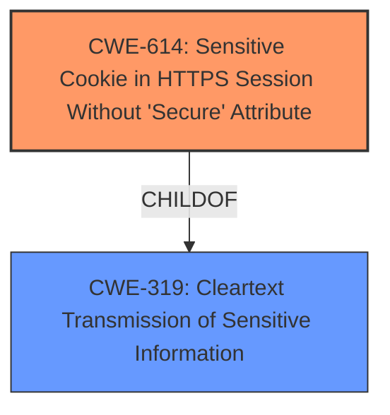

# Raw Analyzer Response for CVE-2024-44575

# Summary
| CWE ID | CWE Name | Confidence | CWE Abstraction Level | CWE Vulnerability Mapping Label | CWE-Vulnerability Mapping Notes |
|---|---|---|---|---|---|
| CWE-614 | Sensitive Cookie in HTTPS Session Without 'Secure' Attribute | 1.0 | Variant | Allowed | Primary CWE |
| CWE-319 | Cleartext Transmission of Sensitive Information | 0.7 | Base | Allowed | Secondary Candidate |

## Evidence and Confidence

*   **Confidence Score:** 0.9
*   **Evidence Strength:** HIGH

## Relationship Analysis
The primary relationship that influenced the decision was the parent-child relationship between CWE-319 (Cleartext Transmission of Sensitive Information) and CWE-614 (Sensitive Cookie in HTTPS Session Without 'Secure' Attribute). CWE-614 is a more specific variant of CWE-319, as it focuses on the specific case of sensitive cookies lacking the Secure attribute. The vulnerability description explicitly mentions this scenario, making CWE-614 the more appropriate choice.

## Vulnerability Chain
The vulnerability chain starts with the **failure to set the Secure attribute for a sensitive cookie (root cause)**, leading to the potential for the cookie to be transmitted in cleartext over an HTTP session (impact).

## Summary of Analysis
The initial analysis strongly pointed towards CWE-614 due to the explicit mention of the missing Secure attribute for sensitive cookies. The retriever results also ranked CWE-614 as the top candidate. The relationship analysis confirmed that CWE-614 is a more specific variant of CWE-319, making it a better fit for the vulnerability description.

The primary basis for this assessment is the vulnerability description itself: "RELY-PCIe v22.2.1 to v23.1.0 **does not set the Secure attribute for sensitive cookies** in HTTPS sessions, which could cause the user agent to send those cookies in cleartext over an HTTP session." This statement directly aligns with the definition of CWE-614.

The selection of CWE-614 is at the optimal level of specificity because it precisely describes the vulnerability: a sensitive cookie transmitted over HTTPS without the Secure attribute. This is more specific than the general case of cleartext transmission.

Relevant CWE Information:

# Enhanced Context (25 CWEs)
The following CWEs were identified as potentially relevant to this vulnerability:

## CWE-614: Sensitive Cookie in HTTPS Session Without 'Secure' Attribute
**Abstraction Level**: Variant
**Similarity Score**: 0.81
**Source**: dense

**Description**:
The Secure attribute for sensitive cookies in HTTPS sessions is not set, which could cause the user agent to send those cookies in plaintext over an HTTP session.

**Mapping Guidance**:
- Usage: Allowed
- Rationale: This CWE entry is at the Variant level of abstraction, which is a preferred level of abstraction for mapping to the root causes of vulnerabilities.

## CWE-319: Cleartext Transmission of Sensitive Information
**Abstraction Level**: Base
**Similarity Score**: 0.71
**Source**: dense

**Description**:
The product transmits sensitive or security-critical data in cleartext in a communication channel that can be sniffed by unauthorized actors.

**Mapping Guidance**:
- Usage: Allowed
- Rationale: This CWE entry is at the Base level of abstraction, which is a preferred level of abstraction for mapping to the root causes of vulnerabilities.

CWE-614 is selected as the primary CWE because the vulnerability description explicitly states that the "Secure" attribute for sensitive cookies is not set. This directly matches the description of CWE-614: "The Secure attribute for sensitive cookies in HTTPS sessions is not set, which could cause the user agent to send those cookies in plaintext over an HTTP session." The "Usage: Allowed" mapping guidance further supports this selection. The confidence level is high (1.0) because of the clear and direct match between the vulnerability description and the CWE definition.

CWE-319 (Cleartext Transmission of Sensitive Information) is considered as a secondary CWE because the ultimate impact of **not setting the Secure attribute** is the potential for transmitting sensitive information in cleartext. While CWE-614 is more specific to the root cause, CWE-319 describes the resulting vulnerability. The confidence level is 0.7 because it represents the potential impact rather than the direct cause.

CWEs considered but not used:

*   CWE-1004 (Sensitive Cookie Without 'HttpOnly' Flag): While related to cookies, the vulnerability description does not mention the HttpOnly flag, so it's not applicable.
*   CWE-312 (Cleartext Storage of Sensitive Information): This CWE is not relevant as the issue is with transmission, not storage.
*   CWE-1275 (Sensitive Cookie with Improper SameSite Attribute): The vulnerability description does not mention the SameSite attribute.
*   CWE-565 and CWE-784 (Reliance on Cookies without Validation and Integrity Checking): These are not applicable as the core issue is not the reliance on the cookie itself, but the missing Secure attribute.
*   CWE-807 and CWE-472 (Reliance on Untrusted Inputs in a Security Decision and External Control of Assumed-Immutable Web Parameter): These are not applicable as the vulnerability doesn't involve untrusted inputs or external control of parameters.
*   CWE-201 and CWE-212 (Insertion of Sensitive Information Into Sent Data and Improper Removal of Sensitive Information Before Storage or Transfer): These are not applicable as the vulnerability doesn't involve insertion or removal of sensitive information.