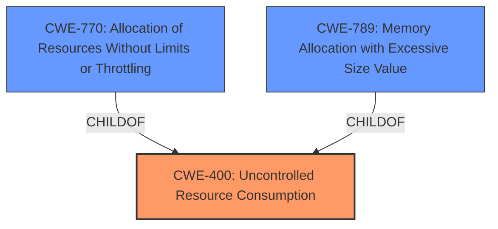

# Analysis Report for CVE-2024-4467

# Vulnerability Analysis Report: CVE-2024-4467

## Description

A flaw was found in the QEMU disk image utility (qemu-img) info command. A **specially crafted image file** containing a `json{}` value describing block devices in QMP could cause the qemu-img process on the host to consume large amounts of memory or CPU time, leading to denial of service or read/write to an existing external file.

## Vulnerability Description Key Phrases

- **Rootcause:** specially crafted image file
- **Impact:** ['consume large amounts of CPU time', 'consume large amounts of memory', 'denial of service']
- **Product:** QEMU disk image utility
- **Component:** info command

## Analysis (with Relationship Data)

# Summary
| CWE ID | CWE Name | Confidence | CWE Abstraction Level | CWE Vulnerability Mapping Label | CWE-Vulnerability Mapping Notes |
|---|---|---|---|---|---|
| CWE-400 | Uncontrolled Resource Consumption | 0.9 | Class | Primary | Allowed-with-Review |
| CWE-770 | Allocation of Resources Without Limits or Throttling | 0.7 | Base | Secondary Candidate | Allowed |
| CWE-789 | Memory Allocation with Excessive Size Value | 0.6 | Variant | Secondary Candidate | Allowed |

## Evidence and Confidence

*   **Confidence Score:** 0.8
*   **Evidence Strength:** MEDIUM

## Relationship Analysis
The primary CWE is CWE-400 [Uncontrolled Resource Consumption], which is a class-level CWE. While less specific than some base or variant CWEs, it accurately reflects the described vulnerability where a specially crafted image leads to excessive memory and CPU consumption.

Several child CWEs of CWE-400 like CWE-770 [Allocation of Resources Without Limits or Throttling] and CWE-789 [Memory Allocation with Excessive Size Value] were considered but ultimately deemed less suitable as primary mappings because the vulnerability isn't solely about allocation, but also CPU consumption and potentially other resource exhaustion.



## Vulnerability Chain
The vulnerability chain starts with a **specially crafted image file** containing a malicious `json{}` value. This leads to **improper input validation**, which in turn causes **uncontrolled resource consumption** (CPU and memory). The ultimate impact is **denial of service** and potentially **unintended file access** on the host system.

Root Cause: **Specially crafted image file** leading to **improper input validation**.
Weakness: **Uncontrolled resource consumption**.
Impact: **Denial of service** and potentially **unintended file access**.

## Summary of Analysis
The primary CWE, CWE-400 [Uncontrolled Resource Consumption], was chosen because it best captures the core weakness: the program consumes excessive resources (CPU and memory) due to a **specially crafted image file**. While CWE-770 [Allocation of Resources Without Limits or Throttling] and CWE-789 [Memory Allocation with Excessive Size Value] are related, they focus specifically on memory allocation, whereas the description mentions both memory and CPU consumption. The choice of CWE-400 aligns with the description of the impact which mentions "consume large amounts of memory or CPU time, leading to denial of service".

The evidence for this assessment is derived directly from the "Vulnerability Description" and "CVE Reference Links Content Summary" sections. The description explicitly mentions "consume large amounts of memory or CPU time, leading to denial of service". The confidence level is high because the description clearly points to resource consumption as the primary impact of the vulnerability.

The selection of CWE-400 [Uncontrolled Resource Consumption] as the primary CWE reflects the overall impact, while CWE-770 [Allocation of Resources Without Limits or Throttling] and CWE-789 [Memory Allocation with Excessive Size Value] are secondary candidates focusing on memory allocation aspects. This approach provides a comprehensive view of the vulnerability, covering both the immediate resource consumption and the specific issue of memory allocation.

Relevant CWE Information:

# Enhanced Context (25 CWEs)
The following CWEs were identified as potentially relevant to this vulnerability:

## CWE-789: Memory Allocation with Excessive Size Value
**Abstraction Level**: Variant
**Similarity Score**: 0.76
**Source**: dense

**Description**:
The product allocates memory based on an untrusted, large size value, but it does not ensure that the size is within expected limits, allowing arbitrary amounts of memory to be allocated.

**Mapping Guidance**:
- Usage: Allowed
- Rationale: This CWE entry is at the Variant level of abstraction, which is a preferred level of abstraction for mapping to the root causes of vulnerabilities.

## CWE-835: Loop with Unreachable Exit Condition ('Infinite Loop')
**Abstraction Level**: Base
**Similarity Score**: 0.73
**Source**: dense

**Description**:
The product contains an iteration or loop with an exit condition that cannot be reached, i.e., an infinite loop.

**Mapping Guidance**:
- Usage: Allowed
- Rationale: This CWE entry is at the Base level of abstraction, which is a preferred level of abstraction for mapping to the root causes of vulnerabilities.

## CWE-755: Improper Handling of Exceptional Conditions
**Abstraction Level**: Class
**Similarity Score**: 0.72
**Source**: dense

**Description**:
The product does not handle or incorrectly handles an exceptional condition.

**Mapping Guidance**:
- Usage: Discouraged
- Rationale: This CWE entry is a level-1 Class (i.e., a child of a Pillar). It might have lower-level children that would be more appropriate

## CWE-190: Integer Overflow or Wraparound
**Abstraction Level**: Base
**Similarity Score**: 0.72
**Source**: dense

**Description**:
The product performs a calculation that can
         produce an integer overflow or wraparound when the logic
         assumes that the resulting value will always be larger than
         the original value. This occurs when an integer value is
         incremented to a value that is too large to store in the
         associated representation. When this occurs, the value may
         become a very small or negative number.

**Mapping Guidance**:
- Usage: Allowed
- Rationale: This CWE entry is at the Base level of abstraction, which is a preferred level of abstraction for mapping to the root causes of vulnerabilities.

## CWE-1285: Improper Validation of Specified Index, Position, or Offset in Input
**Abstraction Level**: Base
**Similarity Score**: 0.72
**Source**: dense

**Description**:
The product receives input that is expected to specify an index, position, or offset into an indexable resource such as a buffer or file, but it does not validate or incorrectly validates that the specified index/position/offset has the required properties.

**Mapping Guidance**:
- Usage: Allowed
- Rationale: This CWE entry is at the Base level of abstraction, which is a preferred level of abstraction for mapping to the root causes of vulnerabilities.

## CWE-119: Improper Restriction of Operations within the Bounds of a Memory Buffer
**Abstraction Level**: Class
**Similarity Score**: 0.71
**Source**: dense

**Description**:
The product performs operations on a memory buffer, but it reads from or writes to a memory location outside the buffer's intended boundary. This may result in read or write operations on unexpected memory locations that could be linked to other variables, data structures, or internal program data.

**Mapping Guidance**:
- Usage: Discouraged
- Rationale: CWE-119 is commonly misused in low-information vulnerability reports when lower-level CWEs could be used instead, or when more details about the vulnerability are available.

## CWE-131: Incorrect Calculation of Buffer Size
**Abstraction Level**: Base
**Similarity Score**: 0.71
**Source**: dense

**Description**:
The product does not correctly calculate the size to be used when allocating a buffer, which could lead to a buffer overflow.

**Mapping Guidance**:
- Usage: Allowed
- Rationale: This CWE entry is at the Base level of abstraction, which is a preferred level of abstraction for mapping to the root causes of vulnerabilities.

## CWE-824: Access of Uninitialized Pointer
**Abstraction Level**: Base
**Similarity Score**: 0.71
**Source**: dense

**Description**:
The product accesses or uses a pointer that has not been initialized.

**Mapping Guidance**:
- Usage: Allowed
- Rationale: This CWE entry is at the Base level of abstraction, which is a preferred level of abstraction for mapping to the root causes of vulnerabilities.

## CWE-407: Inefficient Algorithmic Complexity
**Abstraction Level**: Class
**Similarity Score**: 0.71
**Source**: dense

**Description**:
An algorithm in a product has an inefficient worst-case computational complexity that may be detrimental to system performance and can be triggered by an attacker, typically using crafted manipulations that ensure that the worst case is being reached.

**Mapping Guidance**:
- Usage: Allowed-with-Review
- Rationale: This CWE entry is a Class and might have Base-level children that would be more appropriate

## CWE-909: Missing Initialization of Resource
**Abstraction Level**: Class
**Similarity Score**: 0.71
**Source**: dense

**Description**:
The product does not


## CWE Relationship Analysis

Current CWEs represent these abstraction levels: .


### Vulnerability Chain Analysis

**Chain starting from CWE-400:**
- 400 (Uncontrolled Resource Consumption) - ROOT


**Chain starting from CWE-407:**
- 407 (Inefficient Algorithmic Complexity) - ROOT


### CWE Relationship Diagram

```mermaid
graph TD
    classDef primary fill:#f96,stroke:#333,stroke-width:2px
    classDef secondary fill:#69f,stroke:#333
    classDef tertiary fill:#9e9,stroke:#333
```


*Report generated on 2025-07-13 15:43:54*
