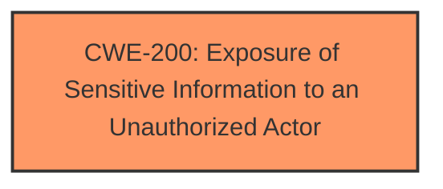

# Analysis Report for CVE-2024-44820

# Vulnerability Analysis Report: CVE-2024-44820

## Description

A sensitive **information disclosure vulnerability** exists in ZZCMS v.2023 and before within the eginfo.php file located at /3/E_bak5.1/upload/. When accessed with the query parameter phome=ShowPHPInfo, the application executes the phpinfo() function, which exposes detailed information about the PHP environment, including server configuration, loaded modules, and environment variables.

## Vulnerability Description Key Phrases

- **Weakness:** information disclosure vulnerability
- **Impact:** ['expose detailed information about the PHP environment', 'information disclosure']
- **Vector:** accessed with the query parameter phome=ShowPHPInfo
- **Product:** ZZCMS
- **Version:** v.2023 and before
- **Component:** eginfo.php file located at /3/E_bak5.1/upload/

## Analysis (with Relationship Data)

# Summary
| CWE ID | CWE Name | Confidence | CWE Abstraction Level | CWE Vulnerability Mapping Label | CWE-Vulnerability Mapping Notes |
|---|---|---|---|---|---|
| CWE-200 | Exposure of Sensitive Information to an Unauthorized Actor | 0.9 | Class | Primary CWE | Discouraged, but most fitting based on the available information. |

## Evidence and Confidence

*   **Confidence Score:** 0.9
*   **Evidence Strength:** MEDIUM

## Relationship Analysis
The primary relationship to consider here is the parent-child relationship. CWE-200 is a class-level CWE, and ideally, we'd want a more specific base or variant CWE. However, based on the limited information, a more specific CWE cannot be definitively determined. Other suggested CWEs such as CWE-209, CWE-497 also deal with exposure of sensitive information, but the root cause in this vulnerability is simply the execution of phpinfo() without proper authorization which directly leads to information exposure.



## Vulnerability Chain
The vulnerability chain is straightforward:

1.  **Root Cause:** Direct access to a PHP file that executes the `phpinfo()` function without authentication.
2.  **Weakness:** Exposure of sensitive information due to the execution of `phpinfo()`.
3.  **Impact:** Unauthorized disclosure of server configuration, loaded modules, and environment variables.

The primary CWE, CWE-200, captures the overall **information disclosure** aspect of the vulnerability.

## Summary of Analysis
The initial analysis pointed towards **CWE-200 - Exposure of Sensitive Information to an Unauthorized Actor** as the most relevant CWE. The vulnerability description clearly states an **information disclosure vulnerability** where accessing a specific file with a specific parameter executes the `phpinfo()` function, leading to the exposure of sensitive information.

While CWE-200 is a Class-level CWE and is generally discouraged, there is not enough information available to specify a more precise Base or Variant CWE. The "CVE Reference Links Content Summary" section is marked as "UNRELATED", which means there's no further information to refine the selection.

The decision is based on the evidence directly available in the "Vulnerability Description" and "Vulnerability Description Key Phrases" sections. The key phrase "**weakness: information disclosure vulnerability**" strongly supports this classification.

Other CWEs were considered but rejected:

*   **CWE-209: Generation of Error Message Containing Sensitive Information:** While `phpinfo()` does output information, it's not an error message.
*   **CWE-497: Exposure of Sensitive System Information to an Unauthorized Control Sphere:** This is more specific to system information, while `phpinfo()` exposes a broader range of information.
*   **CWE-434: Unrestricted Upload of File with Dangerous Type:** This CWE is not applicable as the vulnerability does not involve file uploads.
*   **CWE-306: Missing Authentication for Critical Function**: This could be a valid secondary CWE, but the primary issue is the information disclosure, not the missing authentication itself.
*   **CWE-22: Improper Limitation of a Pathname to a Restricted Directory ('Path Traversal')**: This CWE is not applicable as the vulnerability does not involve path traversal.

Therefore, CWE-200 remains the most appropriate CWE based on the available evidence, despite its higher abstraction level and discouraged usage.


## CWE Relationship Analysis

Current CWEs represent these abstraction levels: .


### Vulnerability Chain Analysis

**Chain starting from CWE-22:**
- 22 (Improper Limitation of a Pathname to a Restricted Directory ('Path Traversal')) - ROOT


**Chain starting from CWE-306:**
- 306 (Missing Authentication for Critical Function) - ROOT


### CWE Relationship Diagram

```mermaid
graph TD
    classDef primary fill:#f96,stroke:#333,stroke-width:2px
    classDef secondary fill:#69f,stroke:#333
    classDef tertiary fill:#9e9,stroke:#333
```


*Report generated on 2025-07-13 15:46:04*
