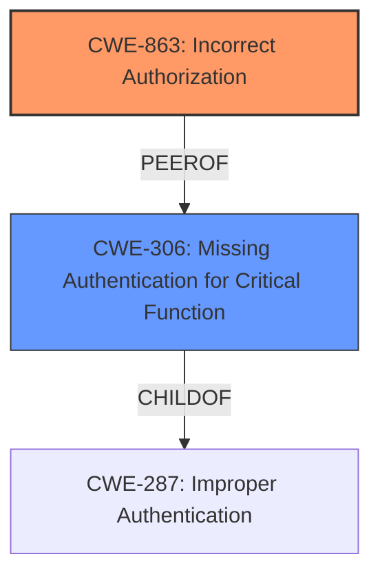

# Raw Analyzer Response for CVE-2024-44893

# Summary
| CWE ID    | CWE Name                                                                 | Confidence | CWE Abstraction Level | CWE Vulnerability Mapping Label | CWE-Vulnerability Mapping Notes |
| --------- | ------------------------------------------------------------------------ | ---------- | --------------------- | ------------------------------- | ----------------------------- |
| CWE-863   | Incorrect Authorization                                                  | 0.9        | Class                 | Allowed-with-Review             | Primary CWE                    |
| CWE-306   | Missing Authentication for Critical Function                             | 0.6        | Base                  | Allowed                         | Secondary Candidate            |

## Evidence and Confidence

*   **Confidence Score:** 0.8
*   **Evidence Strength:** HIGH

## Relationship Analysis
The primary relationship considered was that CWE-863 (Incorrect Authorization) is a Class-level CWE, while many potential child CWEs provide more specific details. However, based on the provided information, the authorization logic is present but flawed, making CWE-863 the most appropriate choice. CWE-306 (Missing Authentication for Critical Function) was considered, but the presence of the `JimuReportTokenInterceptor` indicates an attempt at authentication/authorization, albeit flawed, making CWE-863 more suitable.

## Vulnerability Chain
The vulnerability chain starts with a **flawed authorization** mechanism within the `JimuReportTokenInterceptor`. This leads to an **authentication bypass** because the system incorrectly grants access when a non-existent `shareToken` is provided. The ultimate impact is **privilege escalation**, where an unauthorized user gains access to sensitive resources.

## Summary of Analysis
The initial analysis focused on identifying the root cause of the vulnerability. The key evidence lies in the CVE Reference Links Content Summary, which states: "The vulnerability is caused due to a **flawed logic** in the permission bypass check... It checks for the `previousPage` parameter and a `shareToken`. If a `shareToken` is provided, it queries the database to see if that share token exists, and if it does not, the permission check is bypassed, and the user will be granted access." This clearly indicates an **Incorrect Authorization (CWE-863)**, where the authorization check is present but flawed.

The Retriever Results suggested several CWEs, including CWE-287 (Improper Authentication) and CWE-425 (Direct Request ('Forced Browsing')). However, these were deemed less appropriate as the system does attempt to authenticate/authorize users via the `JimuReportTokenInterceptor`. The core issue is that the authorization logic itself is flawed, leading to the bypass.

The provided guidance on Privileges vs. Permissions helped to solidify the selection of CWE-863. The vulnerability involves a **flawed** permission check, aligning perfectly with the characteristics of CWE-863.

The final decision to use CWE-863 is based on the evidence of a flawed authorization mechanism, supported by the CVE description and the guidance on Privileges vs. Permissions. The CWE is at the Class level, which is appropriate given the available information. Further investigation might reveal a more specific Base-level CWE, but based on the current evidence, CWE-863 is the most accurate classification.

Relevant CWE Information:

# Enhanced Context (25 CWEs)
The following CWEs were identified as potentially relevant to this vulnerability:

## CWE-266: Incorrect Privilege Assignment
**Abstraction Level**: Base
**Similarity Score**: 0.78
**Source**: dense

**Description**:
A product incorrectly assigns a privilege to a particular actor, creating an unintended sphere of control for that actor.

**Mapping Guidance**:
- Usage: Allowed
- Rationale: This CWE entry is at the Base level of abstraction, which is a preferred level of abstraction for mapping to the root causes of vulnerabilities.

## CWE-267: Privilege Defined With Unsafe Actions
**Abstraction Level**: Base
**Similarity Score**: 0.77
**Source**: dense

**Description**:
A particular privilege, role, capability, or right can be used to perform unsafe actions that were not intended, even when it is assigned to the correct entity.

**Mapping Guidance**:
- Usage: Allowed
- Rationale: This CWE entry is at the Base level of abstraction, which is a preferred level of abstraction for mapping to the root causes of vulnerabilities.

## CWE-274: Improper Handling of Insufficient Privileges
**Abstraction Level**: Base
**Similarity Score**: 0.77
**Source**: dense

**Description**:
The product does not handle or incorrectly handles when it has insufficient privileges to perform an operation, leading to resultant weaknesses.

**Mapping Guidance**:
- Usage: Discouraged
- Rationale: This CWE entry could be deprecated in a future version of CWE.

## CWE-280: Improper Handling of Insufficient Permissions or Privileges 
**Abstraction Level**: Base
**Similarity Score**: 0.77
**Source**: dense

**Description**:
The product does not handle or incorrectly handles when it has insufficient privileges to access resources or functionality as specified by their permissions. This may cause it to follow unexpected code paths that may leave the product in an invalid state.

**Mapping Guidance**:
- Usage: Allowed
- Rationale: This CWE entry is at the Base level of abstraction, which is a preferred level of abstraction for mapping to the root causes of vulnerabilities.

## CWE-41: Improper Resolution of Path Equivalence
**Abstraction Level**: Base
**Similarity Score**: 0.77
**Source**: dense

**Description**:
The product is vulnerable to file system contents disclosure through path equivalence. Path equivalence involves the use of special characters in file and directory names. The associated manipulations are intended to generate multiple names for the same object.

**Mapping Guidance**:
- Usage: Allowed
- Rationale: This CWE entry is at the Base level of abstraction, which is a preferred level of abstraction for mapping to the root causes of vulnerabilities.

## CWE-668: Exposure of Resource to Wrong Sphere
**Abstraction Level**: Class
**Similarity Score**: 0.76
**Source**: dense

**Description**:
The product exposes a resource to the wrong control sphere, providing unintended actors with inappropriate access to the resource.

**Mapping Guidance**:
- Usage: Discouraged
- Rationale: CWE-668 is high-level and is often misused as a catch-all when lower-level CWE IDs might be applicable. It is sometimes used for low-information vulnerability reports [REF-1287]. It is a level-1 Class (i.e., a child of a Pillar). It is not useful for trend analysis.

## CWE-472: External Control of Assumed-Immutable Web Parameter
**Abstraction Level**: Base
**Similarity Score**: 0.76
**Source**: dense

**Description**:
The web application does not sufficiently verify inputs that are assumed to be immutable but are actually externally controllable, such as hidden form fields.

**Mapping Guidance**:
- Usage: Allowed
- Rationale: This CWE entry is at the Base level of abstraction, which is a preferred level of abstraction for mapping to the root causes of vulnerabilities.

## CWE-73: External Control of File Name or Path
**Abstraction Level**: Base
**Similarity Score**: 0.75
**Source**: dense

**Description**:
The product allows user input to control or influence paths or file names that are used in filesystem operations.

**Mapping Guidance**:
- Usage: Allowed
- Rationale: This CWE entry is at the Base level of abstraction, which is a preferred level of abstraction for mapping to the root causes of vulnerabilities.

## CWE-425: Direct Request ('Forced Browsing')
**Abstraction Level**: Base
**Similarity Score**: 0.75
**Source**: dense

**Description**:
The web application does not adequately enforce appropriate authorization on all restricted URLs, scripts, or files.

**Mapping Guidance**:
- Usage: Allowed
- Rationale: This CWE entry is at the Base level of abstraction, which is a preferred level of abstraction for mapping to the root causes of vulnerabilities.

## CWE-639: Authorization Bypass Through User-Controlled Key
**Abstraction Level**: Base
**Similarity Score**: 0.75
**Source**: dense

**Description**:
The system's authorization functionality does not prevent one user from gaining access to another user's data or record by modifying the key value identifying the data.

**Mapping Guidance**:
- Usage: Allowed
- Rationale: This CWE entry is at the Base level of abstraction, which is a preferred level of abstraction for mapping to the root causes of vulnerabilities.

## CWE-863: Incorrect Authorization
**Abstraction Level**: Class
**Similarity Score**: 1990.78
**Source**: sparse

**Description**:
The product performs an authorization check when an actor attempts