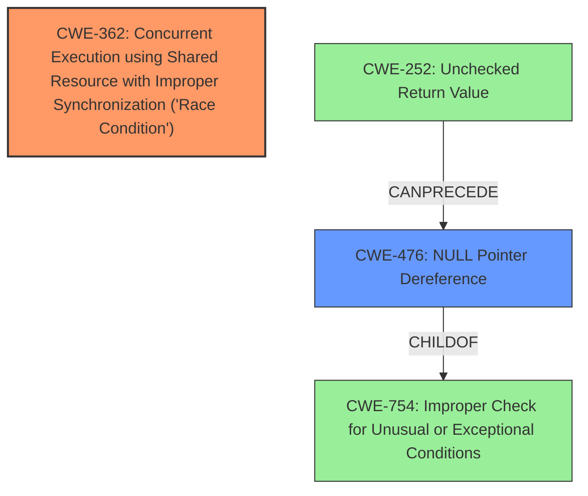

# Analysis Report for CVE-2024-44935

# Vulnerability Analysis Report: CVE-2024-44935

## Description

In the Linux kernel, the following vulnerability has been resolved sctp Fix **null-ptr-deref** in reuseport_add_sock(). syzbot reported a **null-ptr-deref** while accessing sk2->sk_reuseport_cb in reuseport_add_sock(). [0] The repro first creates a listener with SO_REUSEPORT. Then, it creates another listener on the same port and concurrently closes the first listener. The second listen() calls reuseport_add_sock() with the first listener as sk2, where sk2->sk_reuseport_cb is not expected to be cleared concurrently, but the close() does clear it by reuseport_detach_sock(). The problem is SCTP does not properly synchronise reuseport_alloc(), reuseport_add_sock(), and reuseport_detach_sock(). The caller of reuseport_alloc() and reuseport_{add,detach}_sock() must provide synchronisation for sockets that are classified into the same reuseport group. Otherwise, such sockets form multiple identical reuseport groups, and all groups except one would be silently dead. 1. Two sockets call listen() concurrently 2. No socket in the same group found in sctp_ep_hashtable[] 3. Two sockets call reuseport_alloc() and form two reuseport groups 4. Only one group hit first in __sctp_rcv_lookup_endpoint() receives incoming packets Also, the reported **null-ptr-deref** could occur. TCP/UDP guarantees that would not happen by holding the hash bucket lock. Lets apply the locking strategy to __sctp_hash_endpoint() and __sctp_unhash_endpoint(). [0] Oops general protection fault, pr

## Vulnerability Description Key Phrases

- **Rootcause:** improper synchronisation
- **Weakness:** null-ptr-deref
- **Impact:** ['Oops', 'general protection fault']
- **Vector:** multiple identical reuseport groups
- **Product:** Linux kernel
- **Component:** sctp

## Analysis (with Relationship Data)

# Summary
| CWE ID | CWE Name | Confidence | CWE Abstraction Level | CWE Vulnerability Mapping Label | CWE-Vulnerability Mapping Notes |
|---|---|---|---|---|---|
| CWE-362 | Concurrent Execution using Shared Resource with Improper Synchronization ('Race Condition') | 0.9 | Class | Primary CWE | Allowed-with-Review |
| CWE-476 | NULL Pointer Dereference | 0.8 | Base | Secondary Candidate | Allowed |

## Evidence and Confidence

*   **Confidence Score:** 0.85
*   **Evidence Strength:** HIGH

## Relationship Analysis
The primary CWE is CWE-362, a Class-level weakness describing race conditions due to improper synchronization. CWE-476, a Base-level weakness, represents the null pointer dereference, which is a direct consequence of the race condition. CWE-476 is a child of CWE-754 (Improper Check for Unusual or Exceptional Conditions) and can follow CWE-252 (Unchecked Return Value). Although CWE-362 is a Class, it is chosen as the primary CWE, as the description focuses on the race condition as the root cause.



## Vulnerability Chain
The vulnerability chain starts with **improper synchronization** (CWE-362) when accessing shared resources concurrently. This leads to a race condition, where `sk->sk_reuseport_cb` is cleared by `reuseport_detach_sock()` while being accessed by `reuseport_add_sock()`, resulting in a **null-ptr-deref** (CWE-476). The impact is a kernel panic.

## Summary of Analysis
The analysis identifies CWE-362 as the primary weakness due to the **improper synchronisation** of `reuseport_alloc()`, `reuseport_add_sock()`, and `reuseport_detach_sock()` functions when handling SO_REUSEPORT sockets. The race condition leads to a **null-ptr-deref** (CWE-476), causing a kernel panic. The evidence is strong, with the vulnerability description explicitly mentioning the lack of synchronization and the resulting null pointer dereference. The provided crash log clearly shows the KASAN report of null pointer dereference.

The retriever results support both CWE-362 and CWE-476 as relevant. CWE-362 is a Class, but its description aligns well with the root cause of the vulnerability. CWE-476 is at the Base level, which is preferred, and represents the direct consequence of the race condition.

Other CWEs considered but not used:

*   CWE-667 (Improper Locking): While locking is related to synchronization, the description emphasizes the higher-level concept of concurrent execution without proper synchronization rather than a specific locking error.
*   CWE-367 (Time-of-check Time-of-use (TOCTOU) Race Condition): This is a specific type of race condition. While applicable, CWE-362 is more general and accurately captures the **improper synchronization** aspect.
*   CWE-755 (Improper Handling of Exceptional Conditions): This is too generic and doesn't accurately reflect the root cause of the vulnerability.

Relevant CWE Information:

# Enhanced Context (25 CWEs)
The following CWEs were identified as potentially relevant to this vulnerability:

## CWE-362: Concurrent Execution using Shared Resource with Improper Synchronization ('Race Condition')
**Abstraction Level**: Class
**Similarity Score**: 0.79
**Source**: dense

**Description**:
The product contains a concurrent code sequence that requires temporary, exclusive access to a shared resource, but a timing window exists in which the shared resource can be modified by another code sequence operating concurrently.

**Mapping Guidance**:
- Usage: Allowed-with-Review
- Rationale: This CWE entry is a Class and might have Base-level children that would be more appropriate

## CWE-476: NULL Pointer Dereference
**Abstraction Level**: Base
**Similarity Score**: 0.77
**Source**: dense

**Description**:
The product dereferences a pointer that it expects to be valid but is NULL.

**Mapping Guidance**:
- Usage: Allowed
- Rationale: This CWE entry is at the Base level of abstraction, which is a preferred level of abstraction for mapping to the root causes of vulnerabilities.
# Summary
| CWE ID | CWE Name | Confidence | CWE Abstraction Level | CWE Vulnerability Mapping Label | CWE-Vulnerability Mapping Notes |
|---|---|---|---|---|---|
| CWE-362 | Concurrent Execution using Shared Resource with Improper Synchronization ('Race Condition') | 0.9 | Class | Primary CWE | Allowed-with-Review |
| CWE-476 | NULL Pointer Dereference | 0.8 | Base | Secondary Candidate | Allowed |

## Evidence and Confidence

*   **Confidence Score:** 0.85
*   **Evidence Strength:** HIGH

## Relationship Analysis
The primary CWE is CWE-362, a Class-level weakness describing race conditions due to improper synchronization. CWE-476, a Base-level weakness, represents the null pointer dereference, which is a direct consequence of the race condition. CWE-476 is a child of CWE-754 (Improper Check for Unusual or Exceptional Conditions) and can follow CWE-252 (Unchecked Return Value). Although CWE-362 is a Class, it is chosen as the primary CWE, as the description focuses on the race condition as the root cause.


## Vulnerability Chain
The vulnerability chain starts with **improper synchronization** (CWE-362) when accessing shared resources concurrently. This leads to a race condition, where `sk->sk_reuseport_cb` is cleared by `reuseport_detach_sock()` while being accessed by `reuseport_add_sock()`, resulting in a **null-ptr-deref** (CWE-476). The impact is a kernel panic.

## Summary of Analysis
The analysis identifies CWE-362 as the primary weakness due to the **improper synchronisation** of `reuseport_alloc()`, `reuseport_add_sock()`, and `reuseport_detach_sock()` functions when handling SO_REUSEPORT sockets. The race condition leads to a **null-ptr-deref** (CWE-476), causing a kernel panic. The evidence is strong, with the vulnerability description explicitly mentioning the lack of synchronization and the resulting null pointer dereference. The provided crash log clearly shows the KASAN report of null pointer dereference.

The retriever results support both CWE-362 and CWE-476 as relevant. CWE-362 is a Class, but its description aligns well with the root cause of the vulnerability. CWE-476 is at the Base level, which is preferred, and represents the direct consequence of the race condition.

Other CWEs considered but not used:

*   CWE-667 (Improper Locking): While locking is related to synchronization, the description emphasizes the higher-level concept of concurrent execution without proper synchronization rather than a specific locking error.
*   CWE-367 (Time-of-check Time-of-use (TOCTOU) Race Condition): This is a specific type of race condition. While applicable, CWE-362 is more general and accurately captures the **improper synchronization** aspect.


## CWE Relationship Analysis

Current CWEs represent these abstraction levels: .


### Vulnerability Chain Analysis

**Chain starting from CWE-476:**
- 476 (NULL Pointer Dereference) - ROOT


**Chain starting from CWE-667:**
- 667 (Improper Locking) - ROOT


### CWE Relationship Diagram

```mermaid
graph TD
    classDef primary fill:#f96,stroke:#333,stroke-width:2px
    classDef secondary fill:#69f,stroke:#333
    classDef tertiary fill:#9e9,stroke:#333
```


*Report generated on 2025-07-13 15:49:59*
