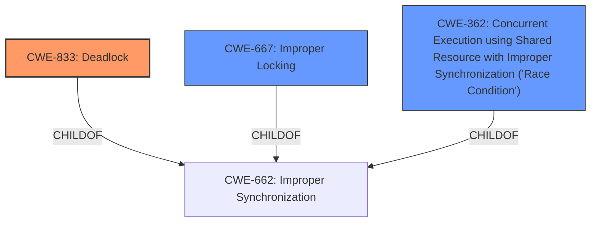

# Analysis Report for CVE-2024-44957

# Vulnerability Analysis Report: CVE-2024-44957

## Description

In the Linux kernel, the following vulnerability has been resolved xen privcmd Switch from mutex to spinlock for irqfds irqfd_wakeup() gets EPOLLHUP, when it is called by eventfd_release() by way of wake_up_poll(&ctx->wqh, EPOLLHUP), which gets called under spin_lock_irqsave(). We cant use a mutex here as it will lead to a deadlock. Fix it by switching over to a spin lock.

## Vulnerability Description Key Phrases

- **Rootcause:** use of mutex instead of spinlock
- **Impact:** deadlock
- **Product:** Linux kernel
- **Component:** xen privcmd

## Analysis (with Relationship Data)

# Summary
| CWE ID | CWE Name | Confidence | CWE Abstraction Level | CWE Vulnerability Mapping Label | CWE-Vulnerability Mapping Notes |
|---|---|---|---|---|---|
| CWE-833 | Deadlock | 1.0 | Base | Allowed | Primary CWE: The **use of a mutex instead of a spinlock** led to a deadlock. |
| CWE-667 | Improper Locking | 0.8 | Class | Allowed-with-Review | Secondary Candidate: The improper use of a mutex where a spinlock was required is a form of improper locking. |
| CWE-362 | Concurrent Execution using Shared Resource with Improper Synchronization ('Race Condition') | 0.6 | Class | Allowed-with-Review | Secondary Candidate: The deadlock is a result of concurrent execution without proper synchronization, although CWE-833 is a better fit. |

## Evidence and Confidence

*   **Confidence Score:** 0.9
*   **Evidence Strength:** HIGH

## Relationship Analysis
The primary CWE is CWE-833 (Deadlock), which is caused by the improper use of synchronization primitives. CWE-667 (Improper Locking) is a Class-level CWE that could be considered, but CWE-833 is more specific and at the Base level. CWE-362 (Concurrent Execution using Shared Resource with Improper Synchronization ('Race Condition')) is related as the deadlock arises from concurrent execution.



## Vulnerability Chain
The vulnerability chain starts with the **incorrect choice of a mutex instead of a spinlock**, leading to a potential deadlock when `irqfd_wakeup()` is called by `eventfd_release()` under `spin_lock_irqsave()`.

## Summary of Analysis
The primary vulnerability is CWE-833 (Deadlock) due to the **use of a mutex instead of a spinlock** in a context where spinlocks are already held. The evidence is strong, with the vulnerability description and the CVE reference summary explicitly mentioning the deadlock and the cause. The choice of CWE-833 is at the optimal level of specificity (Base).

Relevant CWE Information:

# Enhanced Context (25 CWEs)
The following CWEs were identified as potentially relevant to this vulnerability:

## CWE-833: Deadlock
**Abstraction Level**: Base
**Similarity Score**: 0.78
**Source**: dense

**Description**:
The product contains multiple threads or executable segments that are waiting for each other to release a necessary lock, resulting in deadlock.

**Mapping Guidance**:
- Usage: Allowed
- Rationale: This CWE entry is at the Base level of abstraction, which is a preferred level of abstraction for mapping to the root causes of vulnerabilities.

## CWE-667: Improper Locking
**Abstraction Level**: Class
**Similarity Score**: 0.77
**Source**: dense

**Description**:
The product does not properly acquire or release a lock on a resource, leading to unexpected resource state changes and behaviors.

**Mapping Guidance**:
- Usage: Allowed-with-Review
- Rationale: This CWE entry is a Class and might have Base-level children that would be more appropriate

## CWE-362: Concurrent Execution using Shared Resource with Improper Synchronization ('Race Condition')
**Abstraction Level**: Class
**Similarity Score**: 0.73
**Source**: dense

**Description**:
The product contains a concurrent code sequence that requires temporary, exclusive access to a shared resource, but a timing window exists in which the shared resource can be modified by another code sequence operating concurrently.

**Mapping Guidance**:
- Usage: Allowed-with-Review
- Rationale: This CWE entry is a Class and might have Base-level children that would be more appropriate

## CWE-413: Improper Resource Locking
**Abstraction Level**: Base
**Similarity Score**: 0.70
**Source**: dense

**Description**:
The product does not lock or does not correctly lock a resource when the product must have exclusive access to the resource.

**Mapping Guidance**:
- Usage: Allowed
- Rationale: This CWE entry is at the Base level of abstraction, which is a preferred level of abstraction for mapping to the root causes of vulnerabilities.

### CWE Selection Details:

*   **CWE-833 (Deadlock):** This is the most appropriate CWE as the vulnerability description explicitly mentions a deadlock. The **rootcause** is the **use of mutex instead of spinlock** which leads to the deadlock condition.
*   **CWE-667 (Improper Locking):** This is a related CWE, as the **incorrect use of the mutex** is a form of improper locking. However, CWE-833 is more specific to the resulting deadlock.
*   **CWE-362 (Concurrent Execution using Shared Resource with Improper Synchronization ('Race Condition')):** This is also a related CWE, as the deadlock arises from concurrent execution without proper synchronization. However, CWE-833 describes the specific type of synchronization issue (deadlock) more accurately.

Other CWEs were considered but deemed less relevant:

*   CWE-413 (Improper Resource Locking): While resource locking is involved, the core issue is the deadlock, not simply the act of improperly locking a resource.
*   CWE-755, CWE-754, CWE-252, CWE-1285, CWE-119, CWE-367, CWE-476, CWE-1284, CWE-61, CWE-662, CWE-412, CWE-1325, CWE-266, CWE-409, CWE-386, CWE-416: These CWEs do not directly relate to the root cause or the resulting deadlock condition described in the vulnerability.


## CWE Relationship Analysis

Current CWEs represent these abstraction levels: .


### Vulnerability Chain Analysis

**Chain starting from CWE-476:**
- 476 (NULL Pointer Dereference) - ROOT


**Chain starting from CWE-416:**
- 416 (Use After Free) - ROOT


### CWE Relationship Diagram

```mermaid
graph TD
    classDef primary fill:#f96,stroke:#333,stroke-width:2px
    classDef secondary fill:#69f,stroke:#333
    classDef tertiary fill:#9e9,stroke:#333
```


*Report generated on 2025-07-13 15:51:31*
