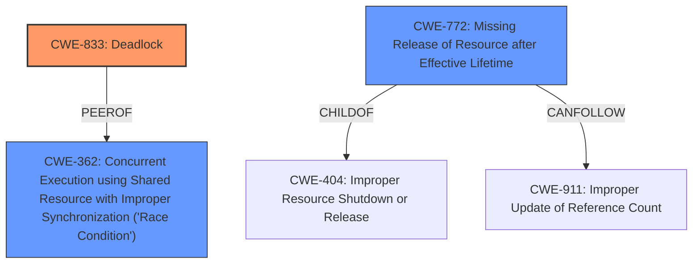

# Analysis Report for CVE-2024-45003

# Vulnerability Analysis Report: CVE-2024-45003

## Description

In the Linux kernel, the following vulnerability has been resolved vfs Dont evict inode under the inode lru traversing context The inode reclaiming process(See function prune_icache_sb) collects all reclaimable inodes and mark them with I_FREEING flag at first, at that time, other processes will be stuck if they try getting these inodes (See function find_inode_fast), then the reclaiming process destroy the inodes by function dispose_list(). Some filesystems(eg. ext4 with ea_inode feature, ubifs with xattr) may do **inode lookup in the inode evicting callback function**, if the inode lookup is operated under the inode lru traversing context, deadlock problems may happen. Case 1 In function ext4_evict_inode(), the ea inode lookup could happen if ea_inode feature is enabled, the lookup process will be stuck under the evicting context like this 1. File A has inode i_reg and an ea inode i_ea 2. getfattr(A, xattr_buf) // i_ea is added into lru // lru->i_ea 3. Then, following three processes running like this PA PB echo 2 > /proc/sys/vm/drop_caches shrink_slab prune_dcache_sb // i_reg is added into lru, lru->i_ea->i_reg prune_icache_sb list_lru_walk_one inode_lru_isolate i_ea->i_state |= I_FREEING // set inode state inode_lru_isolate __iget(i_reg) spin_unlock(&i_reg->i_lock) spin_unlock(lru_lock) rm file A i_

## Vulnerability Description Key Phrases

- **Rootcause:** inode lookup in the inode evicting callback function
- **Impact:** deadlock
- **Product:** Linux kernel
- **Component:** vfs

## Analysis (with Relationship Data)

# Summary
| CWE ID | CWE Name | Confidence | CWE Abstraction Level | CWE Vulnerability Mapping Label | CWE-Vulnerability Mapping Notes |
|---|---|---|---|---|---|
| CWE-833 | Deadlock | 1.0 | Base | Primary | Allowed |
| CWE-362 | Concurrent Execution using Shared Resource with Improper Synchronization ('Race Condition') | 0.7 | Class | Secondary Candidate | Allowed-with-Review |
| CWE-772 | Missing Release of Resource after Effective Lifetime | 0.6 | Base | Secondary Candidate | Allowed |

## Evidence and Confidence

*   **Confidence Score:** 0.9
*   **Evidence Strength:** HIGH

## Relationship Analysis
The primary CWE selected is CWE-833 (Deadlock), which accurately reflects the vulnerability's core issue. CWE-362 (Race Condition) is a related Class-level CWE that describes the concurrent execution aspect, but it is less specific than CWE-833. CWE-772 (Missing Release of Resource after Effective Lifetime) is also related, as the deadlock occurs when resources are not properly released. The hierarchical relationships support the choice of CWE-833 as the primary CWE.



## Vulnerability Chain
The vulnerability chain starts with the **inode lookup in the inode evicting callback function**. This leads to a race condition where the inode reclaiming process and other processes contend for the same resources. The lack of proper synchronization results in a **deadlock**, which is the ultimate impact of the vulnerability.

## Summary of Analysis
The analysis is based on the provided evidence, which clearly indicates a deadlock vulnerability in the Linux kernel. The **rootcause** is the **inode lookup in the inode evicting callback function** during the inode reclaiming process, specifically when certain filesystems (ext4, ubifs) are used. The vulnerability chain involves a race condition and improper synchronization, ultimately leading to a deadlock.

The retriever results included several candidate CWEs, but CWE-833 (Deadlock) best matches the vulnerability description. CWE-362 (Race Condition) is a related weakness, but it is less specific than CWE-833. CWE-772 (Missing Release of Resource after Effective Lifetime) is a plausible secondary weakness, but its relationship to the primary deadlock is less direct.

The selected CWEs are at the optimal level of specificity. CWE-833 is a Base-level CWE that accurately represents the vulnerability's core issue. CWE-362 is a Class-level CWE that provides additional context about the concurrent execution aspect, but it is less specific than CWE-833.

Relevant CWE Information:

# Enhanced Context (25 CWEs)
The following CWEs were identified as potentially relevant to this vulnerability:

## CWE-667: Improper Locking
**Abstraction Level**: Class
**Similarity Score**: 0.79
**Source**: dense

**Description**:
The product does not properly acquire or release a lock on a resource, leading to unexpected resource state changes and behaviors.

**Mapping Guidance**:
- Usage: Allowed-with-Review
- Rationale: This CWE entry is a Class and might have Base-level children that would be more appropriate

## CWE-833: Deadlock
**Abstraction Level**: Base
**Similarity Score**: 0.79
**Source**: dense

**Description**:
The product contains multiple threads or executable segments that are waiting for each other to release a necessary lock, resulting in deadlock.

**Mapping Guidance**:
- Usage: Allowed
- Rationale: This CWE entry is at the Base level of abstraction, which is a preferred level of abstraction for mapping to the root causes of vulnerabilities.

## CWE-362: Concurrent Execution using Shared Resource with Improper Synchronization ('Race Condition')
**Abstraction Level**: Class
**Similarity Score**: 0.76
**Source**: dense

**Description**:
The product contains a concurrent code sequence that requires temporary, exclusive access to a shared resource, but a timing window exists in which the shared resource can be modified by another code sequence operating concurrently.

**Mapping Guidance**:
- Usage: Allowed-with-Review
- Rationale: This CWE entry is a Class and might have Base-level children that would be more appropriate

## CWE-404: Improper Resource Shutdown or Release
**Abstraction Level**: Class
**Similarity Score**: 0.76
**Source**: dense

**Description**:
The product does not release or incorrectly releases a resource before it is made available for re-use.

**Mapping Guidance**:
- Usage: Allowed-with-Review
- Rationale: This CWE entry is a Class and might have Base-level children that would be more appropriate

## CWE-755: Improper Handling of Exceptional Conditions
**Abstraction Level**: Class
**Similarity Score**: 0.76
**Source**: dense

**Description**:
The product does not handle or incorrectly handles an exceptional condition.

**Mapping Guidance**:
- Usage: Discouraged
- Rationale: This CWE entry is a level-1 Class (i.e., a child of a Pillar). It might have lower-level children that would be more appropriate

## CWE-407: Inefficient Algorithmic Complexity
**Abstraction Level**: Class
**Similarity Score**: 0.75
**Source**: dense

**Description**:
An algorithm in a product has an inefficient worst-case computational complexity that may be detrimental to system performance and can be triggered by an attacker, typically using crafted manipulations that ensure that the worst case is being reached.

**Mapping Guidance**:
- Usage: Allowed-with-Review
- Rationale: This CWE entry is a Class and might have Base-level children that would be more appropriate

## CWE-824: Access of Uninitialized Pointer
**Abstraction Level**: Base
**Similarity Score**: 0.75
**Source**: dense

**Description**:
The product accesses or uses a pointer that has not been initialized.

**Mapping Guidance**:
- Usage: Allowed
- Rationale: This CWE entry is at the Base level of abstraction, which is a preferred level of abstraction for mapping to the root causes of vulnerabilities.

## CWE-59: Improper Link Resolution Before File Access ('Link Following')
**Abstraction Level**: Base
**Similarity Score**: 0.75
**Source**: dense

**Description**:
The product attempts to access a file based on the filename, but it does not properly prevent that filename from identifying a link or shortcut that resolves to an unintended resource.

**Mapping Guidance**:
- Usage: Allowed
- Rationale: This CWE entry is at the Base level of abstraction, which is a preferred level of abstraction for mapping to the root causes of vulnerabilities.

## CWE-617: Reachable Assertion
**Abstraction Level**: Base
**Similarity Score**: 0.75
**Source**: dense

**Description**:
The product contains an assert() or similar statement that can be triggered by an attacker, which leads to an application exit or other behavior that is more severe than necessary.

**Mapping Guidance**:
- Usage: Allowed
- Rationale: This CWE entry is at the Base level of abstraction, which is a preferred level of abstraction for mapping to the root causes of vulnerabilities.

## CWE-367: Time-of-check Time-of-use (TOCTOU) Race Condition
**Abstraction Level**: Base
**Similarity Score**: 0.75
**Source**: dense

**Description**:
The product checks the state of a resource before using that resource, but the resource's state can change between the check and the use in a way that invalidates the results of the check. This can cause the product to perform invalid actions when the resource is in an unexpected state.

**Mapping Guidance**:
- Usage: Allowed
- Rationale: This CWE entry is at the Base level of abstraction, which is a preferred level of abstraction for mapping to the root causes of vulnerabilities.

## CWE-775: Missing Release of File Descriptor or Handle after Effective Lifetime
**Abstraction Level**: Variant
**Similarity Score**: 1663.13
**Source**: sparse

**Description**:
The product does not release a file descriptor or handle after its effective lifetime has ended, i.e., after the file descriptor/handle is no longer needed.

**Mapping Guidance**:
- Usage: Allowed
- Rationale: This CWE entry is at the Variant level of abstraction, which is a preferred level of abstraction for mapping to the root causes of vulnerabilities.

## CWE-3


## CWE Relationship Analysis

Current CWEs represent these abstraction levels: .


### Vulnerability Chain Analysis

**Chain starting from CWE-911:**
- 911 (Improper Update of Reference Count) - ROOT


**Chain starting from CWE-407:**
- 407 (Inefficient Algorithmic Complexity) - ROOT


### CWE Relationship Diagram

```mermaid
graph TD
    classDef primary fill:#f96,stroke:#333,stroke-width:2px
    classDef secondary fill:#69f,stroke:#333
    classDef tertiary fill:#9e9,stroke:#333
```


*Report generated on 2025-07-13 15:53:08*
