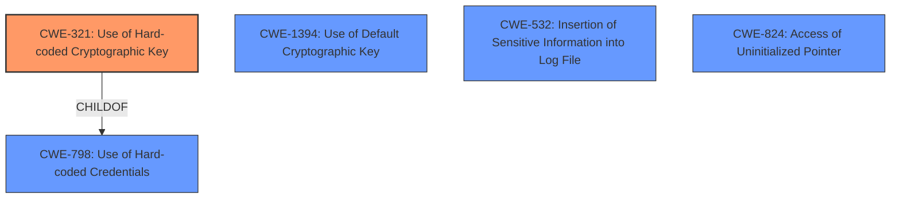

# Analysis for CVE-2024-45004

# Summary

| CWE ID  | CWE Name                                                                            | Confidence | CWE Abstraction Level | CWE Vulnerability Mapping Label | CWE-Vulnerability Mapping Notes |
| :-------- | :---------------------------------------------------------------------------------- | :---------- | :---------------------- | :------------------------------ | :------------------------------ |
| CWE-321   | Use of Hard-coded Cryptographic Key                                               | 0.9         | Variant                 | Allowed                         | Primary CWE                    |
| CWE-1394 | Use of Default Cryptographic Key                                               | 0.7         | Base                 | Allowed                         | Secondary Candidate                  |
| CWE-532   | Insertion of Sensitive Information into Log File                                  | 0.6         | Base                    | Allowed                         | Secondary Candidate                  |
| CWE-824   | Access of Uninitialized Pointer                                                                               | 0.5         | Base                    | Allowed                         | Secondary Candidate                  |

## Evidence and Confidence

*   **Confidence Score:** 0.8
*   **Evidence Strength:** MEDIUM

## Relationship Analysis

The primary CWE is CWE-321 (Use of Hard-coded Cryptographic Key), which is a Variant of CWE-798 (Use of Hard-coded Credentials). CWE-321 is chosen because the vulnerability involves the exposure of a decrypted key, which can be seen as a hard-coded value after the decryption process. CWE-1394 is considered as a secondary candidate because the BEK is decrypted in place, the decrypted BEK can be considered as a default key, thus can be a candidate. Other candidates like CWE-532 and CWE-824 are also considered, but they are not direct fits for the root cause. The abstraction levels were considered, preferring the most specific level (Variant for CWE-321).

## Vulnerability Chain

The vulnerability chain starts with the **Trusted keys unsealing the key blob on load**, leading to the in-place decryption of the BEK. This results in the BEK being stored in plaintext, and subsequent reads leading to the **leak of the blob encryption key**. The final impact is the exposure of the plaintext BEK to userspace.

## Summary of Analysis

The analysis is based on the provided vulnerability description and CVE reference links. The key evidence is the **rootcause**, **uninitialized memory** after the decryption process and the **weakness** of **Trusted keys unsealing the key blob on load**. The retriever results and complete CWE specifications were used to identify the most relevant CWEs. The relationships between CWEs, particularly the parent-child relationship between CWE-798 and CWE-321, were considered. Ultimately, CWE-321 was selected as the primary CWE due to its specific relevance to the vulnerability involving the exposure of a decrypted key. CWE-1394 was considered since the decrypted BEK can be considered as a default key. CWE-532 was considered since the decrypted BEK can be leaked via logs, and CWE-824 was considered due to the **uninitialized memory**. The confidence is rated as 0.8 due to the relatively clear description of the vulnerability and the availability of supporting evidence.

Relevant CWE Information:

# Enhanced Context (25 CWEs)
The following CWEs were identified as potentially relevant to this vulnerability:

## CWE-667: Improper Locking
**Abstraction Level**: Class
**Similarity Score**: 0.74
**Source**: dense

**Description**:
The product does not properly acquire or release a lock on a resource, leading to unexpected resource state changes and behaviors.

**Mapping Guidance**:
- Usage: Allowed-with-Review
- Rationale: This CWE entry is a Class and might have Base-level children that would be more appropriate

*Not Selected*: This CWE is not relevant because the vulnerability does not involve improper locking.

## CWE-252: Unchecked Return Value
**Abstraction Level**: Base
**Similarity Score**: 0.74
**Source**: dense

**Description**:
The product does not check the return value from a method or function, which can prevent it from detecting unexpected states and conditions.

**Mapping Guidance**:
- Usage: Allowed
- Rationale: This CWE entry is at the Base level of abstraction, which is a preferred level of abstraction for mapping to the root causes of vulnerabilities.

*Not Selected*: This CWE is not relevant because the vulnerability does not involve unchecked return values.

## CWE-1391: Use of Weak Credentials
**Abstraction Level**: Class
**Similarity Score**: 0.74
**Source**: dense

**Description**:
The product uses weak credentials (such as a default key or hard-coded password) that can be calculated, derived, reused, or guessed by an attacker.

**Mapping Guidance**:
- Usage: Allowed-with-Review
- Rationale: This CWE entry is a Class and might have Base-level children that would be more appropriate

*Not Selected*: While there's a key involved, it's not about weak credentials being used initially, but about the exposure of the key after decryption.

## CWE-1285: Improper Validation of Specified Index, Position, or Offset in Input
**Abstraction Level**: Base
**Similarity Score**: 0.74
**Source**: dense

**Description**:
The product receives input that is expected to specify an index, position, or offset into an indexable resource such as a buffer or file, but it does not validate or incorrectly validates that the specified index/position/offset has the required properties.

**Mapping Guidance**:
- Usage: Allowed
- Rationale: This CWE entry is at the Base level of abstraction, which is a preferred level of abstraction for mapping to the root causes of vulnerabilities.

*Not Selected*: This CWE is not relevant because the vulnerability does not involve improper validation of indices, positions, or offsets.

## CWE-203: Observable Discrepancy
**Abstraction Level**: Base
**Similarity Score**: 0.74
**Source**: dense

**Description**:
The product behaves differently or sends different responses under different circumstances in a way that is observable to an unauthorized actor, which exposes security-relevant information about the state of the product, such as whether a particular operation was successful or not.

**Mapping Guidance**:
- Usage: Allowed
- Rationale: This CWE entry is at the Base level of abstraction, which is a preferred level of abstraction for mapping to the root causes of vulnerabilities.

*Not Selected*: This CWE is not the primary issue, although the exposure of the key is an observable discrepancy. It's not the root cause.

## CWE-330: Use of Insufficiently Random Values
**Abstraction Level**: Class
**Similarity Score**: 0.73
**Source**: dense

**Description**:
The product uses insufficiently random numbers or values in a security context that depends on unpredictable numbers.

**Mapping Guidance**:
- Usage: Discouraged
- Rationale: This CWE entry is a level-1 Class (i.e., a child of a Pillar). It might have lower-level children that would be more appropriate

*Not Selected*: This CWE is not relevant because the vulnerability does not involve the use of insufficiently random values.

## CWE-321: Use of Hard-coded Cryptographic Key
**Abstraction Level**: Variant
**Similarity Score**: 0.73
**Source**: dense

**Description**:
The use of a hard-coded cryptographic key significantly increases the possibility that encrypted data may be recovered.

**Mapping Guidance**:
- Usage: Allowed
- Rationale: This CWE entry is at the Variant level of abstraction, which is a preferred level of abstraction for mapping to the root causes of vulnerabilities.

*Selected as Primary*: This CWE directly applies as the decrypted BEK is being exposed as a hard-coded value after the decryption process, being sent to userspace.

## CWE-824: Access of Uninitialized Pointer
**Abstraction Level**: Base
**Similarity Score**: 0.73
**Source**: dense

**Description**:
The product accesses or uses a pointer that has not been initialized.

**Mapping Guidance**:
- Usage: Allowed
- Rationale: This CWE entry is at the Base level of abstraction, which is a preferred level of abstraction for mapping to the root causes of vulnerabilities.

*Selected as Secondary Candidate*: The **rootcause** includes the **uninitialized memory**, which may be related to this CWE.

## CWE-362: Concurrent Execution using Shared Resource with