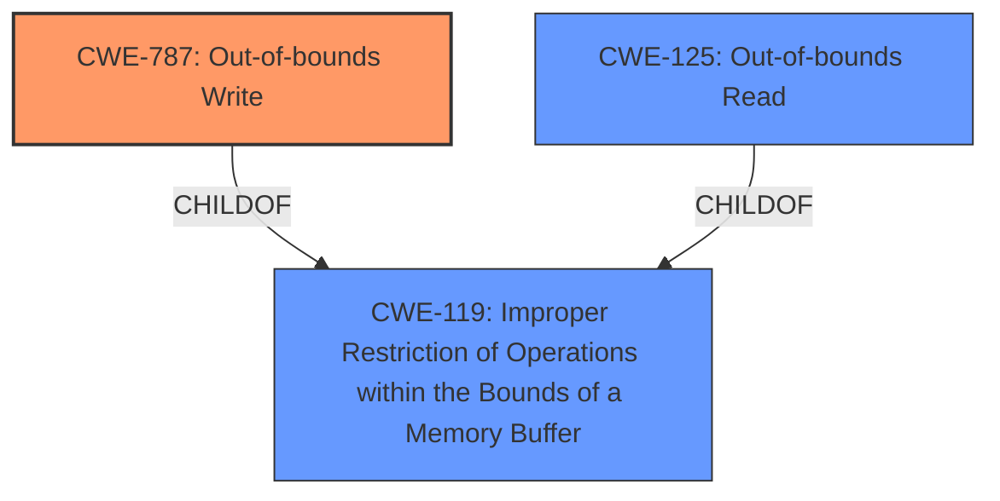

# Raw Analyzer Response for CVE-2024-45025

# Summary
| CWE ID | CWE Name | Confidence | CWE Abstraction Level | CWE Vulnerability Mapping Label | CWE-Vulnerability Mapping Notes |
|---|---|---|---|---|---|
| CWE-787 | Out-of-bounds Write | 0.95 | Base | Primary | Allowed |
| CWE-119 | Improper Restriction of Operations within the Bounds of a Memory Buffer | 0.75 | Class | Secondary | Allowed-with-Review |
| CWE-125 | Out-of-bounds Read | 0.65 | Base | Secondary | Allowed |

## Evidence and Confidence

*   **Confidence Score:** 0.85
*   **Evidence Strength:** HIGH

## Relationship Analysis

The primary weakness is CWE-787 Out-of-bounds Write, as the **bitmap corruption** is caused by writing data outside the intended buffer. CWE-119 Improper Restriction of Operations within the Bounds of a Memory Buffer is a broader category that encompasses out-of-bounds write, indicating a parent-child relationship. CWE-125 Out-of-bounds Read is also considered as the **bitmap corruption** may also be due to reading data from outside the intended buffer.

## Vulnerability Chain

The vulnerability chain involves the following sequence:
1.  The `copy_fd_bitmaps` function in the Linux kernel **incorrectly copies the bitmap** when `close_range` with `CLOSE_RANGE_UNSHARE` is used with a shared descriptor table.
2.  This leads to **bitmap corruption**, where file descriptors might be incorrectly reported as open or closed.
3.  The impact is that a process might use an incorrect file descriptor, such as `dup(0)` returning 128 instead of 64.

The root cause is the incorrect bitmap copying logic in `copy_fd_bitmaps`. The impact is the **bitmap corruption** and subsequent incorrect file descriptor handling.

## Summary of Analysis

The primary CWE is CWE-787 Out-of-bounds Write, as the core issue is writing outside the bounds of the bitmap buffer. The vulnerability description clearly states that "Otherwise we are risking garbage from the last word we'd copied." This indicates that the copy operation can write beyond the intended boundaries. The commit messages in the CVE Reference Links Content Summary also confirm this.

CWE-119 Improper Restriction of Operations within the Bounds of a Memory Buffer is considered a secondary CWE because it's a broader category encompassing out-of-bounds write.

CWE-125 Out-of-bounds Read is considered as the **bitmap corruption** may also be due to reading data from outside the intended buffer.

The retriever results also list CWE-787 with a reasonable similarity score.

Relevant CWE Information:
*   **CWE-787: Out-of-bounds Write**
    *   **Technical Explanation:** The `copy_fd_bitmaps` function in the Linux kernel does not properly handle the case where the file descriptor table is truncated using `close_range` with `CLOSE_RANGE_UNSHARE` when the descriptor table is shared. This results in writing data beyond the intended boundaries of the bitmap.
    *   **Security Implications:** This leads to **bitmap corruption**, which can cause file descriptors to be incorrectly reported as open or closed.
    *   **Relationship:** Child of CWE-119.
    *   **Mapping Guidance:** Usage: Allowed.
*   **CWE-119: Improper Restriction of Operations within the Bounds of a Memory Buffer**
    *   **Technical Explanation:** This is a more general class of vulnerability where operations are not properly restricted within the bounds of a memory buffer, leading to potential read or write errors.
    *   **Security Implications:** Can lead to various issues, including information disclosure, denial of service, or arbitrary code execution.
    *   **Relationship:** Parent of CWE-787.
    *   **Mapping Guidance:** Usage: Allowed-with-Review.
*   **CWE-125: Out-of-bounds Read**
    *   **Technical Explanation:** The product reads data past the end, or before the beginning, of the intended buffer.
    *   **Security Implications:** This can lead to information disclosure or denial of service.
    *   **Relationship:** Child of CWE-119.
    *   **Mapping Guidance:** Usage: Allowed.

Other CWEs Considered:

*   CWE-775: Missing Release of File Descriptor or Handle after Effective Lifetime - While file descriptors are involved, the core issue is the **bitmap corruption** due to improper copying, not the failure to release the descriptor.
*   CWE-911: Improper Update of Reference Count - This is not directly related to reference counting issues.
*   CWE-190: Integer Overflow or Wraparound - There is no indication of integer overflow in the provided description.
*   CWE-362: Concurrent Execution using Shared Resource with Improper Synchronization ('Race Condition') - While the descriptor table is shared, the core issue is not a race condition, but rather incorrect bitmap handling.
*   CWE-1284: Improper Validation of Specified Quantity in Input - There is no mention of improper validation of input quantity.
*   CWE-201: Insertion of Sensitive Information Into Sent Data - This is not related to the insertion of sensitive information.

I am confident that CWE-787 is the most appropriate primary CWE, as it directly addresses the root cause of the vulnerability.