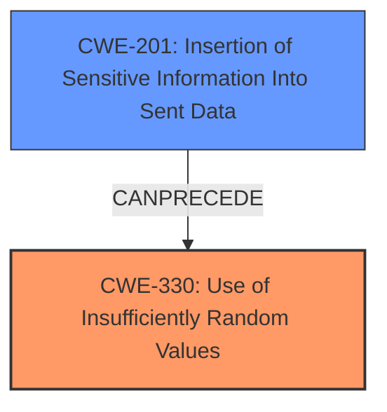

# Enhanced Analysis for CVE-2024-45040

# Summary

| CWE ID | CWE Name | Confidence | CWE Abstraction Level | CWE Vulnerability Mapping Label | CWE-Vulnerability Mapping Notes |
|---|---|---|---|---|---|
| CWE-330 | Use of Insufficiently Random Values | 0.9 | Class | Primary | Allowed-with-Review |
| CWE-201 | Insertion of Sensitive Information Into Sent Data | 0.6 | Base | Secondary Candidate | Allowed |

## Evidence and Confidence

*   **Confidence Score:** 0.75
*   **Evidence Strength:** MEDIUM

## Relationship Analysis
The primary relationship that impacted my decision was the hierarchical relationship. CWE-330 is a Class-level CWE, but it encapsulates the core issue of the vulnerability: the lack of sufficient randomness in the commitment scheme. The `graph` relationships provide additional context, suggesting potential chains involving information leakage (CWE-201).



## Vulnerability Chain
The vulnerability chain starts with the **Use of Insufficiently Random Values** (CWE-330), which leads to **Insertion of Sensitive Information Into Sent Data** (CWE-201).
  - Root Cause: **Use of Insufficiently Random Values** in the commitment generation.
  - Weakness: Lack of hiding property in Groth16 commitments.
  - Impact: Potential exposure of private witnesses due to predictable commitments.

## Summary of Analysis
The initial assessment considered CWE-201 due to the sensitive information being potentially exposed. However, the root cause lies in the fact that the values used to mask or commit to the data are not sufficiently random, making the commitment predictable.

The selection of CWE-330 is heavily based on the following evidence: "The vulnerability affects the zero-knowledge property of the proofs - in case the witness (secret or internal) values are small, then the attacker may be able to enumerate all possible choices to deduce the actual value." The lack of randomness in the commitment scheme is the core issue.

CWE-330 is selected as the primary weakness because it directly reflects the **root cause** of the vulnerability. The commitment scheme lacks sufficient randomness, allowing attackers to potentially deduce the original values. While CWE-201 (Insertion of Sensitive Information Into Sent Data) is a related concern, it's a consequence of the insufficient randomness, not the primary flaw.

The "CVE Reference Links Content Summary" section provides clear evidence for this: "The core weakness is the lack of a random masking term in the commitment calculation, making the commitment non-hiding."

Relevant CWE Information:

# Enhanced Context (25 CWEs)
The following CWEs were identified as potentially relevant to this vulnerability:

## CWE-330: Use of Insufficiently Random Values
**Abstraction Level**: Class
**Similarity Score**: 0.67
**Source**: dense

**Description**:
The product uses insufficiently random numbers or values in a security context that depends on unpredictable numbers.

**Mapping Guidance**:
- Usage: Discouraged
- Rationale: This CWE entry is a level-1 Class (i.e., a child of a Pillar). It might have lower-level children that would be more appropriate

## CWE-201: Insertion of Sensitive Information Into Sent Data
**Abstraction Level**: Base
**Similarity Score**: 0.67
**Source**: dense

**Description**:
The code transmits data to another actor, but a portion of the data includes sensitive information that should not be accessible to that actor.

**Mapping Guidance**:
- Usage: Allowed
- Rationale: This CWE entry is at the Base level of abstraction, which is a preferred level of abstraction for mapping to the root causes of vulnerabilities.

## CWE-201: Insertion of Sensitive Information Into Sent Data
**Abstraction Level**: Base
**Similarity Score**: 1346.76
**Source**: sparse

**Description**:
The code transmits data to another actor, but a portion of the data includes sensitive information that should not be accessible to that actor.

**Mapping Guidance**:
- Usage: Allowed
- Rationale: This CWE entry is at the Base level of abstraction, which is a preferred level of abstraction for mapping to the root causes of vulnerabilities.

## CWE-212: Improper Removal of Sensitive Information Before Storage or Transfer
**Abstraction Level**: Base
**Similarity Score**: 0.70
**Source**: dense

**Description**:
The product stores, transfers, or shares a resource that contains sensitive information, but it does not properly remove that information before the product makes the resource available to unauthorized actors.

**Mapping Guidance**:
- Usage: Allowed
- Rationale: This CWE entry is at the Base level of abstraction, which is a preferred level of abstraction for mapping to the root causes of vulnerabilities.

### Additional Considerations:

*   **CWE-330**: Despite being a Class-level CWE, it directly addresses the **root cause**.
*   **CWE-201**: While relevant, it represents the consequence rather than the **root cause**.

### Mapping Decision:

*   **Primary CWE**: CWE-330 **Use of Insufficiently Random Values**
    *   This CWE captures the essence of the vulnerability: the lack of sufficient randomness in the commitment scheme.
*   **Secondary CWE**: CWE-201 **Insertion of Sensitive Information Into Sent Data**
    *   This represents the impact or potential consequence of the insufficient randomness.

# Supporting Evidence

## CWE-330: Use of Insufficiently Random Values

**Technical Explanation:**

*   The vulnerability arises because the commitment scheme in Groth16 does not adequately randomize the witness values, making them predictable.
*   Attackers can potentially enumerate possible witness values and compare them to the actual commitment, thereby deducing the private witness.
*   This directly violates the zero-knowledge property of the proofs.

**Security Implications:**

*   Loss of confidentiality of committed private witnesses.
*   Potential exposure of sensitive information if witness values are small.

**Relationship Analysis:**

*   CWE-330 is a Class-level CWE.

**Mapping Guidance:**

*   The CWE description aligns well with the vulnerability's **root cause**.

## CWE-201: Insertion of Sensitive Information Into Sent Data

**Technical Explanation:**

*   The insufficient randomness in the commitment scheme allows sensitive information (private witnesses) to be potentially revealed.
*   This is because the commitment becomes predictable, and attackers can deduce the original values.

**Security Implications:**

*   Exposure of private witnesses.
*   Compromised confidentiality.

**Relationship Analysis:**

*   CWE-201 is a Base-level CWE.
*   It represents the consequence of the insufficient randomness (CWE-330).

**Mapping Guidance:**

*   The CWE description is relevant to the impact of the vulnerability.

### CWEs Considered But Not Used:

*   **CWE-79 (Improper Neutralization of Input During Web Page Generation ('Cross-site Scripting'))**: This is not relevant because the vulnerability is not related to web page generation or neutralization of input.
*   **CWE-125 (Out-of-bounds Read)**: This is not relevant because the vulnerability is not related to reading data outside of intended buffer boundaries.
*   **CWE-863 (Incorrect Authorization)**: This is not relevant because the vulnerability is not related to authorization mechanisms.
*   **CWE-252 (Unchecked Return Value)**: This is not relevant because the vulnerability is not caused by failing to check the return value of a function or method.
*   **CWE-770 (Allocation of Resources Without Limits or Throttling)**: This is not relevant because the vulnerability is not related to resource allocation issues.
*   **CWE-212 (Improper Removal of Sensitive Information Before Storage or Transfer)**: While there's sensitive information involved, the core issue isn't the failure to remove it before storage or transfer, but the lack of randomness.
*   **CWE-1284 (Improper Validation of Specified Quantity in Input)**: Not relevant as there is no quantity being specified.
*   **CWE-226 (Sensitive Information in Resource Not Removed Before Reuse)**: Irrelevant as there is no reuse.
*   **CWE-789 (Memory Allocation with Excessive Size Value)**: Irrelevant as there is no oversized memory allocation.
*   **CWE-1325 (Improperly Controlled Sequential Memory Allocation)**: Irrelevant as there is no memory allocation issue.


## CWE Relationship Analysis

Current CWEs represent these abstraction levels: .


### Vulnerability Chain Analysis

**Chain starting from CWE-863:**
- 863 (Incorrect Authorization) - ROOT


**Chain starting from CWE-1284:**
- 1284 (Improper Validation of Specified Quantity in Input) - ROOT


### CWE Relationship Diagram

```mermaid
graph TD
    classDef primary fill:#f96,stroke:#333,stroke-width:2px
    classDef secondary fill:#69f,stroke:#333
    classDef tertiary fill:#9e9,stroke:#333
```