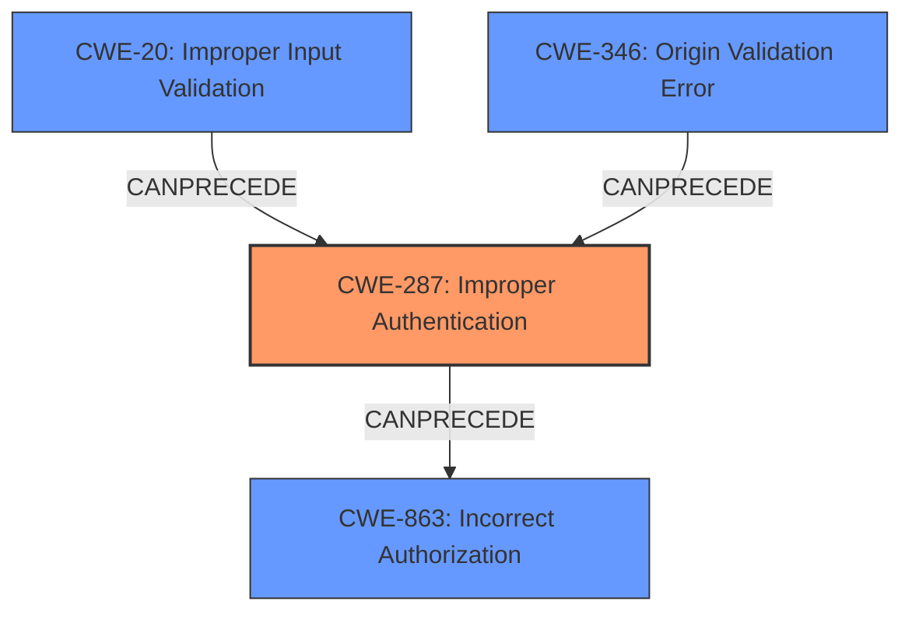

# Raw Analyzer Response for CVE-2024-45051

# Summary
| CWE ID | CWE Name | Confidence | CWE Abstraction Level | CWE Vulnerability Mapping Label | CWE-Vulnerability Mapping Notes |
|---|---|---|---|---|---|
| CWE-287 | Improper Authentication | 0.9 | Class | Primary | Allowed-with-Review |
| CWE-20 | Improper Input Validation | 0.7 | Class | Secondary | Allowed-with-Review |
| CWE-346 | Origin Validation Error | 0.6 | Class | Secondary | Allowed-with-Review |
| CWE-863 | Incorrect Authorization | 0.5 | Class | Secondary | Allowed-with-Review |

## Evidence and Confidence

*   **Confidence Score:** 0.8
*   **Evidence Strength:** MEDIUM

## Relationship Analysis
The primary CWE is CWE-287 Improper Authentication, as the vulnerability allows bypassing authentication mechanisms due to a **lack of proper email validation**. CWE-20 Improper Input Validation is a related weakness because the **maliciously crafted email** represents an invalid input that is not properly handled. CWE-346 Origin Validation Error is also considered because the **domain-based restriction bypass** implies a failure to properly validate the origin or source of the email address. CWE-863 Incorrect Authorization is relevant as the end result is a bypass in access to restricted resources, although authorization is subsequent to the authentication failure in this case.

## Vulnerability Chain
The vulnerability chain starts with a **maliciously crafted email address** (invalid input). This leads to **improper authentication** because the application **fails to validate the email address** correctly, thus **bypassing domain-based restrictions** (**origin validation error**). As a result, an attacker gains **unauthorized access** to private sites, categories, or groups (**incorrect authorization**).

## Summary of Analysis
The analysis identifies CWE-287 Improper Authentication as the primary weakness because the **vulnerability's root cause is bypassing authentication** through a **maliciously crafted email address**. This is supported by the CVE description stating the issue involves **bypassing domain-based restrictions**. The secondary CWEs, CWE-20, CWE-346, and CWE-863, contribute to a more complete understanding of the vulnerability. The evidence strength is medium because while the description is clear about the **bypass**, the exact mechanism of the **email address validation failure** isn't specified.

The graph relationships helped visualize the progression of the vulnerability. The primary weakness, **improper authentication**, is preceded by **improper input validation** and **origin validation error**, leading to **incorrect authorization**.

The selected CWEs are at an appropriate level of specificity. While more specific variants may exist for each, the available information doesn't provide enough detail to justify selecting those variants over the class-level CWEs.

**Justification for CWE Selection:**

*   **CWE-287 Improper Authentication**: This is the primary weakness because the vulnerability allows an attacker to bypass authentication mechanisms, gaining unauthorized access. Evidence: "A maliciously crafted email address could allow an attacker to bypass domain-based restrictions and gain access to private sites, categories and/or groups."
*   **CWE-20 Improper Input Validation**: A secondary weakness, as the crafted email address represents an invalid input that is not properly handled. Evidence: "maliciously crafted email address".
*   **CWE-346 Origin Validation Error**: A secondary weakness, the domain-based restriction bypass implies a failure to properly validate the origin or source of the email address. Evidence: "bypass domain-based restrictions".
*   **CWE-863 Incorrect Authorization**: A secondary weakness, the end result is a bypass in access to restricted resources. Evidence: "gain access to private sites, categories and/or groups."

**CWEs Considered But Not Used:**

*   CWE-201 Insertion of Sensitive Information Into Sent Data: While the vulnerability involves data (email address), the core issue is not about inserting sensitive information but about bypassing authentication.
*   CWE-79 Improper Neutralization of Input During Web Page Generation ('Cross-site Scripting'): This CWE is not relevant as the vulnerability does not involve the injection of malicious scripts into web pages.
*   CWE-352 Cross-Site Request Forgery (CSRF): This CWE is not relevant as the vulnerability does not involve forcing a user to execute unwanted actions on a web application in which they are currently authenticated.