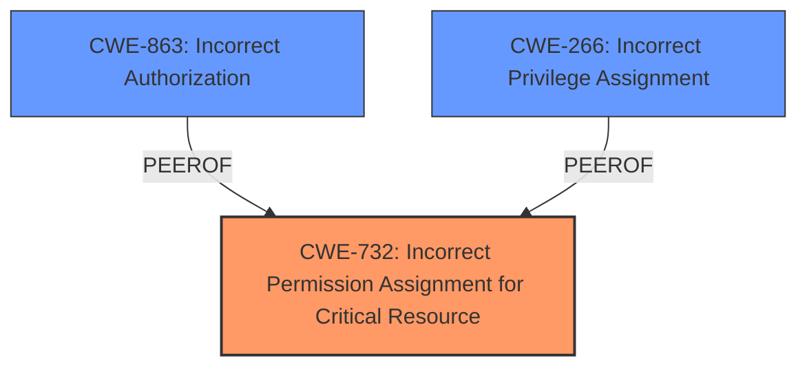

# Analysis Report for CVE-2024-45054

# Vulnerability Analysis Report: CVE-2024-45054

## Description

Hwameistor is an HA local storage system for cloud-native stateful workloads. This ClusterRole has * verbs of * resources. If a malicious user can access the worker node which has hwameistors deployment, he/she can abuse these excessive permissions to do whatever he/she likes to the whole cluster, resulting in a cluster-level privilege escalation. This issue has been patched in version 0.14.6. All users are advised to upgrade. Users unable to upgrade should update and limit the ClusterRole using security-role.

## Vulnerability Description Key Phrases

- **Rootcause:** excessive permissions in Hwameistor ClusterRole
- **Impact:** cluster-level privilege escalation
- **Vector:** malicious user accessing worker node with hwameistors deployment
- **Product:** Hwameistor
- **Version:** before 0.14.6
- **Component:** ClusterRole

## Analysis (with Relationship Data)

# Summary
| CWE ID | CWE Name | Confidence | CWE Abstraction Level | CWE Vulnerability Mapping Label | CWE-Vulnerability Mapping Notes |
|---|---|---|---|---|---|
| CWE-732 | Incorrect Permission Assignment for Critical Resource | 0.9 | Class | Allowed-with-Review | Primary CWE |
| CWE-266 | Incorrect Privilege Assignment | 0.7 | Base | Allowed | Secondary Candidate |
| CWE-863 | Incorrect Authorization | 0.6 | Class | Allowed-with-Review | Secondary Candidate |

## Evidence and Confidence

*   **Confidence Score:** 0.8
*   **Evidence Strength:** HIGH

## Relationship Analysis
The primary weakness identified is CWE-732 [CWE-732: Incorrect Permission Assignment for Critical Resource], which is a Class-level CWE. It relates to the assignment of permissions that allow unintended actors to access security-critical resources. CWE-732 is a parent of CWE-942 [CWE-942: Permissive Cross-domain Policy with Untrusted Domains], which is more specific but doesn't directly apply here. The advisory also suggests possible relationships to privilege management (CWE-269), which is not the primary issue, but a contributing factor. This leads to considering CWE-266 [CWE-266: Incorrect Privilege Assignment] and CWE-863 [CWE-863: Incorrect Authorization] as secondary candidates.



## Vulnerability Chain
The vulnerability chain starts with the **root cause** of **excessive permissions in Hwameistor ClusterRole**. This leads to a cluster-level privilege escalation, where a malicious user accessing a worker node can abuse these permissions.

`Incorrect Permission Assignment` -> `Privilege Escalation` -> `Cluster Compromise`

## Summary of Analysis
The initial analysis pointed towards CWE-732 [CWE-732: Incorrect Permission Assignment for Critical Resource] due to the **incorrect assignment of permissions** to the Hwameistor ClusterRole. This is supported by the vulnerability description which states that the "ClusterRole has * verbs of * resources." The CVE Reference Links Content Summary also confirms the "hwameistor-role ClusterRole had broad, unrestricted permissions."

CWE-732 [CWE-732: Incorrect Permission Assignment for Critical Resource] is chosen as the primary CWE because it directly reflects the **root cause** of the vulnerability: the permissions for a security-critical resource (the ClusterRole) were assigned incorrectly, allowing unintended actors to perform actions they should not be able to.

The related CWEs are considered to give a wider view of the vulnerability:
- CWE-266 [CWE-266: Incorrect Privilege Assignment] is considered as a secondary factor, as the excessive permissions effectively granted incorrect privileges.
- CWE-863 [CWE-863: Incorrect Authorization] is considered because the authorization checks, if any, were insufficient to prevent the privilege escalation.

The selected CWEs are at the optimal level of specificity because they accurately represent the **root cause** and contributing factors of the vulnerability, based on the provided evidence.

Relevant CWE Information:

# Enhanced Context (25 CWEs)
The following CWEs were identified as potentially relevant to this vulnerability:

## CWE-266: Incorrect Privilege Assignment
**Abstraction Level**: Base
**Similarity Score**: 0.80
**Source**: dense

**Description**:
A product incorrectly assigns a privilege to a particular actor, creating an unintended sphere of control for that actor.

**Mapping Guidance**:
- Usage: Allowed
- Rationale: This CWE entry is at the Base level of abstraction, which is a preferred level of abstraction for mapping to the root causes of vulnerabilities.

**Why it could apply:** While the core issue is about permissions assigned to a role (CWE-732), the end result is that a user effectively gets privileges they shouldn't have.

## CWE-863: Incorrect Authorization
**Abstraction Level**: Class
**Similarity Score**: 2269.88
**Source**: sparse

**Description**:
The product performs an authorization check when an actor attempts to access a resource or perform an action, but it does not correctly perform the check.

**Mapping Guidance**:
- Usage: Allowed-with-Review
- Rationale: This CWE entry is a Class and might have Base-level children that would be more appropriate

**Why it could apply:** The authorization check (if present) is not effective in restricting actions, leading to privilege escalation.

## CWE-732: Incorrect Permission Assignment for Critical Resource
**Abstraction Level**: Class
**Similarity Score**: 2167.53
**Source**: sparse

**Description**:
The product specifies permissions for a security-critical resource in a way that allows that resource to be read or modified by unintended actors.

**Mapping Guidance**:
- Usage: Allowed-with-Review
- Rationale: While the name itself indicates an assignment of permissions for resources, this is often misused for vulnerabilities in which "permissions" are not checked, which is an "authorization" weakness (CWE-285 or descendants) within CWE's model [REF-1287].

**Why it applies:** The `hwameistor-role` ClusterRole has overly permissive permissions.


## CWE Relationship Analysis

Current CWEs represent these abstraction levels: .


### Vulnerability Chain Analysis

**Chain starting from CWE-863:**
- 863 (Incorrect Authorization) - ROOT


**Chain starting from CWE-732:**
- 732 (Incorrect Permission Assignment for Critical Resource) - ROOT


### CWE Relationship Diagram

```mermaid
graph TD
    classDef primary fill:#f96,stroke:#333,stroke-width:2px
    classDef secondary fill:#69f,stroke:#333
    classDef tertiary fill:#9e9,stroke:#333
```


*Report generated on 2025-07-13 15:59:07*
