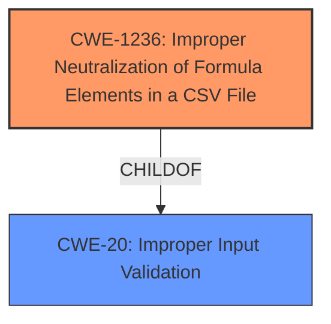

# Analysis for CVE-2024-45084

# Summary

| CWE ID  | CWE Name                                                                                  | Confidence | CWE Abstraction Level | CWE Vulnerability Mapping Label | CWE-Vulnerability Mapping Notes |
| :-------- | :---------------------------------------------------------------------------------------- | :--------- | :---------------------- | :------------------------------ | :------------------------------ |
| CWE-1236 | Improper Neutralization of Formula Elements in a CSV File                                | 1.0        | Base                    | Primary CWE                     | Allowed                       |
| CWE-20    | Improper Input Validation                                                                 | 0.7        | Class                   | Secondary Candidate             | Discouraged                    |

## Evidence and Confidence

*   **Confidence Score:** 0.9
*   **Evidence Strength:** HIGH

## Relationship Analysis

The primary relationship influencing the selection was that CWE-1236 [Improper Neutralization of Formula Elements in a CSV File] directly addresses the formula injection vulnerability described. While CWE-20 [Improper Input Validation] is a broader category, CWE-1236 provides a more specific and accurate representation of the weakness.

## Vulnerability Chain

The vulnerability chain starts with the **improper validation of file contents** (CWE-1236), leading to the possibility of **formula injection**. An authenticated attacker can then leverage this vulnerability to execute arbitrary commands on the system.

## Summary of Analysis

Based on the vulnerability description, the **root cause** is the **improper validation of file contents**, which allows for **formula injection**. The description clearly states that an authenticated attacker can exploit this to execute arbitrary commands.

The primary CWE, CWE-1236 [Improper Neutralization of Formula Elements in a CSV File], is the best fit because it directly addresses the **formula injection** aspect. The retriever results also highlight CWE-1236 as the top candidate. The vulnerability description key phrases also point to **improper validation of file contents** which aligns with CWE-1236.

CWE-20 [Improper Input Validation] was considered but is too broad. While **improper validation** is mentioned, CWE-1236 provides a more specific classification related to **formula injection**, making it a better choice.

Relevant CWE Information:

# Enhanced Context (25 CWEs)
The following CWEs were identified as potentially relevant to this vulnerability:

## CWE-1236: Improper Neutralization of Formula Elements in a CSV File
**Abstraction Level**: Base
**Similarity Score**: 0.79
**Source**: dense

**Description**:
The product saves user-provided information into a Comma-Separated Value (CSV) file, but it does not neutralize or incorrectly neutralizes special elements that could be interpreted as a command when the file is opened by a spreadsheet product.

**Mapping Guidance**:
- Usage: Allowed
- Rationale: This CWE entry is at the Base level of abstraction, which is a preferred level of abstraction for mapping to the root causes of vulnerabilities.

## CWE-20: Improper Input Validation
**Abstraction Level**: Class
**Similarity Score**: 598.92
**Source**: sparse

**Description**:
The product receives input or data, but it does
        not validate or incorrectly validates that the input has the
        properties that are required to process the data safely and
        correctly.

**Mapping Guidance**:
- Usage: Discouraged
- Rationale: CWE-20 is commonly misused in low-information vulnerability reports when lower-level CWEs could be used instead, or when more details about the vulnerability are available [REF-1287]. It is not useful for trend analysis. It is also a level-1 Class (i.e., a child of a Pillar).

**CWE-1236 Explanation**:

*   **How the vulnerability's details match the CWE's characteristics:** The vulnerability allows an attacker to inject formulas into a file that is processed by the application, leading to arbitrary command execution. This directly aligns with CWE-1236, which focuses on the **improper neutralization** of formula elements.
*   **The security implications and potential impact:** An attacker could exploit this vulnerability to execute arbitrary commands on the system, leading to potential data breaches or system compromise.
*   **Any parent-child relationships or chain patterns that influenced your mapping:** CWE-1236 is a child of CWE-20, but it's a more specific fit for this vulnerability.
*   **Whether the weakness is primary or secondary in the vulnerability:** This is the primary weakness.
*   **How the official MITRE mapping guidance influenced your decision:** The mapping guidance for CWE-1236 states that it's at the Base level of abstraction, which is a preferred level. The Usage is "Allowed," further solidifying the choice.

**CWE-20 Explanation**:

*   **Why it was considered but not used as the primary CWE:** CWE-20 is a broad category and doesn't specifically address the **formula injection** aspect of the vulnerability. While it's true that **improper input validation** is involved, CWE-1236 offers a more precise classification.
*   **How the vulnerability's details match the CWE's characteristics:** The vulnerability occurs due to **improper validation of file contents**, aligning with CWE-20.
*   **The security implications and potential impact:** An attacker could exploit this vulnerability to execute arbitrary commands on the system, leading to potential data breaches or system compromise.
*   **Any parent-child relationships or chain patterns that influenced your mapping:** CWE-20 is the parent of CWE-1236.
*   **Whether the weakness is primary or secondary in the vulnerability:** This is a secondary weakness.
*   **How the official MITRE mapping guidance influenced your decision:** The mapping guidance for CWE-20 is "Discouraged," suggesting that a more specific CWE should be used if available, further solidifying the choice of CWE-1236 as the primary CWE.