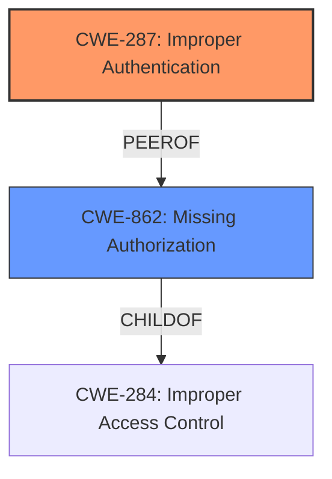

# Raw Analyzer Response for CVE-2024-45113

# Summary
| CWE ID | CWE Name | Confidence | CWE Abstraction Level | CWE Vulnerability Mapping Label | CWE-Vulnerability Mapping Notes |
|---|---|---|---|---|---|
| CWE-287 | Improper Authentication | 1.0 | Class | Primary | Allowed-with-Review |
| CWE-862 | Missing Authorization | 0.7 | Class | Secondary | Allowed-with-Review |

## Evidence and Confidence

*   **Confidence Score:** 0.9
*   **Evidence Strength:** HIGH

## Relationship Analysis
The primary relationship influencing the decision is the guidance differentiating between Authentication and Authorization issues. The vulnerability description and CVE summary explicitly point to "**Improper Authentication**" as the root cause. However, since the impact includes privilege escalation, there is a possibility of a secondary **Missing Authorization** issue if authentication is bypassed and authorization checks are not performed, but the primary weakness appears to be authentication.

## Vulnerability Chain
The vulnerability chain starts with **Improper Authentication (CWE-287)**. If authentication is bypassed, it can lead to **Missing Authorization (CWE-862)**, ultimately resulting in privilege escalation and unauthorized access to the application.

## Summary of Analysis
The initial assessment strongly suggests that the primary weakness is **Improper Authentication (CWE-287)**. This assessment is based on the explicit statements in the vulnerability description and CVE summary, which both highlight "**Improper Authentication**" as the root cause. The retriever results also list CWE-287 as a top candidate. The guidance provided for Authentication vs Authorization further supports this classification. The fact that exploitation does not require user interaction also hints that authentication mechanisms are either flawed or missing.

Although privilege escalation is listed as an impact, the root cause points to a failure in verifying the user's identity. The possibility of **Missing Authorization (CWE-862)** is considered as a secondary weakness if authentication is circumvented altogether and authorization checks are also missing. The final decision is to primarily focus on **CWE-287** as it aligns directly with the provided evidence, but to include **CWE-862** as a possible secondary issue based on the privilege escalation impact.

The selected CWEs are at the Class level, which is appropriate given the available information. Further investigation might reveal a more specific Base or Variant, but the current evidence best supports these Class-level mappings.

Relevant CWE Information:

# Enhanced Context (25 CWEs)
The following CWEs were identified as potentially relevant to this vulnerability:

## CWE-287: Improper Authentication
**Abstraction Level**: Class
**Similarity Score**: 2147.11
**Source**: sparse

**Description**:
The product does not perform or incorrectly performs authentication for an actor, but it requires authentication.

**Mapping Guidance**:
- Usage: Allowed-with-Review
- Rationale: This CWE entry is a Class and might have Base-level children that would be more appropriate

## CWE-862: Missing Authorization
**Abstraction Level**: Class
**Similarity Score**: 1957.41
**Source**: sparse

**Description**:
The product does not perform an authorization check when an actor attempts to access a resource or perform an action.

**Mapping Guidance**:
- Usage: Allowed-with-Review
- Rationale: This CWE entry is a Class and might have Base-level children that would be more appropriate