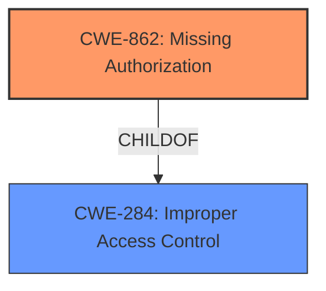

# Analysis Report for CVE-2024-45170

# Vulnerability Analysis Report: CVE-2024-45170

## Description

An issue was discovered in za-internet C-MOR Video Surveillance 5.2401. Due to **improper or missing access control**, low privileged users can use administrative functions of the C-MOR web interface. It was found out that different functions are only available to administrative users. However, access those functions is restricted via the web application user interface and not checked on the server side. Thus, by sending corresponding HTTP requests to the web server of the C-MOR web interface, low privileged users can also use administrative functionality, for instance downloading backup files or changing configuration settings.

## Vulnerability Description Key Phrases

- **Rootcause:** improper or missing access control
- **Impact:** use administrative functions
- **Vector:** sending corresponding HTTP requests
- **Attacker:** low privileged users
- **Product:** za-internet C-MOR Video Surveillance
- **Version:** 5.2401
- **Component:** C-MOR web interface

## Analysis (with Relationship Data)

# Summary
| CWE ID | CWE Name | Confidence | CWE Abstraction Level | CWE Vulnerability Mapping Label | CWE-Vulnerability Mapping Notes |
|---|---|---|---|---|---|
| CWE-862 | Missing Authorization [CWE-862: Missing Authorization] | 1.0 | Base |  | Allowed |
| CWE-284 | Improper Access Control [CWE-284: Improper Access Control] | 0.7 | Pillar |  | Discouraged |

  - The Primary CWE should be first and noted as the Primary CWEs
  - The secondary candidate CWEs should be next and noted as secondary candidates.
  - The confidence is a confidence score 0 to 1 to rate your confidence in your assessment for that CWE.
  - The CWE Abstraction Level as one of these values: Base, Variant, Pillar, Class, Compound
  - The Mapping Notes Usage as one of these values: Allowed, Allowed-with-Review, Prohibited, Discouraged

## Evidence and Confidence

*   **Confidence Score:** 0.9
*   **Evidence Strength:** HIGH

## Relationship Analysis
The primary relationship that influenced the CWE selection was the parent-child relationship between CWE-284 (Improper Access Control) and CWE-862 (Missing Authorization). While the vulnerability description mentions "**improper or missing access control**," the key issue is the lack of authorization checks on the server side, which falls under CWE-862. CWE-284 is a more general term and is discouraged when a more specific CWE is applicable.



Note: The Mermaid diagram should be enclosed in triple backticks with "mermaid" as the language specifier, but do NOT use "markdown" as a language specifier anywhere in your response.

## Vulnerability Chain
The vulnerability chain starts with the **missing authorization** check on the server side (CWE-862). This allows low-privileged users to bypass the UI restrictions and directly access administrative functions by sending HTTP requests. The impact is the ability to download backup files and change configuration settings, leading to unauthorized access and potential data breaches.

## Summary of Analysis
The initial analysis focused on the "**improper or missing access control**" aspect of the vulnerability. However, after reviewing the CWE specifications and the mapping guidance, it became clear that the root cause is the **missing authorization** check (CWE-862) on the server side. The vulnerability description explicitly states that the access restrictions are only enforced on the web application user interface and not checked on the server side. This allows low-privileged users to bypass the UI and directly access administrative functions.

The graph relationships influenced the final selection by highlighting the parent-child relationship between CWE-284 and CWE-862. Since the vulnerability description clearly indicates a **missing authorization** check, CWE-862 is the more specific and appropriate CWE.

The selected CWEs are at the optimal level of specificity because CWE-862 directly addresses the **missing authorization** check on the server side, which is the root cause of the vulnerability. CWE-284 is a more general term and is discouraged when a more specific CWE is applicable.

Relevant CWE Information:

# Enhanced Context (25 CWEs)
The following CWEs were identified as potentially relevant to this vulnerability:

## CWE-41: Improper Resolution of Path Equivalence
**Abstraction Level**: Base
**Similarity Score**: 0.77
**Source**: dense

**Description**:
The product is vulnerable to file system contents disclosure through path equivalence. Path equivalence involves the use of special characters in file and directory names. The associated manipulations are intended to generate multiple names for the same object.

**Mapping Guidance**:
- Usage: Allowed
- Rationale: This CWE entry is at the Base level of abstraction, which is a preferred level of abstraction for mapping to the root causes of vulnerabilities.

I considered this, but it doesn't fit the vulnerability which is related to **missing authorization** rather than path manipulation.

## CWE-425: Direct Request ('Forced Browsing') [CWE-425: Direct Request ('Forced Browsing')]
**Abstraction Level**: Base
**Similarity Score**: 0.77
**Source**: dense

**Description**:
The web application does not adequately enforce appropriate authorization on all restricted URLs, scripts, or files.

**Mapping Guidance**:
- Usage: Allowed
- Rationale: This CWE entry is at the Base level of abstraction, which is a preferred level of abstraction for mapping to the root causes of vulnerabilities.

While this is close, it's more about directly accessing resources without proper authorization, but the root cause is still the **missing authorization** check (CWE-862).

## CWE-807: Reliance on Untrusted Inputs in a Security Decision
**Abstraction Level**: Base
**Similarity Score**: 0.76
**Source**: dense

**Description**:
The product uses a protection mechanism that relies on the existence or values of an input, but the input can be modified by an untrusted actor in a way that bypasses the protection mechanism.

**Mapping Guidance**:
- Usage: Allowed
- Rationale: This CWE entry is at the Base level of abstraction, which is a preferred level of abstraction for mapping to the root causes of vulnerabilities.

This is not the primary issue. The core problem is the **missing authorization**, not the reliance on untrusted inputs.

## CWE-303: Incorrect Implementation of Authentication Algorithm
**Abstraction Level**: Base
**Similarity Score**: 0.76
**Source**: dense

**Description**:
The requirements for the product dictate the use of an established authentication algorithm, but the implementation of the algorithm is incorrect.

**Mapping Guidance**:
- Usage: Allowed
- Rationale: This CWE entry is at the Base level of abstraction, which is a preferred level of abstraction for mapping to the root causes of vulnerabilities.

The vulnerability is not related to authentication algorithms. It's about **missing authorization**.

## CWE-472: External Control of Assumed-Immutable Web Parameter
**Abstraction Level**: Base
**Similarity Score**: 0.76
**Source**: dense

**Description**:
The web application does not sufficiently verify inputs that are assumed to be immutable but are actually externally controllable, such as hidden form fields.

**Mapping Guidance**:
- Usage: Allowed
- Rationale: This CWE entry is at the Base level of abstraction, which is a preferred level of abstraction for mapping to the root causes of vulnerabilities.

This is not the primary issue; the core problem is the **missing authorization** checks.

## CWE-1391: Use of Weak Credentials
**Abstraction Level**: Class
**Similarity Score**: 0.76
**Source**: dense

**Description**:
The product uses weak credentials (such as a default key or hard-coded password) that can be calculated, derived, reused, or guessed by an attacker.

**Mapping Guidance**:
- Usage: Allowed-with-Review
- Rationale: This CWE entry is a Class and might have Base-level children that would be more appropriate

This is not related to the vulnerability description, which focuses on **missing authorization**.

## CWE-267: Privilege Defined With Unsafe Actions
**Abstraction Level**: Base
**Similarity Score**: 0.76
**Source**: dense

**Description**:
A particular privilege, role, capability, or right can be used to perform unsafe actions that were not intended, even when it is assigned to the correct entity.

**Mapping Guidance**:
- Usage: Allowed
- Rationale: This CWE entry is at the Base level of abstraction, which is a preferred level of abstraction for mapping to the root causes of vulnerabilities.

The focus of the vulnerability is **missing authorization**, not unsafe actions related to privileges.

## CWE-497: Exposure of Sensitive System Information to an Unauthorized Control Sphere
**Abstraction Level**: Base
**Similarity Score**: 0.76
**Source**: dense

**Description**:
The product does not properly prevent sensitive system-level information from being accessed by unauthorized actors who do not have the same level of access to the underlying system as the product does.

**Mapping Guidance**:
- Usage: Allowed
- Rationale: This CWE entry is at the Base level of abstraction, which is a preferred level of abstraction for mapping to the root causes of vulnerabilities.

While there is exposure of sensitive information, the root cause is the **missing authorization** that allows unauthorized access.

## CWE-668: Exposure of Resource to Wrong Sphere
**Abstraction Level**: Class
**Similarity Score**: 0.76
**Source**: dense

**Description**:
The product exposes a resource to the wrong control sphere, providing unintended actors with inappropriate access to the resource.

**Mapping Guidance**:
- Usage: Discouraged
- Rationale: CWE-668 is high-level and is often misused as a catch-all when lower-level CWE IDs might be applicable. It is sometimes used for low-information vulnerability


## CWE Relationship Analysis

Current CWEs represent these abstraction levels: .


### Vulnerability Chain Analysis

**Chain starting from CWE-862:**
- 862 (Missing Authorization) - ROOT


**Chain starting from CWE-267:**
- 267 (Privilege Defined With Unsafe Actions) - ROOT


### CWE Relationship Diagram

```mermaid
graph TD
    classDef primary fill:#f96,stroke:#333,stroke-width:2px
    classDef secondary fill:#69f,stroke:#333
    classDef tertiary fill:#9e9,stroke:#333
```


*Report generated on 2025-07-13 16:08:57*
