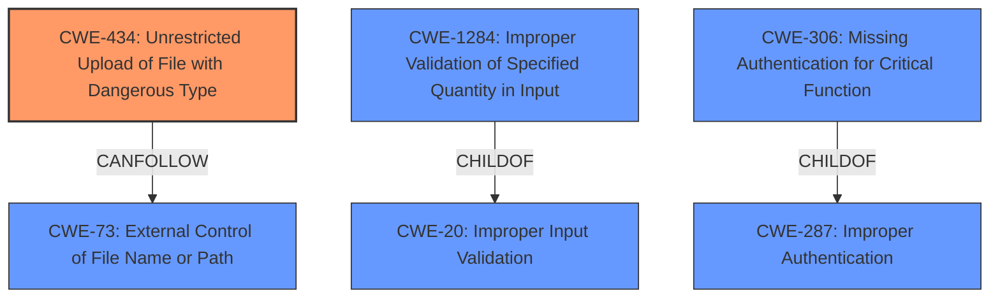

# Raw Analyzer Response for CVE-2024-45171

# Summary

| CWE ID  | CWE Name                                                                                  | Confidence | CWE Abstraction Level | CWE Vulnerability Mapping Label | CWE-Vulnerability Mapping Notes |
| ------- | ----------------------------------------------------------------------------------------- | ---------- | ----------------------- | ------------------------------- | ----------------------------- |
| CWE-434 | Unrestricted Upload of File with Dangerous Type                                           | 0.9        | Base                    | Primary                         | Allowed                       |
| CWE-306 | Missing Authentication for Critical Function                                           | 0.6        | Base                    | Secondary                         | Allowed                       |
| CWE-20 | Improper Input Validation                                                                   | 0.5        | Class                   | Secondary                         | Discouraged                  |
| CWE-646 | Reliance on File Name or Extension of Externally-Supplied File | 0.4        | Variant                   | Secondary                         | Allowed                       |

## Evidence and Confidence

*   **Confidence Score:** 0.8
*   **Evidence Strength:** HIGH

## Relationship Analysis

The primary weakness is CWE-434 [Unrestricted Upload of File with Dangerous Type], which is a base-level CWE. It is related to CWE-73 [External Control of File Name or Path] and can be preceded by it. CWE-20 [Improper Input Validation] is a parent of CWE-1284 [Improper Validation of Specified Quantity in Input]. CWE-306 [Missing Authentication for Critical Function] is a base level CWE, and child of CWE-287 [Improper Authentication].
CWE-434 is a peer of CWE-430 [Insufficient Qualification of File Name] and CWE-436 [Unvalidated Uncompressed Data].

## Vulnerability Chain

The vulnerability chain starts with **improper input validation**, leading to the **unrestricted upload of a file with a dangerous type**. This allows for arbitrary code execution and potential system compromise.
The missing authentication could also be a starting point for this vulnerability.

## Summary of Analysis

The primary vulnerability is CWE-434 [Unrestricted Upload of File with Dangerous Type], supported by the evidence "it is possible to upload dangerous files, for instance PHP code, to the C-MOR system". The system **does not properly validate the content or type of the uploaded file**, allowing an attacker to upload a PHP web shell and execute arbitrary commands. The fact that the filename only needs to contain ".cbkf" to be considered valid is a clear indicator of insufficient validation.
The root cause is the **improper user input validation**.

CWE-306 [Missing Authentication for Critical Function] is considered because the vulnerability description mentions "low-privileged authenticated users can also use this file upload functionality". This indicates a potential lack of proper authentication checks, where even users with minimal privileges can exploit the upload feature.

CWE-20 [Improper Input Validation] is also relevant as a more general weakness, because the root cause is **improper user input validation**. However, CWE-434 [Unrestricted Upload of File with Dangerous Type] is a more precise classification in this instance. The vulnerability description mentions that the only condition for a valid filename is that it contains a .cbkf string, which indicates **improper input validation**.

CWE-646 [Reliance on File Name or Extension of Externally-Supplied File] is considered because the vulnerability relies on the ".cbkf" string in the filename.

The primary decision is based on the evidence from the CVE summary, specifically the "Unrestricted File Upload (CWE-434)" and "Insufficient File Name Validation" points. These details align strongly with the characteristics of CWE-434.

The selected CWEs are at the optimal level of specificity, with CWE-434 being a Base-level CWE that directly addresses the unrestricted file upload vulnerability. CWE-306 is a Base-level CWE that addresses the lack of proper authentication.

**CWEs Considered But Not Used**

*   CWE-22 [Improper Limitation of a Pathname to a Restricted Directory ('Path Traversal')]: While the uploaded files are stored in a specific directory, the primary issue is not about path traversal.
*   CWE-73 [External Control of File Name or Path]: While the filename is externally controlled, the core issue is the unrestricted upload of dangerous file types.
*   CWE-88 [Improper Neutralization of Argument Delimiters in a Command ('Argument Injection')]: This CWE is not applicable as the vulnerability does not involve argument injection.
* CWE-425 [Direct Request ('Forced Browsing')]: The primary issue is not about forced browsing, but about unrestricted file uploads and broken access control.