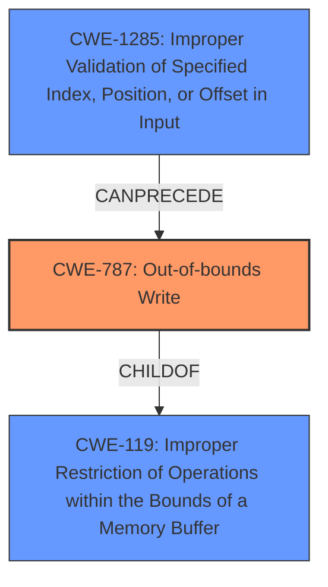

# Enhanced Analysis for CVE-2024-45181

# Summary
| CWE ID  | CWE Name                                                                            | Confidence | CWE Abstraction Level | CWE Vulnerability Mapping Label | CWE-Vulnerability Mapping Notes |
| :-------- | :---------------------------------------------------------------------------------- | :---------- | :---------------------- | :------------------------------ | :------------------------------ |
| CWE-787   | Out-of-bounds Write                                                               | 1.0         | Base                    | Primary                         | Allowed                         |
| CWE-1285  | Improper Validation of Specified Index, Position, or Offset in Input             | 0.7         | Base                    | Secondary                       | Allowed                         |
| CWE-119   | Improper Restriction of Operations within the Bounds of a Memory Buffer           | 0.6         | Class                   | Secondary                       | Discouraged                      |

## Evidence and Confidence

*   **Confidence Score:** 0.8
*   **Evidence Strength:** HIGH

## Relationship Analysis
The primary CWE is CWE-787, which represents the **out-of-bounds write** condition. CWE-119 is a broader class that encompasses buffer overflows in general, and CWE-787 is a specific type of CWE-119. CWE-1285 represents the **improper bounds check** that led to the out-of-bounds write. The relationship between these CWEs is that CWE-1285 can precede CWE-787, leading to CWE-119.



## Vulnerability Chain
The vulnerability chain starts with an **improper bounds check** (CWE-1285), which leads to an **out-of-bounds write** (CWE-787), resulting in kernel **memory corruption** (impact implied by CWE-787 and CWE-119).

## Summary of Analysis
The vulnerability is primarily due to an **out-of-bounds write** caused by an **improper bounds check**. The evidence for this is explicitly stated in the vulnerability description: "**improper bounds check** allows crafted packets to cause an arbitrary address write, resulting in kernel **memory corruption**." The CVE reference link summary confirms this, stating: "Root Cause: Improper buffer bounds check in the WibuKey driver... Weakness/Vulnerability: The vulnerability is a CWE-119: Improper Restriction of Operations within the Bounds of a Memory Buffer. This allows for specially crafted calls to the driver to write data to arbitrary memory addresses, leading to kernel memory corruption."

CWE-787 is the most specific and accurate representation of the **out-of-bounds write** vulnerability. CWE-119 is a broader category, and while applicable, CWE-787 provides more detail. The retriever results also support this, with CWE-787 having the highest score. CWE-1285 represents the root cause of the **improper bounds check** which led to the vulnerability.

Relevant CWE Information:

# Enhanced Context (25 CWEs)
The following CWEs were identified as potentially relevant to this vulnerability:

## CWE-824: Access of Uninitialized Pointer
**Abstraction Level**: Base
**Similarity Score**: 0.74
**Source**: dense

**Description**:
The product accesses or uses a pointer that has not been initialized.

**Mapping Guidance**:
- Usage: Allowed
- Rationale: This CWE entry is at the Base level of abstraction, which is a preferred level of abstraction for mapping to the root causes of vulnerabilities.

**Why Not Used:** This CWE does not align with the vulnerability description of an **improper bounds check** leading to an **out-of-bounds write**.

## CWE-131: Incorrect Calculation of Buffer Size
**Abstraction Level**: Base
**Similarity Score**: 0.74
**Source**: dense

**Description**:
The product does not correctly calculate the size to be used when allocating a buffer, which could lead to a buffer overflow.

**Mapping Guidance**:
- Usage: Allowed
- Rationale: This CWE entry is at the Base level of abstraction, which is a preferred level of abstraction for mapping to the root causes of vulnerabilities.

**Why Not Used:** While an incorrect calculation of buffer size can lead to a buffer overflow, the primary root cause identified is an **improper bounds check**, making CWE-1285 and CWE-787 more relevant.

## CWE-1285: Improper Validation of Specified Index, Position, or Offset in Input
**Abstraction Level**: Base
**Similarity Score**: 0.73
**Source**: dense

**Description**:
The product receives input that is expected to specify an index, position, or offset into an indexable resource such as a buffer or file, but it does not validate or incorrectly validates that the specified index/position/offset has the required properties.

**Mapping Guidance**:
- Usage: Allowed
- Rationale: This CWE entry is at the Base level of abstraction, which is a preferred level of abstraction for mapping to the root causes of vulnerabilities.

**Why Used:** This CWE aligns with the **improper bounds check** root cause and is included as a secondary CWE.

## CWE-119: Improper Restriction of Operations within the Bounds of a Memory Buffer
**Abstraction Level**: Class
**Similarity Score**: 0.72
**Source**: dense

**Description**:
The product performs operations on a memory buffer, but it reads from or writes to a memory location outside the buffer's intended boundary. This may result in read or write operations on unexpected memory locations that could be linked to other variables, data structures, or internal program data.

**Mapping Guidance**:
- Usage: Discouraged
- Rationale: CWE-119 is commonly misused in low-information vulnerability reports when lower-level CWEs could be used instead, or when more details about the vulnerability are available.

**Why Used:** While CWE-787 is more specific, CWE-119 is still relevant as it describes the general issue of operating outside the bounds of a memory buffer. It's included as a secondary CWE but marked as "Discouraged" per MITRE guidance.

## CWE-191: Integer Underflow (Wrap or Wraparound)
**Abstraction Level**: Base
**Similarity Score**: 0.72
**Source**: dense

**Description**:
The product subtracts one value from another, such that the result is less than the minimum allowable integer value, which produces a value that is not equal to the correct result.

**Mapping Guidance**:
- Usage: Allowed
- Rationale: This CWE entry is at the Base level of abstraction, which is a preferred level of abstraction for mapping to the root causes of vulnerabilities.

**Why Not Used:** This CWE is not related to the **improper bounds check** or **out-of-bounds write** vulnerability.

## CWE-755: Improper Handling of Exceptional Conditions
**Abstraction Level**: Class
**Similarity Score**: 0.72
**Source**: dense

**Description**:
The product does not handle or incorrectly handles an exceptional condition.

**Mapping Guidance**:
- Usage: Discouraged
- Rationale: This CWE entry is a level-1 Class (i.e., a child of a Pillar). It might have lower-level children that would be more appropriate

**Why Not Used:** This CWE is too general and doesn't provide specific information about the root cause or weakness.

## CWE-252: Unchecked Return Value
**Abstraction Level**: Base
**Similarity Score**: 0.72
**Source**: dense

**Description**:
The product does not check the return value from a method or function, which can prevent it from detecting unexpected states and conditions.

**Mapping Guidance**:
- Usage: Allowed
- Rationale: This CWE entry is at the Base level of abstraction, which is a preferred level of abstraction for mapping to the root causes of vulnerabilities.

**Why Not Used:** This CWE is not related to the **improper bounds check** or **out-of-bounds write** vulnerability.

## CWE-134: Use of Externally-Controlled Format String
**Abstraction Level**: Base
**Similarity Score**: 0.72
**Source**: dense

**Description**:
The product uses a function that accepts a format string as an argument, but the format string originates from an external source.

**Mapping Guidance**:
- Usage: Allowed
- Rationale: This CWE entry is at the Base level of abstraction, which is a preferred level of abstraction for mapping to the root causes of vulnerabilities.

**Why Not Used:** This CWE is not related to the **improper bounds check** or **out-


## CWE Relationship Analysis

Current CWEs represent these abstraction levels: .


### Vulnerability Chain Analysis

**Chain starting from CWE-131:**
- 131 (Incorrect Calculation of Buffer Size) - ROOT


**Chain starting from CWE-787:**
- 787 (Out-of-bounds Write) - ROOT


### CWE Relationship Diagram

```mermaid
graph TD
    classDef primary fill:#f96,stroke:#333,stroke-width:2px
    classDef secondary fill:#69f,stroke:#333
    classDef tertiary fill:#9e9,stroke:#333
```