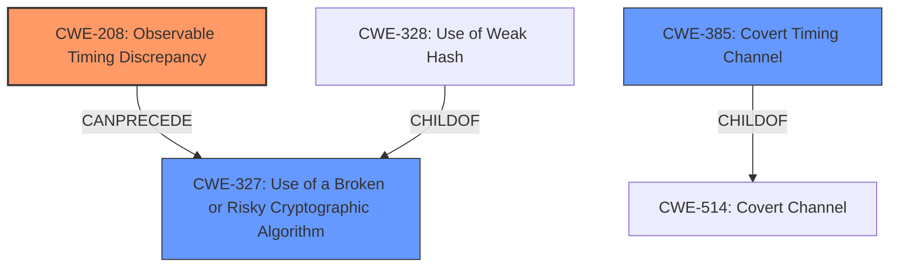

# Enhanced Analysis for CVE-2024-45191

# Summary

| CWE ID  | CWE Name                                                                           | Confidence | CWE Abstraction Level | CWE Vulnerability Mapping Label | CWE-Vulnerability Mapping Notes |
| :-------- | :--------------------------------------------------------------------------------- | :---------- | :---------------------- | :-------------------------------- | :-------------------------------- |
| CWE-208   | Observable Timing Discrepancy                                                      | 0.9         | Base                    | Primary CWE                     | Allowed                           |
| CWE-327   | Use of a Broken or Risky Cryptographic Algorithm                                  | 0.7         | Class                   | Secondary Candidate               | Allowed-with-Review             |
| CWE-385   | Covert Timing Channel                                                              | 0.6         | Base                    | Secondary Candidate               | Allowed                           |

## Evidence and Confidence

*   **Confidence Score:** 0.8
*   **Evidence Strength:** HIGH

## Relationship Analysis

The primary CWE selected is CWE-208 Observable Timing Discrepancy, which is a Base level CWE. The vulnerability description clearly states that the AES implementation is vulnerable to **cache-timing attacks**. The retriever results also list CWE-208 as the top candidate.

CWE-327 Use of a Broken or Risky Cryptographic Algorithm is a Class level CWE and parent of CWE-328 Use of Weak Hash. The vulnerability doesn't explicitly state that the cryptographic algorithm is broken, but the timing attack makes it risky and less secure.

CWE-385 Covert Timing Channel is another potential candidate. It is a base level CWE and child of CWE-514. It describes the timing channel as a way to leak information.



## Vulnerability Chain

The vulnerability chain starts with the **cache-timing attacks** in the AES implementation due to the use of S-boxes (lookup table). This leads to observable timing discrepancies, potentially allowing an attacker to extract the secret key.
  - **Root Cause:** **Cache-timing attacks** due to use of S-boxes.
  - **Weakness:** Observable Timing Discrepancy (CWE-208)
  - **Impact:** Potential secret key extraction

## Summary of Analysis

The primary assessment is based on the vulnerability description and the CVE Reference Links Content Summary. The key phrase "cache-timing attacks" directly points to timing-related weaknesses. The CVE Reference Links Content Summary confirms that the root cause is the use of S-boxes, which leads to cache hits and misses that reveal information about the key. This aligns perfectly with CWE-208 (Observable Timing Discrepancy).

The graph relationships influenced the decision to consider CWE-327 and CWE-385 as secondary candidates. While the primary issue is the timing discrepancy, the use of a vulnerable AES implementation could be considered a risky cryptographic algorithm.

The selected CWEs are at the optimal level of specificity because CWE-208 directly addresses the **observable timing discrepancy**, which is the core weakness exploited in this vulnerability.

Relevant CWE Information:

*   **CWE-208 Observable Timing Discrepancy**: The product uses a software-based implementation of AES that relies on a look-up table (S-box) for the `SubWord` step. This design makes the implementation vulnerable to **cache-timing attacks**.
*   **CWE-327 Use of a Broken or Risky Cryptographic Algorithm**: The AES implementation is vulnerable to **cache-timing attacks**. This could be considered a risky cryptographic algorithm.
*   **CWE-385 Covert Timing Channel**: The timing channel is a way to leak information about the key, which is a covert channel.


## CWE Relationship Analysis

Current CWEs represent these abstraction levels: .


### Vulnerability Chain Analysis

**Chain starting from CWE-327:**
- 327 (Use of a Broken or Risky Cryptographic Algorithm) - ROOT


**Chain starting from CWE-514:**
- 514 (Covert Channel) - ROOT


### CWE Relationship Diagram

```mermaid
graph TD
    classDef primary fill:#f96,stroke:#333,stroke-width:2px
    classDef secondary fill:#69f,stroke:#333
    classDef tertiary fill:#9e9,stroke:#333
```