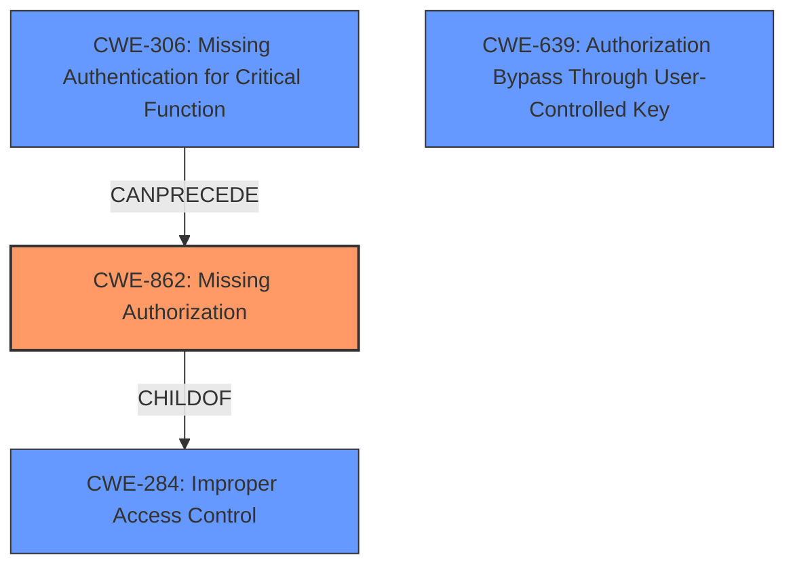

# Analysis for CVE-2024-45233

# Summary
| CWE ID    | CWE Name                                                              | Confidence | CWE Abstraction Level | CWE Vulnerability Mapping Label | CWE-Vulnerability Mapping Notes |
| --------- | --------------------------------------------------------------------- | ---------- | --------------------- | ------------------------------- | ----------------------------- |
| CWE-862   | Missing Authorization                                                 | 0.9        | Class                 | Primary CWE                     | Allowed-with-Review           |
| CWE-284   | Improper Access Control                                               | 0.7        | Class                 | Secondary Candidate              | Discouraged                   |
| CWE-306   | Missing Authentication for Critical Function                          | 0.6        | Base                  | Secondary Candidate              | Allowed                       |
| CWE-639   | Authorization Bypass Through User-Controlled Key                      | 0.5        | Base                  | Secondary Candidate              | Allowed                       |

## Evidence and Confidence

*   **Confidence Score:** 0.8
*   **Evidence Strength:** HIGH

## Relationship Analysis
The primary weakness is the **missing authorization** check, represented by CWE-862. This is a class-level CWE. Several other CWEs are related:
  - CWE-284 (Improper Access Control) is a parent of CWE-862 and represents a broader category of access control issues.
  - CWE-306 (Missing Authentication for Critical Function) relates to missing authentication, which can precede authorization issues.
  - CWE-639 (Authorization Bypass Through User-Controlled Key) represents a specific case of authorization bypass.

The choice of CWE-862 is preferred over CWE-284 as it more specifically describes the **missing** authorization check. The relationship to CWE-306 is considered, but the description indicates the functions require an authenticated user, so authorization is the issue. CWE-639 is a more specific scenario that is not described in the vulnerability.

## Vulnerability Chain
The vulnerability chain starts with the **missing authorization** check (CWE-862) in the `OutputController`. This allows an unauthenticated attacker to directly call several actions, leading to broken access control and the ability to edit, update, delete, or export data of persisted forms.
  - **Root Cause:** CWE-862 (**Missing Authorization**)
  - **Impact:** Broken Access Control leading to data modification/export.

## Summary of Analysis
The initial analysis focused on identifying the root cause of the vulnerability based on the provided evidence. The vulnerability description key phrases explicitly mention "**missing or insufficiently implemented access checks**," which directly points to an authorization issue. The CVE Reference Links Content Summary further clarifies this by highlighting the **missing** authorization checks in the `OutputController`.

The retriever results suggested several potential CWEs, including CWE-285 (Improper Authorization), CWE-863 (Incorrect Authorization), CWE-862 (Missing Authorization), CWE-287 (Improper Authentication), and CWE-639 (Authorization Bypass Through User-Controlled Key).

Based on the evidence and the CWE specifications, CWE-862 (Missing Authorization) was selected as the primary CWE because it accurately reflects the root cause: the product does not perform an authorization check when an actor attempts to access a resource or perform an action.

CWE-284 (Improper Access Control) was considered but ultimately deemed less specific than CWE-862. While CWE-284 is a broader category encompassing various access control failures, the vulnerability description explicitly indicates a **missing** authorization check, making CWE-862 a more precise fit.

CWE-306 (Missing Authentication for Critical Function) was also considered, as it addresses the absence of authentication. However, the vulnerability description implies that the affected functionalities require an authenticated user, thus the core issue lies in the **missing** authorization checks after authentication.

CWE-639 (Authorization Bypass Through User-Controlled Key) was considered but not selected because the vulnerability does not specifically involve the modification of a key value to bypass authorization.

The decision to select CWE-862 is supported by the MITRE mapping guidance, which recommends using more specific child CWEs over general parent CWEs when the evidence supports it.

The confidence in this mapping is high (0.9) due to the clear and explicit evidence in the vulnerability description and the CVE Reference Links Content Summary. The selection of CWE-862 is at the optimal level of specificity, accurately representing the root cause of the vulnerability.