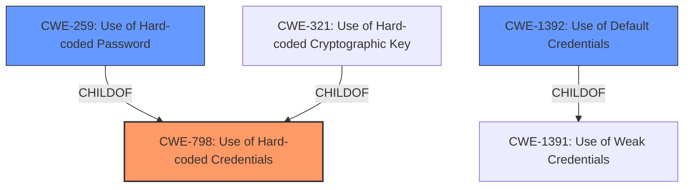

# Analysis Report for CVE-2024-45275

# Vulnerability Analysis Report: CVE-2024-45275

## Description

The devices contain two hard coded user accounts with hardcoded passwords that allow an unauthenticated remote attacker for full control of the affected devices.

## Vulnerability Description Key Phrases

- **Rootcause:** hardcoded user accounts with hardcoded passwords
- **Impact:** full control of the affected devices
- **Attacker:** unauthenticated remote attacker

## Analysis (with Relationship Data)

# Summary
| CWE ID | CWE Name | Confidence | CWE Abstraction Level | CWE Vulnerability Mapping Label | CWE-Vulnerability Mapping Notes |
|---|---|---|---|---|---|
| CWE-798 | Use of Hard-coded Credentials | 1.0 | Base | Primary | Allowed |
| CWE-259 | Use of Hard-coded Password | 0.9 | Variant | Secondary Candidate | Allowed |
| CWE-1392 | Use of Default Credentials | 0.7 | Base | Secondary Candidate | Allowed |

## Evidence and Confidence

*   **Confidence Score:** 0.9
*   **Evidence Strength:** HIGH

## Relationship Analysis
The primary CWE is CWE-798 (Use of Hard-coded Credentials), which is a base-level CWE. CWE-259 (Use of Hard-coded Password) and CWE-321 (Use of Hard-coded Cryptographic Key) are variants of CWE-798. CWE-1392 (Use of Default Credentials) is related to CWE-1391 (Use of Weak Credentials). The selection of CWE-798 as primary is based on the fact that the vulnerability description mentions hardcoded credentials (user accounts with hardcoded passwords).



## Vulnerability Chain
The vulnerability chain starts with the **hardcoded user accounts with hardcoded passwords** (CWE-798). This leads to an unauthenticated remote attacker gaining full control of the affected devices, thus achieving remote code execution.

## Summary of Analysis
The analysis is based on the provided evidence, which clearly states the presence of **hardcoded user accounts with hardcoded passwords**. This maps directly to CWE-798 (Use of Hard-coded Credentials).

The vulnerability description states: "The devices contain two **hard coded user accounts with hardcoded passwords** that allow an unauthenticated remote attacker for full control of the affected devices." The CVE Reference Links Content Summary also mentions: "The vulnerability stems from the presence of two **hardcoded user accounts with hardcoded passwords** within the affected devices."

CWE-798 is chosen as the primary CWE because it directly reflects the root cause: the use of hardcoded credentials. While CWE-259 (Use of Hard-coded Password) is a more specific variant, the description mentions both user accounts and passwords, making CWE-798 a more accurate representation. CWE-1392 (Use of Default Credentials) could also be a secondary candidate, but "hardcoded" is more precise than "default" in this case.

The selected CWEs are at the optimal level of specificity because they accurately describe the **root cause** of the vulnerability without being overly specific or general.

Relevant CWE Information:

# Enhanced Context (25 CWEs)
The following CWEs were identified as potentially relevant to this vulnerability:

## CWE-798: Use of Hard-coded Credentials
**Abstraction Level**: Base
**Similarity Score**: 0.82
**Source**: dense

**Description**:
The product contains hard-coded credentials, such as a password or cryptographic key.

**Mapping Guidance**:
- Usage: Allowed
- Rationale: This CWE entry is at the Base level of abstraction, which is a preferred level of abstraction for mapping to the root causes of vulnerabilities.

**Explanation**: This CWE directly matches the **root cause** of the vulnerability, which is the presence of **hard-coded credentials**.

## CWE-259: Use of Hard-coded Password
**Abstraction Level**: Variant
**Similarity Score**: 0.80
**Source**: dense

**Description**:
The product contains a **hard-coded password**, which it uses for its own inbound authentication or for outbound communication to external components.

**Mapping Guidance**:
- Usage: Allowed
- Rationale: This CWE entry is at the Variant level of abstraction, which is a preferred level of abstraction for mapping to the root causes of vulnerabilities.

**Explanation**: This is a more specific variant of CWE-798, focusing specifically on **hard-coded passwords**. Since the vulnerability involves both user accounts and passwords, CWE-798 is a slightly better fit as the primary.

## CWE-1391: Use of Weak Credentials
**Abstraction Level**: Class
**Similarity Score**: 0.79
**Source**: dense

**Description**:
The product uses weak credentials (such as a default key or **hard-coded password**) that can be calculated, derived, reused, or guessed by an attacker.

**Mapping Guidance**:
- Usage: Allowed-with-Review
- Rationale: This CWE entry is a Class and might have Base-level children that would be more appropriate

**Explanation**: This CWE is too general, as it encompasses various types of weak credentials, not just **hard-coded ones**.

## CWE-321: Use of Hard-coded Cryptographic Key
**Abstraction Level**: Variant
**Similarity Score**: 0.77
**Source**: dense

**Description**:
The use of a **hard-coded cryptographic key** significantly increases the possibility that encrypted data may be recovered.

**Mapping Guidance**:
- Usage: Allowed
- Rationale: This CWE entry is at the Variant level of abstraction, which is a preferred level of abstraction for mapping to the root causes of vulnerabilities.

**Explanation**: This CWE is not applicable because the vulnerability description does not specifically mention cryptographic keys.

## CWE-1392: Use of Default Credentials
**Abstraction Level**: Base
**Similarity Score**: 0.77
**Source**: dense

**Description**:
The product uses **default credentials** (such as passwords or cryptographic keys) for potentially critical functionality.

**Mapping Guidance**:
- Usage: Allowed
- Rationale: This CWE entry is at the Base level of abstraction, which is a preferred level of abstraction for mapping to the root causes of vulnerabilities.

**Explanation**: Although the credentials are hardcoded, they could be considered defaults. Thus, I am including it as a secondary candidate.

## CWE-288: Authentication Bypass Using an Alternate Path or Channel
**Abstraction Level**: Base
**Similarity Score**: 0.77
**Source**: dense

**Description**:
The product requires authentication, but the product has an alternate path or channel that does not require authentication.

**Mapping Guidance**:
- Usage: Allowed
- Rationale: This CWE entry is at the Base level of abstraction, which is a preferred level of abstraction for mapping to the root causes of vulnerabilities.

**Explanation**: This CWE is not applicable because the vulnerability is due to the use of hardcoded credentials, not an alternate authentication path.

## CWE-912: Hidden Functionality
**Abstraction Level**: Class
**Similarity Score**: 0.76
**Source**: dense

**Description**:
The product contains functionality that is not documented, not part of the specification, and not accessible through an interface or command sequence that is obvious to the product's users or administrators.

**Mapping Guidance**:
- Usage: Allowed-with-Review
- Rationale: This CWE entry is a Class and might have Base-level children that would be more appropriate

**Explanation**: This CWE is not applicable as the vulnerability is not about hidden functionality.

## CWE-1188: Initialization of a Resource with an Insecure Default
**Abstraction Level**: Base
**Similarity Score**: 0.76
**Source**: dense

**Description**:
The product initializes or sets a resource with a default that is intended to be changed by the administrator, but the default is not secure.

**Mapping Guidance**:
- Usage: Allowed
- Rationale: This CWE entry is at the Base level of abstraction, which is a preferred level of abstraction for mapping to the root causes of vulnerabilities.

**Explanation**: This CWE is not applicable as the vulnerability is not about insecure defaults that should be changed.

## CWE-312: Cleartext Storage of Sensitive Information
**Abstraction Level**: Base
**Similarity Score**: 0.75
**Source**: dense

**Description**:
The product stores sensitive information in cleartext within a resource that might be accessible to another control sphere.

**Mapping Guidance**:
- Usage: Allowed
- Rationale: This CWE entry is at the Base level of abstraction, which is a preferred level of abstraction for mapping to the root causes of vulnerabilities.

**Explanation**: This CWE is not applicable, as there is no mention of clear


## CWE Relationship Analysis

Current CWEs represent these abstraction levels: .


### Vulnerability Chain Analysis

**Chain starting from CWE-288:**
- 288 (Authentication Bypass Using an Alternate Path or Channel) - ROOT


**Chain starting from CWE-321:**
- 321 (Use of Hard-coded Cryptographic Key) - ROOT


### CWE Relationship Diagram

```mermaid
graph TD
    classDef primary fill:#f96,stroke:#333,stroke-width:2px
    classDef secondary fill:#69f,stroke:#333
    classDef tertiary fill:#9e9,stroke:#333
```


*Report generated on 2025-07-13 16:16:00*
