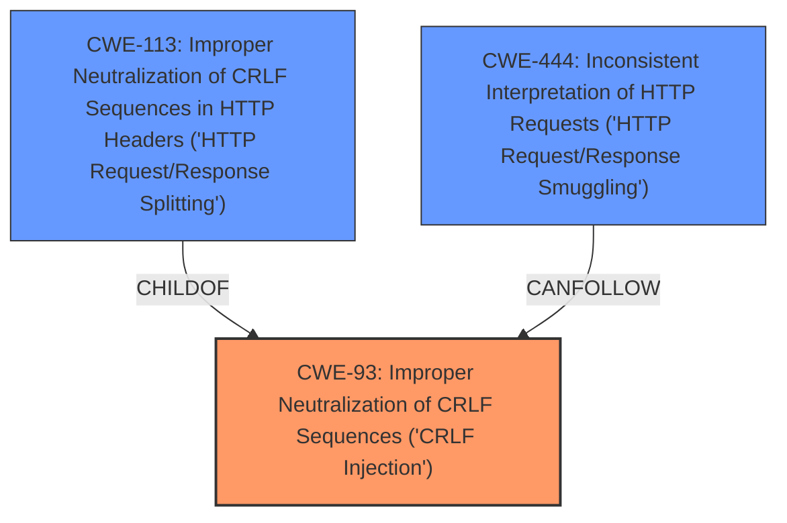

# Analysis for CVE-2024-45302

# Summary

| CWE ID | CWE Name | Confidence | CWE Abstraction Level | CWE Vulnerability Mapping Label | CWE-Vulnerability Mapping Notes |
|---|---|---|---|---|---|
| CWE-93 | Improper Neutralization of CRLF Sequences ('CRLF Injection') | 1.0 | Base | Primary | Allowed |
| CWE-113 | Improper Neutralization of CRLF Sequences in HTTP Headers ('HTTP Request/Response Splitting') | 0.9 | Variant | Secondary Candidate | Allowed |
| CWE-444 | Inconsistent Interpretation of HTTP Requests ('HTTP Request/Response Smuggling') | 0.7 | Base | Secondary Candidate | Allowed |

## Evidence and Confidence

*   **Confidence Score:** 0.9
*   **Evidence Strength:** HIGH

## Relationship Analysis

The primary CWE is CWE-93, which represents the fundamental **CRLF injection** issue. CWE-113 is a variant that is specific to HTTP headers, and CWE-444 represents the potential impact of exploiting the CRLF injection.

## Vulnerability Chain

The vulnerability chain starts with the **improper handling of header values** in RestSharp, leading to **CRLF injection**. This can then be exploited to achieve HTTP request smuggling or splitting, and potentially SSRF.

CWE-93 (Root Cause: **CRLF Injection**) -> CWE-113 (Specific Context: HTTP Headers) -> CWE-444 (Potential Impact: HTTP Request Smuggling)

## Summary of Analysis

The vulnerability in RestSharp allows for **CRLF injection** due to the `HttpHeaders.TryAddWithoutValidation` method **not sanitizing header values**. This can lead to HTTP request smuggling and other attacks.

The primary CWE is CWE-93, which captures the core issue of **improper neutralization of CRLF sequences**. CWE-113 is a more specific variant focusing on HTTP headers, while CWE-444 describes a potential consequence (HTTP request smuggling).

The evidence from the vulnerability description supports this classification:

*   "The second argument to `RestRequest.AddHeader` (the header value) is vulnerable to **CRLF injection**."
*   "The way HTTP headers are added to a request is via the `HttpHeaders.TryAddWithoutValidation` method which does not check for CRLF characters in the header value."
*   "In general, **CRLF-injection** into a HTTP header (when using HTTP/1.1) means that one can inject additional HTTP headers or smuggle whole HTTP requests."
*   "If an application using the RestSharp library passes a user-controllable value through to a header, then that application becomes vulnerable to **CRLF-injection**."

The retriever results also support this, with CWE-93 and CWE-113 being the top matches.

CWE-79 (Improper Neutralization of Input During Web Page Generation ('Cross-site Scripting')) was considered, but it's not applicable because the vulnerability is not related to web page generation or XSS. CWE-78 (Improper Neutralization of Special Elements used in an OS Command ('OS Command Injection')) was not selected because the vulnerability is not related to OS command execution. CWE-1333 (Inefficient Regular Expression Complexity) was not selected because there is no indication in the description that regular expressions are involved. CWE-74 (Improper Neutralization of Special Elements in Output Used by a Downstream Component ('Injection')) was considered, but CWE-93 is a more specific and appropriate choice.