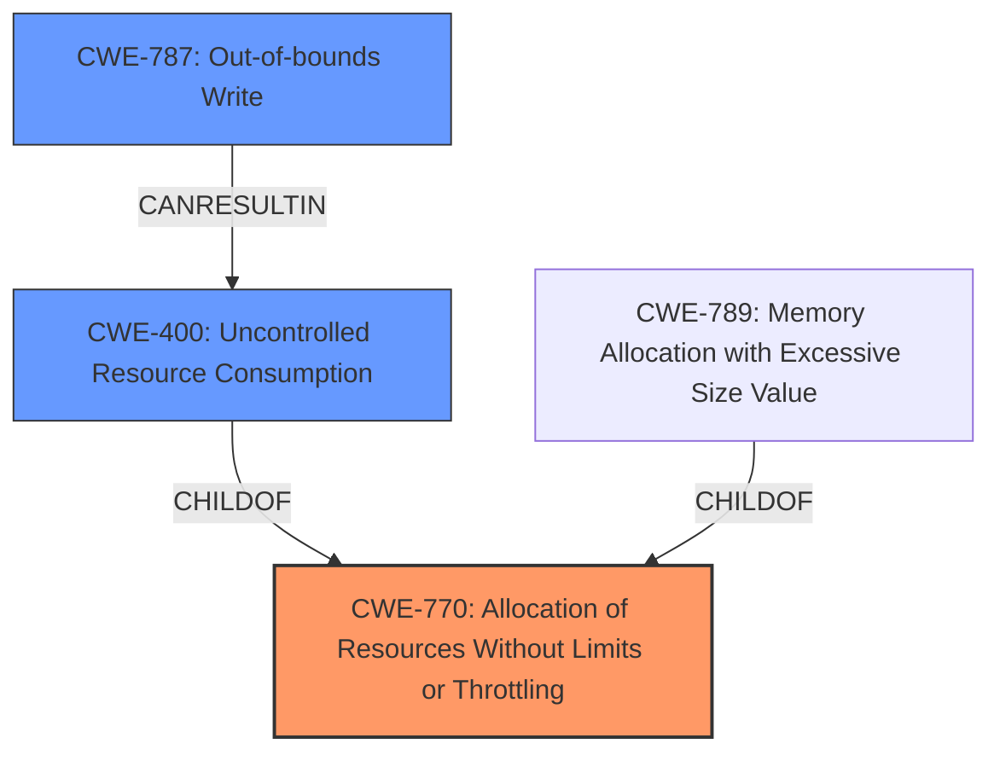

# Analysis for CVE-2024-45311

# Summary
| CWE ID | CWE Name | Confidence | CWE Abstraction Level | CWE Vulnerability Mapping Label | CWE-Vulnerability Mapping Notes |
|---|---|---|---|---|---|
| CWE-770 | Allocation of Resources Without Limits or Throttling | 0.85 | Base | Allowed | Primary CWE - Addresses the **lack of limits** on resource allocation |
| CWE-400 | Uncontrolled Resource Consumption | 0.75 | Class | Discouraged | Secondary Candidate - Represents the resulting resource exhaustion |
| CWE-787 | Out-of-bounds Write | 0.65 | Base | Allowed | Secondary Candidate - Addresses the specific type of memory corruption |

## Evidence and Confidence

*   **Confidence Score:** 0.75
*   **Evidence Strength:** MEDIUM

## Relationship Analysis
The primary CWE, CWE-770, is a base-level weakness describing the **unlimited allocation of resources**. CWE-400, a class-level CWE, represents the consequence of such uncontrolled allocation: **resource exhaustion**. CWE-787, also a base-level CWE, indicates a specific type of memory corruption (**out-of-bounds write**) that can occur due to the improper resource handling.
CWE-770 is a parent of CWE-789.

## Vulnerability Chain
The vulnerability chain starts with **unlimited resource allocation** (CWE-770), which leads to **uncontrolled resource consumption** (CWE-400). In specific scenarios described in the vulnerability, this can then result in an **out-of-bounds write** (CWE-787) leading to a panic (Denial of Service).

## Summary of Analysis
The initial assessment considered the retriever results, particularly CWE-770 (**Allocation of Resources Without Limits or Throttling**) and CWE-400 (**Uncontrolled Resource Consumption**). The description and CVE reference links content summary indicate that the `quinn-proto` library **does not properly limit** the allocation of resources when handling incoming connections, especially after a `retry()` call. The vulnerability manifests as a panic (Denial of Service) due to the **incorrect state management** and **lack of proper cleanup**, suggesting **uncontrolled resource consumption**.

The relationship graph reinforces that **CWE-770** is a strong candidate as the root cause, leading to **CWE-400** as a consequence. CWE-787 is added as it is a type of memory corruption from the **incorrect handling of buffers**.

The selected CWEs are at the optimal level of specificity because they accurately capture the **lack of resource limits** (**CWE-770**), the resulting **resource consumption** (**CWE-400**), and a potential consequence such as **out-of-bounds write** (**CWE-787**). The evidence directly supports the identification of these weaknesses from the following:
- **Vulnerability Description Key Phrases**
  - **weakness:** **panic when calling retry() on unvalidated connection**
- **CVE Reference Links Content Summary**
  - **Incorrect state management after retry:** The `Endpoint` struct's handling of `Incoming` connections after a `retry` call is flawed. After calling `retry`, the code does not remove the initial connection state and associated buffer from the endpoint's data structures. This results in a double free or an out-of-bounds access when a duplicate initial packet for the same connection is subsequently received and either rejected or accepted.

The decision is made with a confidence score of 0.75 because, while the evidence strongly suggests **uncontrolled resource allocation** and **consumption**, the exact mechanism of resource exhaustion and the steps leading to the panic could benefit from further investigation.

Relevant CWE Information:

### CWE-770: Allocation of Resources Without Limits or Throttling
**Technical Explanation:** The `quinn-proto` library doesn't properly restrict the number or size of resources allocated for incoming connections, especially after a `retry()` call. This can lead to excessive memory usage and other resource exhaustion.
**Security Implications:** An attacker can exploit this vulnerability to cause a denial of service by exhausting the server's resources, making it unavailable to legitimate users.
**Relationship to other CWEs:** ChildOf CWE-400 (**Uncontrolled Resource Consumption**). ParentOf CWE-789 (**Memory Allocation with Excessive Size Value**).
**Primary/Secondary:** Primary CWE, representing the root cause.
**Mapping Guidance Influence:** The MITRE mapping guidance allows the use of CWE-770, as it is a base-level CWE that accurately reflects the root cause.

### CWE-400: Uncontrolled Resource Consumption
**Technical Explanation:** The product does not properly control the allocation and maintenance of a limited resource, thereby enabling an actor to influence the amount of resources consumed, eventually leading to the exhaustion of available resources.
**Security Implications:** An attacker can exploit this vulnerability to cause a denial of service by exhausting the server's resources, making it unavailable to legitimate users.
**Relationship to other CWEs:** ChildOf CWE-664 (**Improper Control of a Resource Through its Lifetime**).
**Primary/Secondary:** Secondary CWE, representing the impact.
**Mapping Guidance Influence:** The MITRE mapping guidance discourages the use of CWE-400 for low-information vulnerability reports. However, in this case, the description provides enough context to justify its inclusion, as it represents the result of the **lack of resource limits** (CWE-770).

### CWE-787: Out-of-bounds Write
**Technical Explanation:** The product writes data past the end, or before the beginning, of the intended buffer.
**Security Implications:** This can lead to memory corruption, potentially causing a crash or allowing an attacker to execute arbitrary code.
**Relationship to other CWEs:** ChildOf CWE-119 (**Improper Restriction of Operations within the Bounds of a Memory Buffer**).
**Primary/Secondary:** Secondary CWE, representing a potential consequence of the **incorrect buffer management** after a `retry()` call.
**Mapping Guidance Influence:** The MITRE mapping guidance allows the use of CWE-787, as it is a base-level CWE that accurately reflects the memory corruption.

### Other CWEs Considered and Rejected:
- **CWE-789 (Memory Allocation with Excessive Size Value):** While the retriever results included this CWE, the description does not explicitly mention excessive size values being the primary issue. The core problem is the **lack of limits** on allocating resources, making CWE-770 a better fit.
- **CWE-1284 (Improper Validation of Specified Quantity in Input):** This CWE relates to improper validation of input quantities. While input is involved, the vulnerability primarily stems from the **lack of resource management** after a `retry()` call, making CWE-770 more appropriate.
- **CWE-362 (Concurrent Execution using Shared Resource with Improper Synchronization ('Race Condition'))**: While concurrency might be present, there is no clear indication of race conditions being the primary cause. The issue lies in the **uncontrolled resource allocation**, making CWE-770 a better fit.