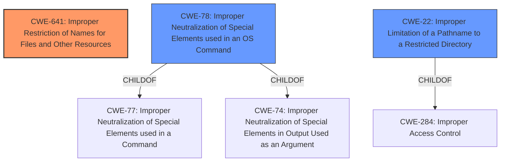

# Analysis for CVE-2024-45312

# Summary

| CWE ID | CWE Name | Confidence | CWE Abstraction Level | CWE Vulnerability Mapping Label | CWE-Vulnerability Mapping Notes |
|---|---|---|---|---|---|
| CWE-641 | Improper Restriction of Names for Files and Other Resources | 0.8 | Base | Allowed | Primary CWE. The application fails to restrict the filename passed to aspell, allowing an attacker to specify arbitrary files. |
| CWE-78 | Improper Neutralization of Special Elements used in an OS Command ('OS Command Injection') | 0.6 | Base | Allowed | Secondary candidate. The lack of sanitization of the language parameter could potentially lead to OS Command Injection. |
| CWE-22 | Improper Limitation of a Pathname to a Restricted Directory ('Path Traversal') | 0.5 | Base | Allowed | Secondary candidate. The vulnerability description mentions "File access is limited to the scope of the overleaf server" which could indicate path traversal is possible within the server's scope. |

## Evidence and Confidence

*   **Confidence Score:** 0.7
*   **Evidence Strength:** MEDIUM

## Relationship Analysis
The primary CWE, CWE-641, focuses on the improper restriction of filenames. CWE-78 and CWE-22 represent potential consequences if the arbitrary filename handling leads to command injection or path traversal, respectively. These are children of more general injection or access control CWEs. The selection of CWE-641 as the primary CWE highlights the root cause, while the other two are potential exploits of the root cause.

## Vulnerability Chain
The vulnerability chain starts with the **improper restriction of names for files (CWE-641)**. This allows an attacker to specify an arbitrary filename to be loaded as a dictionary. This could lead to:
1.  **Improper Neutralization of Special Elements used in an OS Command ('OS Command Injection') (CWE-78)** if the filename contains OS command special elements.
2.  **Improper Limitation of a Pathname to a Restricted Directory ('Path Traversal') (CWE-22)** if the filename contains path traversal sequences.
The end result is arbitrary file access, as described in the vulnerability.

## Summary of Analysis
The initial analysis of the vulnerability description indicates a weakness related to improper input validation, specifically concerning the language parameter passed to the `aspell` executable. The retriever results and complete CWE specifications were used to narrow down the potential CWEs.

The strongest evidence supporting the classification comes from the vulnerability description and the CVE Reference Links Content Summary, specifically:

*   "allows an arbitrary language parameter in client spelling requests to be passed to the `aspell` executable"
*   "This causes `aspell` to attempt to load a dictionary file with an arbitrary filename."
*   "The vulnerability stems from insufficient input sanitization... the `language` parameter in client spelling requests was not properly validated."

These points directly relate to the application's failure to restrict the filename passed to `aspell`, leading to the selection of CWE-641 as the primary weakness. The other potential CWEs (CWE-78, CWE-22) were considered as secondary candidates because they represent possible exploitation routes stemming from the initial weakness.

CWE-641 is chosen as the primary CWE because it directly addresses the root cause: the **improper restriction** of filenames. This is more specific than a generic input validation error.

Other CWEs Considered but Not Used:

*   CWE-78 and CWE-22: These were considered as secondary weaknesses because they describe potential exploitation routes.
*   CWE-918 (Server-Side Request Forgery): Not directly applicable, as the vulnerability doesn't involve making requests to internal servers.
*   CWE-94 (Improper Control of Generation of Code ('Code Injection')): Potentially applicable if the arbitrary file access leads to code execution, but not the primary issue.
*   CWE-1336 (Improper Neutralization of Special Elements Used in a Template Engine): Not applicable, as the vulnerability doesn't involve a template engine.