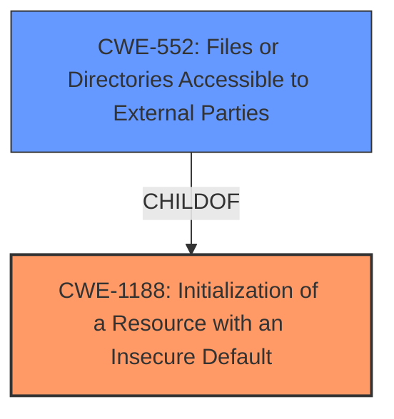

# Analysis Report for CVE-2024-45313

# Vulnerability Analysis Report: CVE-2024-45313

## Description

Overleaf is a web-based collaborative LaTeX editor. When installing Server Pro using the Overleaf Toolkit from before 2024-07-17 or legacy docker-compose.yml from before 2024-08-28, the configuration for LaTeX compiles was insecure by default, requiring the administrator to enable the security features via a configuration setting (`SIBLING_CONTAINERS_ENABLED` in Toolkit, `SANDBOXED_COMPILES` in legacy docker-compose/custom deployments). If these security features are not enabled then users have access to the `sharelatex` container resources (filesystem, network, environment variables) when running compiles, leading to **multiple file access vulnerabilities**, either directly or via symlinks created during compiles. The setting has now been changed to be secure by default for new installs in the Toolkit and legacy docker-compose deployment. The Overleaf Toolkit has been updated to set `SIBLING_CONTAINERS_ENABLED=true` by default for new installs. It is recommended that any existing installations using the previous default setting migrate to using sibling containers. Existing installations can set `SIBLING_CONTAINERS_ENABLED=true` in `config/overleaf.rc` as a mitigation. In legacy docker-compose/custom deployments `SANDBOXED_COMPILES=true` should be used.

## Vulnerability Description Key Phrases

- **Rootcause:** insecure default configuration
- **Weakness:** multiple file access vulnerabilities
- **Impact:** access to sharelatex container resources
- **Product:** Overleaf
- **Component:** ['Server Pro', 'LaTeX compiles']

## Analysis (with Relationship Data)

# Summary
| CWE ID  | CWE Name                                                        | Confidence | CWE Abstraction Level | CWE Vulnerability Mapping Label | CWE-Vulnerability Mapping Notes |
|---------|-----------------------------------------------------------------|------------|-----------------------|---------------------------------|---------------------------------|
| CWE-1188 | Initialization of a Resource with an Insecure Default          | 1          | Base                  | Primary                           | Allowed                         |
| CWE-552 | Files or Directories Accessible to External Parties             | 0.7        | Base                  | Secondary                         | Allowed                         |

## Evidence and Confidence

*   **Confidence Score:** 0.85
*   **Evidence Strength:** HIGH

## Relationship Analysis

The primary CWE is CWE-1188, which describes the root cause of the vulnerability: an **insecure default configuration**. CWE-552 represents a consequence of this insecure default, specifically that files and directories are made accessible to unauthorized parties. This creates a parent-child relationship where CWE-1188 leads to CWE-552. Other CWEs like CWE-732 and CWE-306 were considered but deemed less relevant as they focus on incorrect permission assignments or missing authentication, rather than the underlying issue of an insecure default setting.



## Vulnerability Chain

The vulnerability chain starts with the **insecure default configuration** (CWE-1188), which leads to users gaining unauthorized access to container resources. This unauthorized access results in **multiple file access vulnerabilities** (CWE-552), enabling malicious actors to potentially access sensitive data or execute arbitrary code within the container.

## Summary of Analysis

The analysis strongly suggests that the primary weakness is CWE-1188, **Initialization of a Resource with an Insecure Default**. The vulnerability description clearly states that the configuration for LaTeX compiles was **insecure by default**, and administrators were required to manually enable security features. This directly matches the definition of CWE-1188.

Supporting evidence:

*   "When installing Server Pro using the Overleaf Toolkit from before 2024-07-17 or legacy docker-compose.yml from before 2024-08-28, the configuration for LaTeX compiles was **insecure by default**, requiring the administrator to enable the security features..."
*   "The setting has now been changed to be secure by default for new installs in the Toolkit and legacy docker-compose deployment."
*   CVE Reference Links Content Summary: "The default configuration for LaTeX compiles in Overleaf Server Pro installations prior to the specified dates was insecure."

The secondary weakness, CWE-552, **Files or Directories Accessible to External Parties**, is a direct consequence of the **insecure default configuration**. Because the security features were not enabled by default, users gained unauthorized access to the `sharelatex` container resources, leading to file access vulnerabilities.

CWEs considered but not used:

*   CWE-306, Missing Authentication for Critical Function: While access control is related, the core issue isn't the absence of authentication, but the **insecure default configuration** that bypasses intended access restrictions.
*   CWE-732, Incorrect Permission Assignment for Critical Resource: Similar to CWE-306, this CWE is not the primary cause. The problem lies in the **insecure default configuration**, not necessarily in an explicit misconfiguration of permissions.

The selected CWEs are at the optimal level of specificity. CWE-1188 is a Base-level CWE that accurately describes the **root cause** of the vulnerability. CWE-552, also a Base-level CWE, describes the direct consequence of this insecure default.


## CWE Relationship Analysis

Current CWEs represent these abstraction levels: .


### Vulnerability Chain Analysis

**Chain starting from CWE-1188:**
- 1188 (Initialization of a Resource with an Insecure Default) - ROOT


**Chain starting from CWE-552:**
- 552 (Files or Directories Accessible to External Parties) - ROOT


### CWE Relationship Diagram

```mermaid
graph TD
    classDef primary fill:#f96,stroke:#333,stroke-width:2px
    classDef secondary fill:#69f,stroke:#333
    classDef tertiary fill:#9e9,stroke:#333
```


*Report generated on 2025-07-13 16:18:44*
