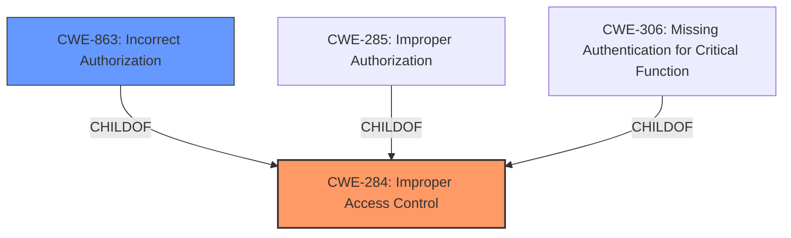

# Analysis for CVE-2024-45326

# Summary
| CWE ID  | CWE Name                       | Confidence | CWE Abstraction Level | CWE Vulnerability Mapping Label | CWE-Vulnerability Mapping Notes |
| :-------- | :----------------------------- | :--------- | :-------------------- | :------------------------------ | :------------------------------ |
| CWE-284 | Improper Access Control        | 1          | Pillar                | Primary                         | Allowed-with-Review              |
| CWE-863 | Incorrect Authorization         | 0.7        | Class                 | Secondary                       | Allowed-with-Review              |

## Evidence and Confidence

*   **Confidence Score:** 1
*   **Evidence Strength:** HIGH

## Relationship Analysis
The primary CWE is CWE-284, which is a high-level category. The analysis considered the guidance to prefer more specific child CWEs if applicable. The relationship guidance suggests that if the root cause is an authentication issue, CWE-306 should be used. If the root cause is an authorization issue with flawed logic, then CWE-863 should be used. Given that the vulnerability description specifies "Improper Access Control" and the attacker is "authenticated," it suggests the issue lies in authorization. CWE-863 is considered a secondary candidate because the authorization check is likely present, but flawed.



## Vulnerability Chain
The vulnerability chain begins with **Improper Access Control** [**CWE-284**], which allows an authenticated attacker with no privileges to perform operations on the central management appliance via crafted requests.
  - **Root Cause:** **CWE-284** (**Improper Access Control**)
  - **Weakness:** Likely **CWE-863** (**Incorrect Authorization**) because the attacker is authenticated
  - **Impact:** Performing operations on the central management appliance

## Summary of Analysis
The initial assessment identified **CWE-284** as the primary weakness based on the vulnerability description and key phrases. The description explicitly states "Improper Access Control," aligning directly with **CWE-284**. However, after reviewing the Authentication vs Authorization vs Access Control Guidance, it became apparent that **CWE-863** (**Incorrect Authorization**) is a more specific candidate, given that the attacker is authenticated. The final decision is to assign **CWE-284** as the primary, due to the explicit description of the vulnerability and the evidence available, and **CWE-863** as a secondary candidate because the attacker is authenticated. The mapping is based on the provided evidence and the CWE specifications. The selected CWEs are at the optimal level of specificity given the available information.

Relevant CWE Information:

# Enhanced Context (25 CWEs)

## CWE-284: Improper Access Control
An **Improper Access Control** vulnerability [**CWE-284**] in FortiDeceptor version 6.0.0, version 5.3.3 and below, version 5.2.1 and below, version 5.1.0, version 5.0.0 may allow an authenticated attacker with none privileges to perform operations on the central management appliance via crafted requests.

### Vulnerability Description Key Phrases
- **rootcause:** **Improper Access Control**
- **weakness:** **CWE-284**
- **impact:** perform operations on the central management appliance
- **vector:** crafted requests
- **attacker:** authenticated attacker with none privileges
- **product:** FortiDeceptor
- **version:** version 6.0.0 and version 5.3.3 and below and version 5.2.1 and below and version 5.1.0 and version 5.0.0

## CVE Reference Links Content Summary
```text
**Relevant Content from fortiguard.fortinet.com_35f2834c_20250624_120903.html:**

*   **Vulnerability:** Improper Access Control vulnerability in FortiDeceptor.
*   **Affected Component:** GUI
*   **Impact:** Improper access control.
*   **CVE ID:** CVE-2024-45326
*   **Root Cause:** An Improper Access Control vulnerability [CWE-284]
*   **Attack Vector:** May allow an authenticated attacker with none privileges to perform operations on the central management appliance via crafted requests.
*   **Required Attacker Capabilities/Position:** Authenticated attacker with none privileges.
*   **Affected Versions:**
    *   FortiDeceptor 6.0 - 6.0.0
    *   FortiDeceptor 5.3 - All versions
    *   FortiDeceptor 5.2 - All versions
    *   FortiDeceptor 5.1 - All versions
    *   FortiDeceptor 5.0 - All versions
*   **Mitigation:**
    *   Upgrade to FortiDeceptor 6.0.1 or above.
    *   Migrate to a fixed release.
```

The vulnerability description explicitly mentions "Improper Access Control," which directly corresponds to **CWE-284** (**Improper Access Control**). This CWE is a high-level category, but in the absence of more detailed information about the specific flaw in access control, it serves as the most appropriate primary classification. The summary of the CVE reference link also states the root cause is **CWE-284**.

The fact that the attacker is authenticated suggests a potential flaw in authorization, making **CWE-863** (**Incorrect Authorization**) a strong secondary candidate. While the description doesn't explicitly state that an authorization check exists but is flawed, the "authenticated attacker with none privileges" implies that authentication is bypassed, and the authorization is likely incorrect.

Other CWEs Considered and Rejected:

*   **CWE-285** (**Improper Authorization**): Considered, but **CWE-863** is more specific as the authorization check is present but flawed
*   **CWE-306** (**Missing Authentication for Critical Function**): Rejected because the attacker is authenticated.