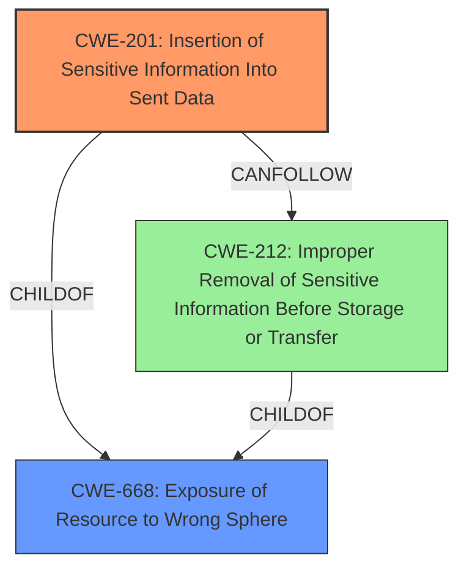

# Raw Analyzer Response for CVE-2024-45336

# Summary
| CWE ID  | CWE Name                                                                            | Confidence | CWE Abstraction Level | CWE Vulnerability Mapping Label | CWE-Vulnerability Mapping Notes |
| :-------- | :---------------------------------------------------------------------------------- | :--------- | :---------------------- | :------------------------------ | :------------------------------ |
| CWE-201 | Insertion of Sensitive Information Into Sent Data                                  | 0.90        | Base                    | Primary CWE                     | Allowed                       |
| CWE-668 | Exposure of Resource to Wrong Sphere | 0.70        | Class                    | Secondary Candidate                     | Discouraged                       |

## Evidence and Confidence

*   **Confidence Score:** 0.80
*   **Evidence Strength:** HIGH

## Relationship Analysis
The primary relationship that influenced the CWE selection was the parent-child relationship. CWE-201 is a base-level CWE that accurately captures the root cause, while CWE-668 is a class-level CWE that describes the broader impact of exposing resources to the wrong sphere. The "CanFollow" relationships of CWE-201 suggest potential follow-up weaknesses, but none are directly applicable in this case. The Retriever Results listed CWE-212, which is a peer of CWE-201, but it wasn't as accurate because the sensitive information is not being stored or transferred, but rather being sent. The abstraction level of CWE-201 being Base made it a more suitable choice than the Class-level CWE-668.

## Vulnerability Chain
The vulnerability chain starts with the HTTP client **incorrectly sending sensitive headers** after a cross-domain redirect due to a subsequent same-domain redirect. This leads to the **insertion of sensitive information into sent data**, which can then lead to the **exposure of the resource to the wrong sphere**.
  - The root cause is the improper handling of sensitive headers during redirects.
  - This leads to the inclusion of sensitive information in the request to the final destination.
  - The impact is potential exposure of sensitive data to an unintended recipient.

## Summary of Analysis
The initial analysis focused on identifying the **root cause** of the vulnerability, which is the **incorrect handling of sensitive headers** during cross-domain redirects. The retriever results suggested several potential CWEs, but CWE-201 (Insertion of Sensitive Information Into Sent Data) best captures the specific weakness. The vulnerability description clearly states that the HTTP client **sends sensitive headers** to an unintended destination after a series of redirects. This aligns directly with the description of CWE-201.

The evidence is the following: "In the event that the client received a subsequent same-domain redirect, however, the sensitive headers would be restored. For example, a chain of redirects from a.com/, to b.com/1, and finally to b.com/2 would **incorrectly send the Authorization header** to b.com/2."

The graph relationships influenced the selection by highlighting the parent-child relationship between CWE-201 and CWE-668, which helped in understanding the broader impact of the vulnerability.

CWE-201 is selected because it is at the optimal level of specificity. It is a Base-level CWE that directly addresses the **insertion of sensitive information** into the sent data. While other CWEs like CWE-668 describe the broader impact, CWE-201 focuses on the core weakness.

Relevant CWE Information:

*   **CWE-201: Insertion of Sensitive Information Into Sent Data**

    *   **Technical Explanation:** The vulnerability involves the **unintended inclusion of sensitive headers (like Authorization)** in HTTP requests after a cross-domain redirect, specifically when a subsequent same-domain redirect occurs. This results in the sensitive information being sent to a potentially untrusted destination.
    *   **Security Implications:** This can lead to the exposure of sensitive credentials or other confidential information, potentially allowing unauthorized access or data breaches.
    *   **Relationship Analysis:** CWE-201 is a Base-level CWE. The parent is CWE-668 (Exposure of Resource to Wrong Sphere).
    *   **Mapping Guidance Influence:** The MITRE mapping guidance for CWE-201 allows its usage, reinforcing its appropriateness for this vulnerability.
    *   **Confidence:** 0.90

*   **CWE-668: Exposure of Resource to Wrong Sphere**
    *   **Technical Explanation:** The vulnerability exposes sensitive information by sending it to a domain it was not intended for. The Authorization header which is meant to be private between the client and the intended server is being sent to a different server.
    *   **Security Implications:** Sensitive information can be exposed to unintended parties.
    *   **Relationship Analysis:** CWE-668 is a Class-level CWE.
    *   **Mapping Guidance Influence:** The MITRE mapping guidance for CWE-668 discourages its usage because it is high-level, but it can be used as a secondary CWE to provide the broader context of the vulnerability's impact.
    *   **Confidence:** 0.70