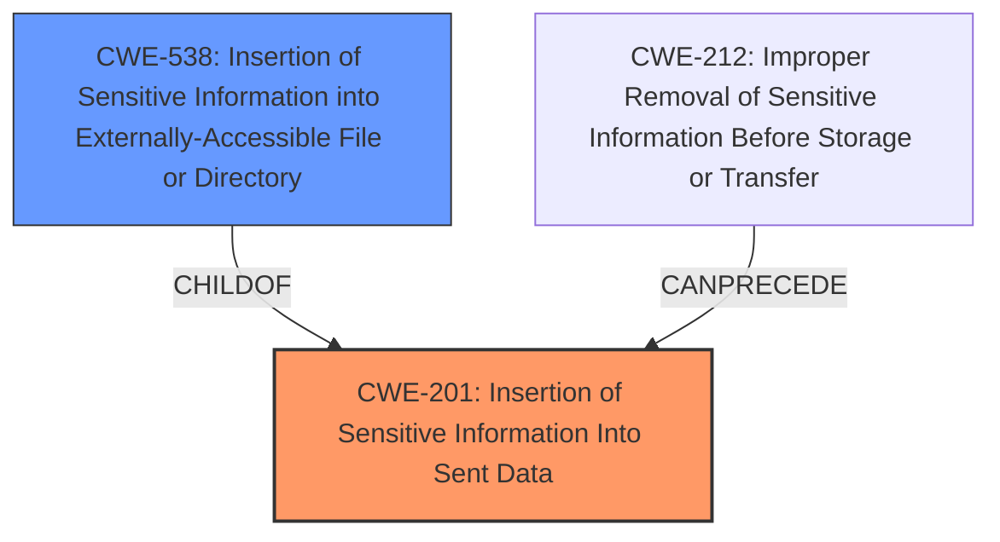

# Analysis Report for CVE-2024-45391

# Vulnerability Analysis Report: CVE-2024-45391

## Description

Tina is an open-source content management system (CMS). Sites building with Tina CMSs command line interface (CLI) prior to version 1.6.2 that use a search token may be vulnerable to the search token being leaked via lock file (tina-lock.json). Administrators of Tina-enabled websites with search setup should rotate their key immediately. This issue has been patched in @tinacms/cli version 1.6.2. Upgrading and rotating the search token is required for the proper fix.

## Vulnerability Description Key Phrases

- **Impact:** leakage of search token
- **Product:** Tina CMS
- **Version:** prior to version 1.6.2
- **Component:** command line interface (CLI)

## Analysis (with Relationship Data)

# Summary
| CWE ID | CWE Name | Confidence | CWE Abstraction Level | CWE Vulnerability Mapping Label | CWE-Vulnerability Mapping Notes |
|---|---|---|---|---|---|
| CWE-201 | Insertion of Sensitive Information Into Sent Data | 1.0 | Base | Allowed | Primary CWE. The **search token** was written to the tina-lock.json file, which is often committed to version control. |
| CWE-538 | Insertion of Sensitive Information into Externally-Accessible File or Directory | 0.7 | Base | Allowed | The **search token**, which is sensitive information, was inserted into the `tina-lock.json` file, which is externally accessible. |

## Evidence and Confidence

*   **Confidence Score:** 0.9
*   **Evidence Strength:** HIGH

## Relationship Analysis
The primary relationship that influenced the decision was the parent-child relationship between CWE-669 (Incorrect Behavior Order: Concurrent Execution Expected Order Violation) and CWE-201 (Insertion of Sensitive Information Into Sent Data). While CWE-669 represents a broader category of flaws related to incorrect behavior order, CWE-201 provides a more specific and accurate description of the vulnerability.

The other relationship was the parent-child relationship between CWE-212 (Improper Removal of Sensitive Information Before Storage or Transfer) and CWE-201 (Insertion of Sensitive Information Into Sent Data). While CWE-212 represents a broader category of flaws related to improper removal of sensitive data, CWE-201 provides a more specific and accurate description of the vulnerability.

The relationship between CWE-201 (Insertion of Sensitive Information Into Sent Data) and CWE-538 (Insertion of Sensitive Information into Externally-Accessible File or Directory) influenced the decision to include CWE-538 as a secondary CWE. CWE-538 refines the scenario by specifying that the sensitive information is placed in an externally-accessible file, which aligns with the vulnerability where the search token is written to a lock file that is often committed to version control.



## Vulnerability Chain
The vulnerability chain begins with the `@tinacms/cli` tool writing the search configuration, including the search indexer token, to the `tina-lock.json` file (CWE-201). This lock file is often committed to version control systems, inadvertently exposing the sensitive search token (CWE-538). The impact of this exposure is a confidentiality breach and potential unauthorized access.
- The **Primary CWE** should identify the issue that led to the vulnerability i.e. the first in the "Vulnerability Chain"

## Summary of Analysis
The primary weakness is the unintentional exposure of the search indexer token. This token should be treated as a secret, and its inclusion in a publicly accessible lock file constitutes a security risk. The `@tinacms/cli` tool lacked proper filtering to exclude sensitive information from being written to the lock file. The `tina-lock.json` file is often committed to version control systems, inadvertently exposing the sensitive search token.

The evidence for selecting CWE-201 as the primary weakness is strong, as the vulnerability description explicitly states that the search token is written to the `tina-lock.json` file. The "CVE Reference Links Content Summary" section confirms this, stating that the vulnerability stems from the `@tinacms/cli` tool writing the search configuration, including the search indexer token, to the `tina-lock.json` file.

CWE-201 is at the optimal level of specificity, as it accurately describes the vulnerability as the insertion of sensitive information into sent data. While other CWEs, such as CWE-212 (Improper Removal of Sensitive Information Before Storage or Transfer), were considered, they do not fully capture the essence of the vulnerability. CWE-201 is more specific in that it focuses on the insertion of sensitive information into sent data, which is the root cause of the vulnerability.

CWE-538 was selected as a secondary CWE because the sensitive information was placed in an externally-accessible file, which aligns with the vulnerability where the search token is written to a lock file that is often committed to version control.

Relevant CWE Information:
- CWE-201: Insertion of Sensitive Information Into Sent Data
- CWE-538: Insertion of Sensitive Information into Externally-Accessible File or Directory


## CWE Relationship Analysis

Current CWEs represent these abstraction levels: .


### Vulnerability Chain Analysis

**Chain starting from CWE-201:**
- 201 (Insertion of Sensitive Information Into Sent Data) - ROOT


**Chain starting from CWE-669:**
- 669 (Incorrect Resource Transfer Between Spheres) - ROOT


### CWE Relationship Diagram

```mermaid
graph TD
    classDef primary fill:#f96,stroke:#333,stroke-width:2px
    classDef secondary fill:#69f,stroke:#333
    classDef tertiary fill:#9e9,stroke:#333
```


*Report generated on 2025-07-13 16:24:55*
