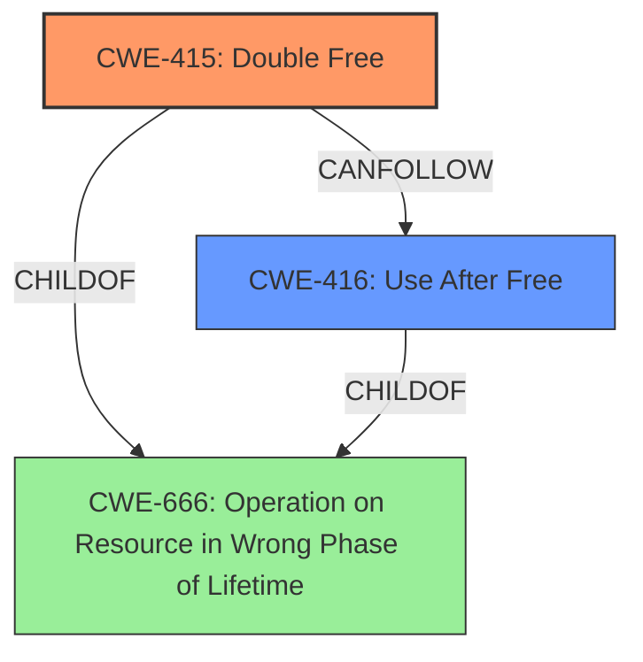

# Analysis for CVE-2024-45402

# Summary

| CWE ID | CWE Name | Confidence | CWE Abstraction Level | CWE Vulnerability Mapping Label | CWE-Vulnerability Mapping Notes |
|---|---|---|---|---|---|
| CWE-415 | Double Free | 1.0 | Variant | Primary | Allowed |
| CWE-416 | Use After Free | 0.7 | Variant | Secondary | Allowed |

## Evidence and Confidence

*   **Confidence Score:** 0.9
*   **Evidence Strength:** HIGH

## Relationship Analysis
The primary weakness is a **double free** condition (CWE-415), which under certain circumstances, can lead to a **use-after-free** vulnerability (CWE-416). CWE-415 and CWE-416 are peer vulnerabilities, but in this case, the **double free** is the root cause that *can precede* the **use-after-free**. Both CWEs are at the Variant level of abstraction.

## Vulnerability Chain
The vulnerability chain starts with a **double free** condition (CWE-415) caused by improper disposal of objects in the Picotls library when parsing a spoofed TLS handshake message. This **double free** can then lead to a **use-after-free** vulnerability (CWE-416). If the **use-after-free** condition is exploitable, it may lead to arbitrary code execution.

CWE-415 (Root Cause) -> CWE-416 (Potential Consequence) -> Arbitrary Code Execution (Impact)

## Summary of Analysis
The primary weakness is the **double free** condition, as explicitly stated in the vulnerability description: "When parsing a spoofed TLS handshake message, picotls (specifically, bindings within picotls that call the crypto libraries) may attempt to **free the same memory twice**." This maps directly to CWE-415 (Double Free). The description further explains that this **double free** "could potentially lead to a **use-after-free** scenario," which justifies including CWE-416 as a secondary weakness. The analysis focuses on the root cause (CWE-415) and its direct consequence (CWE-416), rather than just the potential impact (arbitrary code execution).

CWE-415 is chosen as the primary CWE because it represents the root cause of the vulnerability. CWE-416 is included as a secondary CWE because it is a direct consequence of the **double free** and contributes to the overall risk. Both CWEs are at the Variant level, providing a sufficient level of specificity.

CWEs like CWE-364 (Signal Handler Race Condition), CWE-362 (Concurrent Execution using Shared Resource with Improper Synchronization ('Race Condition')), and CWE-190 (Integer Overflow or Wraparound) were considered but not selected because they do not directly relate to the **double free** and potential **use-after-free** issues described in the vulnerability. These CWEs appear in the retriever results due to keyword overlap but do not accurately capture the specific nature of this vulnerability.