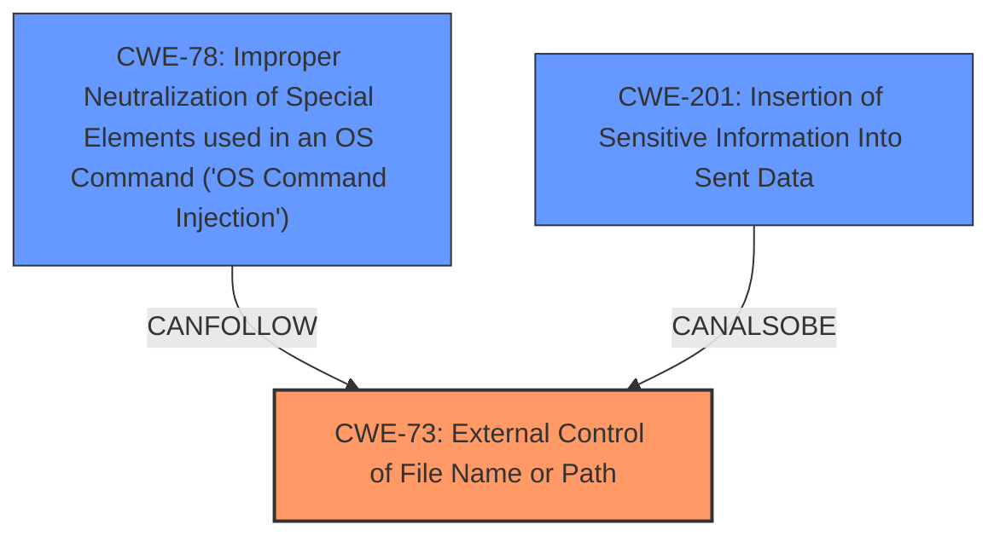

# Analysis for CVE-2024-45405

# Summary

| CWE ID | CWE Name | Confidence | CWE Abstraction Level | CWE Vulnerability Mapping Label | CWE-Vulnerability Mapping Notes |
|---|---|---|---|---|---|
| CWE-73 | External Control of File Name or Path | 0.9 | Base | Allowed | Primary CWE. The product allows user input to control or influence paths or file names that are used in filesystem operations. |
| CWE-201 | Insertion of Sensitive Information Into Sent Data | 0.6 | Base | Allowed | Secondary CWE. The product stores, transfers, or shares a resource that contains sensitive information, but it does not properly remove that information before the product makes the resource available to unauthorized actors. |
| CWE-78 | Improper Neutralization of Special Elements used in an OS Command ('OS Command Injection') | 0.5 | Base | Allowed | Secondary CWE. The product constructs all or part of an OS command using externally-influenced input from an upstream component, but it does not neutralize or incorrectly neutralizes special elements that could modify the intended OS command when it is executed. |

## Evidence and Confidence

*   **Confidence Score:** 0.7
*   **Evidence Strength:** MEDIUM

## Relationship Analysis
The primary weakness is CWE-73, as the vulnerability allows for external control of the file path. CWE-201 is added as a secondary weakness because the file path itself can be considered sensitive information that is being improperly handled. CWE-78 is considered a secondary candidate since code execution occurs because of the **improper handling of the file path**, which allows an attacker to inject OS commands, but the primary issue is the path manipulation.

## Vulnerability Chain
The vulnerability chain starts with the **improper resolution of paths** (CWE-73), leading to the potential injection of sensitive information (CWE-201), which ultimately enables code execution (CWE-78).

## Summary of Analysis
The primary CWE is CWE-73 (External Control of File Name or Path) because the root cause of the vulnerability lies in the **improper handling of file paths**. The `gix-path` library **fails to properly validate or sanitize the paths** of configuration files, allowing an attacker to manipulate these paths. This aligns directly with the description of CWE-73, which states that "The product allows user input to control or influence paths or file names that are used in filesystem operations." The evidence for this is found in the **Vulnerability Description**, which states that `gix-path` **improperly resolves paths containing unusual or non-ASCII characters**.

CWE-201 (Insertion of Sensitive Information Into Sent Data) is considered a secondary weakness, as the **improperly resolved path** can be seen as sensitive information being inserted into the application's data flow.

CWE-78 (Improper Neutralization of Special Elements used in an OS Command ('OS Command Injection')) is also a secondary candidate because the vulnerability can lead to code execution through command injection. The **CVE Reference Links Content Summary** explicitly mentions the possibility of arbitrary code execution by injecting a crafted configuration file. However, this is a consequence of the path manipulation, not the primary weakness.

I considered CWE-22 (Improper Limitation of a Pathname to a Restricted Directory ('Path Traversal')) but determined that it was not as accurate as CWE-73. While path traversal is a potential outcome of this vulnerability, the **root cause is the lack of proper control over the file name or path itself**, not specifically the traversal of directories.

I also considered CWE-88 (Improper Neutralization of Argument Delimiters in a Command ('Argument Injection')), but this is more related to the command itself than the path. The code execution occurs due to the **improperly parsed path**, which points to a malicious configuration file, not necessarily due to argument injection into the `git config` command.

The selected CWEs are at the optimal level of specificity because they directly address the **root cause of the vulnerability (CWE-73)** and its immediate consequences (CWE-201, CWE-78). They provide a clear and accurate representation of the weakness based on the available evidence.