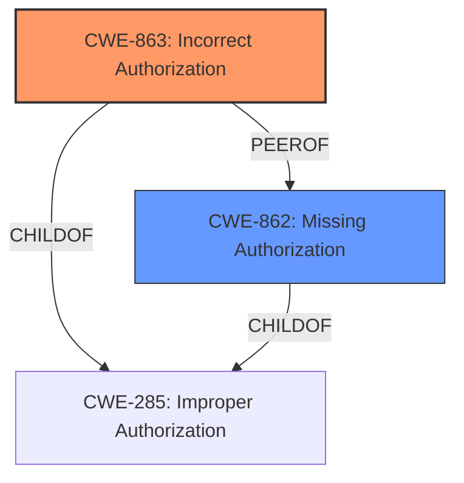

# Analysis for CVE-2024-45442

# Summary
| CWE ID | CWE Name | Confidence | CWE Abstraction Level | CWE Vulnerability Mapping Label | CWE-Vulnerability Mapping Notes |
|---|---|---|---|---|---|
| CWE-863 | Incorrect Authorization | 0.9 | Class | Primary | Allowed-with-Review |
| CWE-862 | Missing Authorization | 0.7 | Class | Secondary Candidate | Allowed-with-Review |

## Evidence and Confidence

*   **Confidence Score:** 0.8
*   **Evidence Strength:** MEDIUM

## Relationship Analysis
The primary relationship identified is that CWE-863 (Incorrect Authorization) and CWE-862 (Missing Authorization) are peer CWEs, both dealing with authorization issues. CWE-863 is selected as the primary CWE because the description mentions "**Vulnerability of permission verification for APIs**", which implies that some authorization mechanism is in place but is flawed. If there was no authorization at all, CWE-862 would be a better fit. Both are Class level, but are more specific than their parent CWE, CWE-285 (Improper Authorization) , which is discouraged.

## Vulnerability Chain
The vulnerability chain starts with a **vulnerability of permission verification for APIs**. This **incorrect authorization** (CWE-863) directly leads to the impact of affecting system availability. The chain is relatively short in this case. Alternatively, if authorization was completely missing the chain would start with **Missing Authorization** (CWE-862)

## Summary of Analysis
The initial assessment, based on the vulnerability description, pointed towards authorization-related issues. The description mentions "**Vulnerability of permission verification for APIs**". This suggests that the system attempts to verify permissions, but the verification process is flawed.

The analysis focused on distinguishing between missing authorization (CWE-862) and incorrect authorization (CWE-863). The key phrase "permission verification" indicates that there is an attempt to authorize API calls, however the check is vulnerable. This supports the selection of CWE-863 (Incorrect Authorization) as the primary CWE.

The evidence for this decision comes directly from the vulnerability description, which specifically mentions a flaw in permission verification. The retriever results also included CWE-863 and CWE-862, further supporting this choice.

The chosen CWE is at the optimal level of specificity, as it accurately reflects the presence of a flawed authorization mechanism rather than a complete lack of authorization.

Relevant CWE Information:
* CWE-863: Incorrect Authorization
* CWE-862: Missing Authorization
* CWE-285: Improper Authorization