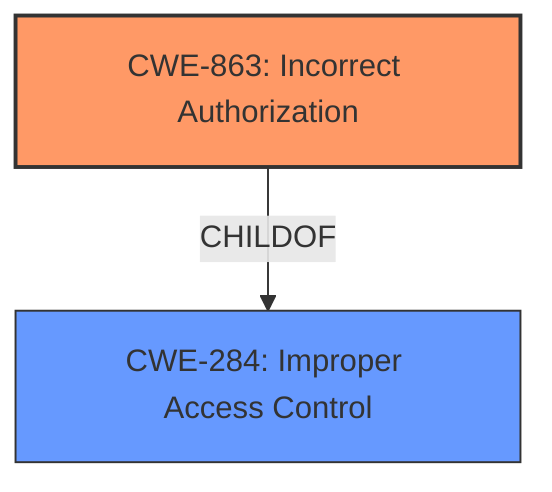

# Analysis for CVE-2024-45446

# Summary

| CWE ID | CWE Name | Confidence | CWE Abstraction Level | CWE Vulnerability Mapping Label | CWE-Vulnerability Mapping Notes |
|---|---|---|---|---|---|
| CWE-863 | Incorrect Authorization | 0.9 | Class | Primary | Allowed-with-Review |
| CWE-284 | Improper Access Control | 0.7 | Class | Secondary | Allowed |

## Evidence and Confidence

*   **Confidence Score:** 0.9
*   **Evidence Strength:** HIGH

## Relationship Analysis

The primary relationship that influenced the CWE selection is the parent-child relationship between CWE-284 (Improper Access Control) and CWE-863 (Incorrect Authorization). The vulnerability description specifically mentions an "**Access permission verification vulnerability**", which suggests that an authorization mechanism is present but **incorrectly** implemented. This aligns more closely with CWE-863, a child of CWE-284, providing a more specific classification.

## Vulnerability Chain

The vulnerability chain starts with an **incorrect** implementation of access permission verification (**Access permission verification vulnerability**). This **incorrect authorization** then leads to a potential impact on availability.

## Summary of Analysis

The analysis is primarily based on the provided evidence, specifically the key phrase "**Access permission verification vulnerability**". This phrase indicates that there's an attempt to verify access permissions, but the verification is flawed. This aligns directly with the definition of CWE-863 (Incorrect Authorization), which states that the product performs an authorization check, but it does not correctly perform the check. The vulnerability is at the optimal level of specificity because it identifies the specific type of access control failure (incorrect authorization) rather than just a general access control issue.

Relevant CWE Information:

# Enhanced Context (25 CWEs)

## CWE-863: Incorrect Authorization
**Abstraction Level**: Class
**Similarity Score**: 1489.60
**Source**: sparse

**Description**:
The product performs an authorization check when an actor attempts to access a resource or perform an action, but it does not correctly perform the check.

**Mapping Guidance**:
- Usage: Allowed-with-Review
- Rationale: This CWE entry is a Class and might have Base-level children that would be more appropriate

## CWE-284: Improper Access Control
**Abstraction Level**: Class
**Similarity Score**: 1475.12
**Source**: sparse

**Description**:
Used when the system fails to enforce restrictions on access to resources.
If no specific privilege or permission mistake is identifiable, use this.

# Complete CWE Specifications

CWE-863: Incorrect Authorization

CWE-284: Improper Access Control

CWE-285 (Improper Authorization) was considered but deemed less appropriate. While it also relates to authorization issues, CWE-285 describes a scenario where the product does not perform or incorrectly performs an authorization check. In this case, the description indicates that access permission verification exists, but it's flawed, making CWE-863 a better fit.

CWE-862 (Missing Authorization) was also considered, but the "**Access permission verification vulnerability**" key phrase indicates that authorization is attempted, making CWE-862 an unsuitable selection.