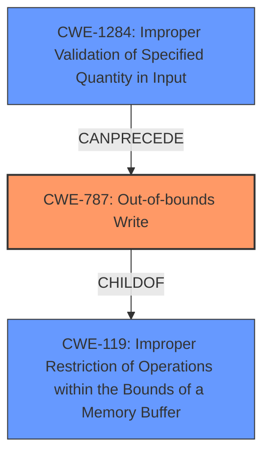

# Analysis Report for CVE-2024-45467

# Vulnerability Analysis Report: CVE-2024-45467

## Description

A vulnerability has been identified in Tecnomatix Plant Simulation V2302 (All versions < V2302.0016), Tecnomatix Plant Simulation V2404 (All versions < V2404.0005). The affected application is vulnerable to **memory corruption** while parsing specially crafted WRL files. This could allow an attacker to execute code in the context of the current process.

## Vulnerability Description Key Phrases

- **Weakness:** memory corruption
- **Impact:** execute code in the context of the current process
- **Vector:** specially crafted WRL files
- **Attacker:** attacker
- **Product:** Tecnomatix Plant Simulation
- **Version:** V2302 (All versions < V2302.0016), V2404 (All versions < V2404.0005)

## Analysis (with Relationship Data)

# Summary
| CWE ID | CWE Name | Confidence | CWE Abstraction Level | CWE Vulnerability Mapping Label | CWE-Vulnerability Mapping Notes |
|---|---|---|---|---|---|
| CWE-787 | Out-of-bounds Write | 0.9 | Base | Primary | Allowed |
| CWE-119 | Improper Restriction of Operations within the Bounds of a Memory Buffer | 0.7 | Class | Secondary | Discouraged |
| CWE-1284 | Improper Validation of Specified Quantity in Input | 0.6 | Base | Secondary | Allowed |

## Evidence and Confidence

*   **Confidence Score:** 0.8
*   **Evidence Strength:** HIGH

## Relationship Analysis
The primary CWE is CWE-787, which is a **Base** level CWE detailing that data is written past the end or before the beginning of the intended buffer. This is a child of CWE-119, which describes improper restriction of operations within the bounds of a memory buffer. CWE-1284 describes improper validation of a specified quantity in input, and can precede CWE-787 if the size of input is not validated.



## Vulnerability Chain
The vulnerability chain starts with the parsing of a specially crafted WRL file, which leads to **memory corruption**. The **memory corruption** is caused by an out-of-bounds write. This can lead to arbitrary code execution.

CWE-1284 (Improper Validation of Specified Quantity in Input) -> CWE-787 (Out-of-bounds Write) -> Arbitrary Code Execution

## Summary of Analysis
The initial assessment focused on the **memory corruption** aspect and the provided "CWE for similar CVE Descriptions" which lead to CWE-787 as the primary candidate with high confidence, backed by both description matching and retriever results. The description clearly indicates a **memory corruption** issue stemming from parsing specially crafted WRL files which allows an attacker to execute code. The **Root Cause of Vulnerability** indicates that memory corruption occurs while parsing specially crafted WRL files. The **Weaknesses/Vulnerabilities Present** section suggests CWE-119 due to a lack of proper bounds checking.

The graph relationships influenced the decision by showing the parent-child relationship between CWE-787 and CWE-119. The CANPRECEDE relationship between CWE-1284 and CWE-787 suggests a possible cause.

The selected CWEs are at the optimal level of specificity because CWE-787 directly describes the **out-of-bounds write**, which is the **root cause** of the **memory corruption**. CWE-119 is a broader category that encompasses the issue but isn't as specific as CWE-787. CWE-1284 suggests that the size was not validated, and thus it could lead to the out-of-bounds write condition.

The evidence from the vulnerability description strongly supports CWE-787 as the primary weakness, especially since the description includes "memory corruption while parsing specially crafted WRL files."

CWE-119 is considered as a secondary issue since the **root cause** is the out-of-bounds write, and CWE-119 is a more general case.

CWE-1284 is considered as a possible root cause to the out-of-bounds write.

CWE-NVD-noinfo was ignored because the provided description provides enough information to identify specific CWEs.

CWE-125 (Out-of-bounds Read) was not selected as there is no evidence of a read out of bounds.

CWE-190 (Integer Overflow or Wraparound) was not selected as there is no direct evidence of integer overflow.

CWE-824 (Access of Uninitialized Pointer) was not selected as there is no direct evidence of accessing an uninitialized pointer.


## CWE Relationship Analysis

Current CWEs represent these abstraction levels: .


### Vulnerability Chain Analysis

**Chain starting from CWE-1284:**
- 1284 (Improper Validation of Specified Quantity in Input) - ROOT


**Chain starting from CWE-125:**
- 125 (Out-of-bounds Read) - ROOT


### CWE Relationship Diagram

```mermaid
graph TD
    classDef primary fill:#f96,stroke:#333,stroke-width:2px
    classDef secondary fill:#69f,stroke:#333
    classDef tertiary fill:#9e9,stroke:#333
```


*Report generated on 2025-07-13 16:34:29*
