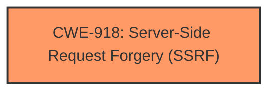

# Raw Analyzer Response for CVE-2024-45479

# Summary
| CWE ID | CWE Name | Confidence | CWE Abstraction Level | CWE Vulnerability Mapping Label | CWE-Vulnerability Mapping Notes |
|---|---|---|---|---|---|
| CWE-918 | Server-Side Request Forgery (SSRF) | 1.0 | Base | Primary | Allowed |

## Evidence and Confidence

*   **Confidence Score:** 1.0
*   **Evidence Strength:** HIGH

## Relationship Analysis
The primary relationship that influences this decision is the direct match of the vulnerability to the definition of CWE-918. No other CWEs in the Retriever Results or Complete CWE Specifications directly relate to CWE-918 in a way that would suggest a different classification. The abstraction level of CWE-918 is Base, which is preferred.

## Vulnerability Chain
The vulnerability chain here is simple:
1.  **Root Cause:** **SSRF** vulnerability in the Edit Service Page.
2.  **Impact:** An attacker can make requests to internal resources not directly accessible.

## Summary of Analysis
The vulnerability is described as an **SSRF** vulnerability in the Edit Service Page of Apache Ranger UI. The CVE Reference Links Content Summary confirms this by stating the **root cause of the vulnerability** is a Server-Side Request Forgery (**SSRF**) issue.

The Retriever Results list CWE-918 as the top result with a score of 1.000. CWE-918's description aligns perfectly with the vulnerability: "The web server receives a URL or similar request from an upstream component and retrieves the contents of this URL, but it does not sufficiently ensure that the request is being sent to the expected destination."

Given the direct match in the vulnerability description, the content summary, and the retriever results, assigning CWE-918 is a clear and well-supported decision. The evidence is strong and confidence is high.

Other CWEs were considered but deemed less relevant:

*   CWE-22: Improper Limitation of a Pathname to a Restricted Directory ('Path Traversal') - While path traversal could potentially be related to SSRF in some scenarios, the primary issue here is the server making requests on behalf of the attacker, not traversing directories.
*   CWE-611: Improper Restriction of XML External Entity Reference - This is specific to XML processing and doesn't fit the general SSRF description.
*   CWE-116: Improper Encoding or Escaping of Output - This relates to output encoding issues, not SSRF.
*   CWE-917: Improper Neutralization of Special Elements used in an Expression Language Statement ('Expression Language Injection') - This relates to expression language injection, not SSRF.
* CWE-532: Insertion of Sensitive Information into Log File - While sensitive information *could* be logged as a result of the SSRF, the root cause is not primarily related to logging.