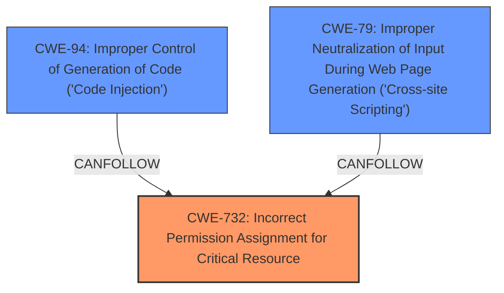

# Raw Analyzer Response for CVE-2024-45489

# Summary
| CWE ID | CWE Name | Confidence | CWE Abstraction Level | CWE Vulnerability Mapping Label | CWE-Vulnerability Mapping Notes |
|---|---|---|---|---|---|
| CWE-732 | Incorrect Permission Assignment for Critical Resource | 0.9 | Class | Allowed-with-Review | Primary CWE |
| CWE-94 | Improper Control of Generation of Code ('Code Injection') | 0.7 | Base | Allowed-with-Review | Secondary Candidate |
| CWE-79 | Improper Neutralization of Input During Web Page Generation ('Cross-site Scripting') | 0.6 | Base | Allowed | Secondary Candidate |

## Evidence and Confidence

*   **Confidence Score:** 0.8
*   **Evidence Strength:** HIGH

## Relationship Analysis
The primary weakness is **Incorrect Permission Assignment for Critical Resource (CWE-732)**, a class-level CWE. The analysis considered potential child CWEs and related vulnerabilities in the chain. The **Improper Control of Generation of Code ('Code Injection') (CWE-94)** and **Improper Neutralization of Input During Web Page Generation ('Cross-site Scripting') (CWE-79)** can result from the misconfigured permissions, because Javascript boosts with another user's ID can be created or updated and then executed.

## Vulnerability Chain
The vulnerability chain starts with **misconfigured Firebase ACLs** (**Incorrect Permission Assignment for Critical Resource (CWE-732)**), which allows attackers to create or update boosts using another user's ID. This leads to the installation of the boost in the victim's browser and execution of arbitrary Javascript (**Improper Control of Generation of Code ('Code Injection') (CWE-94)**, **Improper Neutralization of Input During Web Page Generation ('Cross-site Scripting') (CWE-79)**) in a privileged context.
  - Map the sequence from initial flaw to final impact
  - Identify which CWEs represent root causes vs. impacts
  - Note any missing links in the chain based on relationship data
  - Remember the **Primary CWE** should identify the issue that led to the vulnerability i.e. the first in the "Vulnerability Chain"

## Summary of Analysis
The initial analysis identified **Incorrect Permission Assignment for Critical Resource (CWE-732)** as the root cause due to the **misconfigured Firebase ACLs**. This allowed unauthorized modification of boost ownership. The subsequent **Improper Control of Generation of Code ('Code Injection') (CWE-94)** and **Improper Neutralization of Input During Web Page Generation ('Cross-site Scripting') (CWE-79)** are consequences of the initial permission issue, where arbitrary Javascript can be executed within a user's browser.

The evidence from the "CVE Reference Links Content Summary" section confirms that the **root cause** stemmed from "**misconfigured Access Control Lists (ACLs) in Arc's Firebase backend**." This supports the selection of **Incorrect Permission Assignment for Critical Resource (CWE-732)**.

The **"Vulnerability Description Key Phrases"** also identifies the **"misconfigured Firebase ACLs"** as the **rootcause**.

The retriever results list **Incorrect Permission Assignment for Critical Resource (CWE-732)** as the top match, which further validates the selection.

The relationships between CWEs influenced the final decision by highlighting how the permission issue leads to code execution vulnerabilities.

The selected CWEs are at the optimal level of specificity because **Incorrect Permission Assignment for Critical Resource (CWE-732)** directly addresses the root cause, while **Improper Control of Generation of Code ('Code Injection') (CWE-94)** and **Improper Neutralization of Input During Web Page Generation ('Cross-site Scripting') (CWE-79)** describe the subsequent impacts.

Relevant CWE Information:

# Enhanced Context (25 CWEs)
The following CWEs were identified as potentially relevant to this vulnerability:

## CWE-668: Exposure of Resource to Wrong Sphere
**Abstraction Level**: Class
**Similarity Score**: 0.69
**Source**: dense

**Description**:
The product exposes a resource to the wrong control sphere, providing unintended actors with inappropriate access to the resource.

**Mapping Guidance**:
- Usage: Discouraged
- Rationale: CWE-668 is high-level and is often misused as a catch-all when lower-level CWE IDs might be applicable. It is sometimes used for low-information vulnerability reports [REF-1287]. It is a level-1 Class (i.e., a child of a Pillar). It is not useful for trend analysis.

## CWE-639: Authorization Bypass Through User-Controlled Key
**Abstraction Level**: Base
**Similarity Score**: 0.69
**Source**: dense

**Description**:
The system's authorization functionality does not prevent one user from gaining access to another user's data or record by modifying the key value identifying the data.

**Mapping Guidance**:
- Usage: Allowed
- Rationale: This CWE entry is at the Base level of abstraction, which is a preferred level of abstraction for mapping to the root causes of vulnerabilities.

## CWE-116: Improper Encoding or Escaping of Output
**Abstraction Level**: Class
**Similarity Score**: 0.69
**Source**: dense

**Description**:
The product prepares a structured message for communication with another component, but encoding or escaping of the data is either missing or done incorrectly. As a result, the intended structure of the message is not preserved.

**Mapping Guidance**:
- Usage: Allowed-with-Review
- Rationale: This CWE entry is a Class and might have Base-level children that would be more appropriate

## CWE-451: User Interface (UI) Misrepresentation of Critical Information
**Abstraction Level**: Class
**Similarity Score**: 0.69
**Source**: dense

**Description**:
The user interface (UI) does not properly represent critical information to the user, allowing the information - or its source - to be obscured or spoofed. This is often a component in phishing attacks.

**Mapping Guidance**:
- Usage: Allowed-with-Review
- Rationale: This CWE entry is a Class and might have Base-level children that would be more appropriate

## CWE-267: Privilege Defined With Unsafe Actions
**Abstraction Level**: Base
**Similarity Score**: 0.69
**Source**: dense

**Description**:
A particular privilege, role, capability, or right can be used to perform unsafe actions that were not intended, even when it is assigned to the correct entity.

**Mapping Guidance**:
- Usage: Allowed
- Rationale: This CWE entry is at the Base level of abstraction, which is a preferred level of abstraction for mapping to the root causes of vulnerabilities.

## CWE-923: Improper Restriction of Communication Channel to Intended Endpoints
**Abstraction Level**: Class
**Similarity Score**: 0.68
**Source**: dense

**Description**:
The product establishes a communication channel to (or from) an endpoint for privileged or protected operations, but it does not properly ensure that it is communicating with the correct endpoint.

**Mapping Guidance**:
- Usage: Allowed-with-Review
- Rationale: This CWE entry is a Class and might have Base-level children that would be more appropriate

## CWE-201: Insertion of Sensitive Information Into Sent Data
**Abstraction Level**: Base
**Similarity Score**: 0.68
**Source**: dense

**Description**:
The code transmits data to another actor, but a portion of the data includes sensitive information that should not be accessible to that actor.

**Mapping Guidance**:
- Usage: Allowed
- Rationale: This CWE entry is at the Base level of abstraction, which is a preferred level of abstraction for mapping to the root causes of vulnerabilities.

## CWE-502: Deserialization of Untrusted Data
**Abstraction Level**: Base
**Similarity Score**: 0.68
**Source**: dense

**Description**:
The product deserializes untrusted data without sufficiently ensuring that the resulting data will be valid.

**Mapping Guidance**:
- Usage: Allowed
- Rationale: This CWE entry is at the Base level of abstraction, which is a preferred level of abstraction for mapping to the root causes of vulnerabilities.

## CWE-367: Time-of-check Time-of-use (TOCTOU) Race Condition
**Abstraction Level**: Base
**Similarity Score**: 0.67
**Source**: dense

**Description**:
The product checks the state of a resource before using that resource, but the resource'